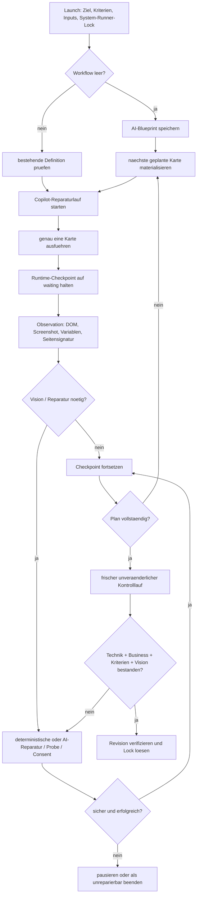

```bash
php artisan migrate --force
php artisan storage:link
php artisan optimize:clear
php artisan config:cache
supervisorctl reread
supervisorctl update
supervisorctl restart followflow-queue:*
```

Production must use `APP_ENV=production`, `APP_DEBUG=false` and
`QUEUE_CONNECTION=database`. An example Supervisor configuration is available
at `deployment/supervisor-followflow-queue.conf.example`. The full client-side
workflow protocol does not depend on the queue worker for live progress or
step routing, while legacy and non-portable fallback workflows still do.

Geplante Aufgaben ausführen:

php artisan schedule:run

Admin-Tasks & Reports generieren:

php artisan admin:tasks

API & Integrationen

PayPal API für Verkäuferauszahlungen

ApexCharts für animierte Statistiken

Cookiebot für DSGVO-konforme Einbindung von Google Maps

Benutzerverwaltung mit Jetstream & Teams

Support & Weiterentwicklung

Feature-Wünsche und Fehlerberichte können über GitHub Issues eingereicht werden. Updates werden regelmäßig implementiert, insbesondere Sicherheits- und Performance-Optimierungen.

# AiUserFactory

## Agenten-Uebergabe: Workflow Manager und Workflow Copilot

Stand: 2026-07-16

Dieser Abschnitt ist die gemeinsame Kommunikationsebene fuer Codex, Claude und
weitere Agents. Vor Arbeiten am Workflow Manager oder Workflow Copilot zuerst
diesen Abschnitt und danach die genannten Kerndateien lesen. Nach einer
wesentlichen Aenderung den Ist-Stand, die Verifikation und den letzten Eintrag im
Arbeitsprotokoll aktualisieren.

### Soll-Ist

| Bereich | Soll | Ist |
| --- | --- | --- |
| Vorschau-Tests | Manuelle Tests und Copilot-Live-Optimierung verwenden dieselbe Oberflaeche mit Workflow-Karte, Steps, Tasks, Browserfenstern, Screenshots, Variablen, Artefakten und Logs. | Umgesetzt. Beide Wege verwenden `showRunPreviewModal` und `x-workflows.run-preview`. Das fruehere separate Copilot-Vorschaumodal wird nicht mehr geoeffnet. |
| Einfluss des Copiloten | Der Copilot kann den gemeinsamen Test beobachten, an sicheren Task-Grenzen pruefen, pausieren, fortsetzen, anweisen, zurueckspulen und stoppen. | Umgesetzt. Jeder Copilot-Task wird als wartender Checkpoint gehalten und als `checkpoint.review_pause` protokolliert. Die Steuerungen liegen im gemeinsamen Vorschaumodal und im Chat. |
| Leerer Workflow | Aus Zielbeschreibung, Erfolgskriterien und benannten Workflow-Eingaben soll ein leerer Workflow selbststaendig geplant und aufgebaut werden. | Umgesetzt. `WorkflowCopilotPlanningService` fordert eine JSON-Planung an, erlaubt nur Keys aus `WorkflowTaskCatalog`, legt Steps und Tasks an und erzeugt Loop-Endsegmente automatisch. Erst danach startet die Optimierung. |
| Kurze Arbeitszyklen | Der Copilot soll nicht viele Aenderungen blind stapeln, sondern regelmaessig Kontext und Teststatus neu pruefen. | Umgesetzt. Der Assistant-Systemprompt fordert nach hoechstens zwei aendernden Toolaufrufen eine erneute Kontext- oder Statuspruefung. Der Runtime-Supervisor prueft weiterhin jeden Task-Checkpoint. |
| Modelluebergabe | Screenshots und redigiertes DOM sollen vom Bildverstehen-Modell ausgewertet werden; Vision, Erstplanung und Reparatur muessen denselben vollstaendigen Ausfuehrungsvertrag, Task-Katalog, Workflow-Graph, Variablen-, Loop- und Routingregeln kennen. | Umgesetzt. `WorkflowCopilotPromptContextService` liefert allen drei Modellpfaden denselben redigierten Kontext mit kompletter Task-Semantik, Routing-Prioritaet, terminaler `fail`-Bedeutung, Workflow-Diagnosen und Regeln fuer den unveraenderlichen Kontrolllauf. `WorkflowCopilotVisionService` liefert den visuellen Befund ueber `image_understanding`; `WorkflowCopilotPlanningService` und `WorkflowCopilotRepairService` planen kataloggebunden ueber `data_analysis`. |
| Chat-Scroll | Nach neuen Nachrichten, Poll-Ergebnissen, Streaming-Text und Hoehenaenderungen muss der Chat unten bleiben. | Umgesetzt. `MutationObserver`, `ResizeObserver`, zwei Animation-Frames und kurze Nachpruefungen halten Nachrichtenbereich und wachsenden Composer am Ende. |
| Chat-Audio | Neue Vorleseausgaben duerfen eine laufende Nachricht nicht abbrechen, sondern muessen in Eingangsreihenfolge abgespielt werden. | Umgesetzt. Neue Assistant-Nachrichten werden stabil erkannt und in die bestehende TTS-Warteschlange aufgenommen. Nur explizites Stoppen, Schliessen oder Deaktivieren leert die Queue. |
| Serverlokale Sprache | Spracheingabe und -ausgabe sollen ohne kostenpflichtigen Anbieter und ohne oeffentlichen Voice-Port direkt auf dem Laravel-Server laufen. | Anwendungscode und UI sind produktiv ausgerollt. `whisper_local` nutzt ffmpeg plus whisper.cpp, `piper_local` Piper per CLI. Die Plesk-Runtime ist noch nicht installiert: Der Live-Status meldet deaktiviert sowie alle sechs Komponenten als fehlend; Vosk/eSpeak bleiben bis zur Installation aktiv. |
| Vollstaendiges Protokoll | Sichtbare Antworten, Toolaufrufe, Toolergebnisse, Anpassungen, Revisionen, Checkpoints, Taskversuche und alle Testlaeufe muessen exportierbar sein. | Umgesetzt. `WorkflowCopilotLogExportService` erzeugt ein ZIP mit Gesamtsnapshot, JSONL-Ereignisstrom, Chat-/Toolprotokoll, finalem Workflow und einem bereinigten Debug-ZIP pro Run. |
| Kostenbudget | Das USD-Budget muss global voreinstellbar und pro Optimierung anpassbar sein; Planung, Vision, Reparaturplanung und Verifikation muessen demselben Lauf zugerechnet werden. | Umgesetzt. `max_cost_usd=0` bedeutet unbegrenzt. OpenRouter-Usage wird pro Antwort normalisiert, als `ai.usage_recorded` protokolliert und beendet den Lauf vor der naechsten Aktion, sobald das Limit erreicht ist. |
| Laufarchiv | Copilot-Optimierungslaeufe sollen mit Kosten, Logs, Testlaeufen, Revisionen und bereinigten Laufdaten in einem eigenen Livewire-Modul sichtbar sein. | Umgesetzt. `WorkflowCopilotRuns` ist global auf der Workflow-Liste und workflowbezogen im Manager als Modal erreichbar. Es nutzt keine zweite Run-Vorschau; der vollstaendige Datensatz bleibt als redigiertes ZIP exportierbar. |
| Consent-Hindernisse | Ein sichtbarer Consent-Dialog muss auch nach technisch erfolgreicher Task-Ausfuehrung als Blockade behandelt und vorzugsweise ueber `Alle ablehnen` beseitigt werden. Ein optional nicht vorhandener Dialog darf weder abbrechen noch eine Selbstschleife bilden. | Umgesetzt. Consent-Aktionen werden vor der DOM-Begrenzung priorisiert. `consent_blocked` startet eine deterministische Strukturreparatur. Bestehende IF-/Klick-Paare werden statisch so geroutet, dass gefunden zum Handler und nicht gefunden sowie bereits erledigt zur normalen Fortsetzung fuehren; dadurch funktioniert derselbe Pfad auch im unveraenderlichen Kontrolllauf. |
| Geheimnisse | Exportierte Diagnosepakete duerfen keine Passwoerter, Tokens, Cookies, Session-Payloads oder WebSocket-Endpunkte enthalten. | Umgesetzt fuer strukturierte sensible Felder und bekannte Geheimwerte. Freitext bleibt grundsaetzlich sorgfaeltig zu behandeln und darf keine unbekannten Geheimnisse enthalten. |
| Ausfuehrungsziel | Autonome Reparaturen duerfen nur auf dem System-Runner laufen. | Umgesetzt und serverseitig erzwungen. ClientController bleibt fuer normale Vorschau-Tests moeglich, aber nicht fuer Copilot-Reparatursitzungen. |

### Architektur und Zustaendigkeiten

| Datei | Zustaendigkeit |
| --- | --- |
| `app/Livewire/Admin/Network/WorkflowManager.php` | Startparameter, gemeinsames Vorschaumodal, Copilot-Steuerung und Log-Download. |
| `resources/views/livewire/admin/network/workflow-manager.blade.php` | Workflow-Editor, Startdialog und gemeinsame Vorschau-/Copilot-Oberflaeche. |
| `app/Livewire/Admin/Network/WorkflowRunPreview.php` | Datenprojektion fuer Workflow-Karte, Browserfenster, Timeline, Variablen und Artefakte. |
| `resources/views/livewire/admin/network/workflow-run-preview.blade.php` | Die eine verbindliche Vorschau fuer manuelle und autonome Runs. |
| `app/Services/Workflows/WorkflowCopilotPlanningService.php` | Kataloggebundene Erstplanung und Aufbau eines leeren Workflows. |
| `app/Services/Workflows/WorkflowCopilotPromptContextService.php` | Gemeinsamer redigierter Ausfuehrungsvertrag, vollstaendiger Task-Katalog, Workflow-Graph, Routingregeln und statische Diagnosen fuer Vision, Erstplanung und Reparatur. |
| `app/Services/Workflows/WorkflowCopilotSupervisorService.php` | Checkpoint-Beobachtung, Reparatur, Probe, Fortsetzung und Endverifikation. |
| `app/Services/Workflows/WorkflowCopilotSessionService.php` | Persistente Sitzungen, unveraenderliche Events, Checkpoints, Status und Locks. |
| `app/Livewire/Admin/Network/WorkflowCopilotRuns.php` | Globale oder workflowbezogene Projektion der Optimierungslaeufe mit Kosten, Logs, Tests, Revisionen und bereinigten Daten. |
| `resources/views/livewire/admin/network/workflow-copilot-runs.blade.php` | Dichte Listen-/Detailoberflaeche des Copilot-Laufarchivs innerhalb der bestehenden Modale. |
| `app/Services/Ai/WorkflowCopilotAiUsageTracker.php` | Request-lokale Erfassung und Normalisierung der vom AI-Provider gemeldeten Token- und Kostendaten. |
| `app/Services/Workflows/WorkflowCopilotObservationService.php` | Redigierte Browserbeobachtung und priorisierte sichtbare Interaktionskarte, insbesondere fuer Consent-Aktionen. |
| `app/Services/Workflows/WorkflowCopilotRepairService.php` | Kataloggebundene Task-/Routenreparaturen sowie deterministische, eigenstaendige Consent-Klick-Listen. |
| `app/Services/Ai/WorkflowAssistantToolService.php` | Assistant-Tools, Systemprompt und Start von normalen Tests bzw. Optimierungen. |
| `app/Livewire/Tools/Chatbot.php` | Chatdurchlauf, Toolausfuehrung und persistente Chat-/Tool-Auditereignisse. |
| `resources/views/livewire/tools/chatbot.blade.php` | Chatinteraktion, Streaming, Autoscroll und Weiterleitung zur gemeinsamen Vorschau. |
| `app/Services/Ai/LocalAssistantVoiceService.php` | Isolierte ffmpeg-/Whisper-/Piper-Prozesse, Status, Locks, Timeouts und Temp-Bereinigung. |
| `scripts/bootstrap-local-assistant-voice.sh` | Gepinnter, idempotenter Linux/Plesk-Bootstrap ohne offenen Voice-Port. |
| `docs/local-assistant-voice.md` | Installation, Betrieb, Diagnose und Rollback der lokalen Voice-Runtime. |
| `app/Services/Workflows/WorkflowCopilotLogExportService.php` | Bereinigter, uebertragbarer Gesamtlog einer Optimierung. |

### Verbindliche Regeln fuer weitere Agents

1. Keine zweite Vorschau fuer den Copilot anlegen. Neue Run-Daten in
   `WorkflowRunPreview` und der bestehenden Vorschau ergaenzen.
2. Keine Task-Keys erfinden. Planung und Mutationen muessen ueber
   `WorkflowTaskCatalog` laufen.
3. Ein leerer Workflow darf nur vor dem Sitzungs-Lock initial aufgebaut werden.
   Spaetere Aenderungen laufen revisioniert ueber die aktive Copilot-Sitzung.
4. Erfolgskriterien waehrend der Endverifikation nicht abschwaechen und keine
   Workflow-Mutationen im eingefrorenen Kontrolllauf zulassen.
5. Events sind ein Auditlog und werden nicht aktualisiert oder geloescht. Neue
   Informationen als neues Event speichern.
6. Exporte immer redigieren. Neue sensible Kontextfelder in die Redaktionslogik
   von Run-Debugpaket und Copilot-Log aufnehmen.
7. Workflow-Runtime-Aenderungen unter `node/workflows` anschliessend in den
   ClientController synchronisieren. Reine Laravel-/Blade-Aenderungen brauchen
   diesen Sync nicht.
8. Die README ist das laufende Teamprotokoll. Vor Beginn den neuesten Eintrag
   lesen, das eigene Arbeitspaket mit Agent und Status `in_arbeit` kenntlich
   machen und nach jedem abgeschlossenen Arbeitspaket Ergebnis, Tests, Risiken
   und den naechsten Schritt nachtragen. Reine Such- oder Leseschritte brauchen
   keinen eigenen Eintrag.
9. Parallel arbeitende Agents bearbeiten nicht still denselben Bereich. Im
   Arbeitsprotokoll zuerst Dateibereich und Ziel beanspruchen; bei Ueberschneidung
   den vorhandenen Stand uebernehmen und die eigene Abgrenzung dokumentieren.
10. AI-Kosten nur aus Provider-Usage uebernehmen, nie schaetzen. Historische
    Sitzungen ohne Usage als `nicht erfasst` anzeigen; `max_cost_usd=0` bleibt
    unbegrenzt.

### Arbeitsprotokoll

Statuswerte: `geplant`, `in_arbeit`, `verifiziert`, `blockiert`.

| Datum | Agent | Status | Aenderung | Verifikation | Naechster Schritt |
| --- | --- | --- | --- | --- | --- |
| 2026-07-15 | Codex | verifiziert | Gemeinsame Vorschau, autonome Erstplanung, Checkpoint-Pruefpausen, Chat-Autoscroll und kompletter Audit-ZIP-Export. | PHP-Syntaxpruefung; gezielte Unit-/Featuretests mit SQLite in-memory. | Visuellen End-to-End-Test mit real konfigurierter AI-Verbindung und einer echten Browserseite durchfuehren. |
| 2026-07-15 | Codex | verifiziert | Teamprotokoll-Regeln ergaenzt, drei veraltete Testannahmen an bestehende Run-/Probe-Invarianten angepasst und eine gefundene JWT-Luecke in Modellprompt, Gesamtlog und Run-Debugpaket geschlossen. | 36 Unit-/Featuretests mit SQLite in-memory, 271 Assertions; alle fachlichen Tests bestanden, zwei bekannte lokale Env-Datei-Warnungen. | Gesamte Copilot-Testsuite, Blade-Kompilierung und Diff-Pruefung ausfuehren. |
| 2026-07-15 | Codex | verifiziert | Abschlussverifikation fuer den gemeinsamen Workflow-Manager-/Copilot-Stand abgeschlossen. | Gesamte Copilot-Suite: 67 Tests/526 Assertions; zusaetzliche UI-/Toolauswahl: 13 Tests/177 Assertions; echter verschachtelter Audit-/Run-Debug-ZIP-Test: 1 Test/20 Assertions; Blade-Cache erfolgreich; `git diff --check` ohne Inhaltsfehler; Pint fuer sieben unmittelbar geaenderte Dateien gruen. Zwei lokale Warnungen betreffen fehlende Env-Dateien. Der bestehende grosse `WorkflowRunDebugPackageService` ist als Gesamtdatei nicht Pint-sauber und wurde nicht unnoetig komplett umformatiert. | Realen End-to-End-Lauf mit konfigurierter AI-Verbindung und sichtbarer Browserseite durchfuehren; Ergebnis als neuen Eintrag anhaengen. |
| 2026-07-15 | Claude | verifiziert | Analyse der beiden geplanten Detailfixes ergab Korrekturen am Plan: (1) Die Budget-Vergleiche sind KEIN Off-by-one, sondern bewusstes Design (Gate `>=` vor neuer Aktion vs. Sicherheitsnetz `>` im Steady-State); statt Logikaenderung wurde die Semantik als Docblock an `budgetExceeded` dokumentiert. (2) Die beiden bekannten Testwarnungen stammen NICHT aus dem `WorkflowCopilotObservationService` (dessen Lesestellen sind bereits mit `is_file` abgesichert), sondern aus Dotenv `safeLoad` beim App-Boot wegen fehlender lokaler `.env`; behoben durch lokale `.env.testing` (nur Kommentare, phpunit.xml behaelt Vorrang) plus `.gitignore`-Eintrag. | Gesamte Copilot-Suite mit SQLite in-memory: 69 Tests/532 Assertions gruen, 0 Warnungen (vorher 2). Ursache der Warnung per Stacktrace verifiziert (vlucas/phpdotenv Reader). | Realer End-to-End-Lauf mit konfigurierter AI-Verbindung bleibt der wichtigste offene Punkt (siehe Codex-Eintraege). |
| 2026-07-15 | Codex | blockiert | Kostenfreie serverlokale Sprachein- und -ausgabe fuer den Workflow-Chatbot nach dem Luczor-Muster. Anwendung, Einstellungen, Chat, Aktivierungsbefehl, Fake-Binary-Tests, gepinnter Linux/Plesk-Bootstrap und Betriebsdokumentation sind umgesetzt. Chat-Autoscroll prueft das Ende zusaetzlich nach 80, 250 und 600 ms. Keine Aenderungen an Claudes Copilot-Supervisor-/Observation-Arbeitsbereich. | 16 Voice-/Provider-/Chat-Tests mit 119 Assertions gruen; Workflow-UI: 10 Tests/99 Assertions; Blade-Cache und `bash -n` gruen; Git-/Hugging-Face-Pins und SHA-256-Werte live verifiziert. Commit `53742f3` liegt auf `origin/main`; die neue Voice-UI ist produktiv sichtbar. Live-Runtime-Status: deaktiviert; ffmpeg, Whisper CLI/Modell und Piper CLI/Modell/Config fehlen. SSH-Port 22 ist erreichbar, aber die uebergebene Plesk-Sitzung steht auch nach drei Pruefungen unangemeldet auf `login_up.php`. | In Plesk anmelden oder den Plesk-Subscription-/SSH-Benutzer bereitstellen. Danach `bash scripts/bootstrap-local-assistant-voice.sh` ausfuehren und produktiven Status, Mikrofontranskription sowie WAV-Ausgabe testen. |

| 2026-07-15 | Claude | verifiziert | UI/UX-Optimierung Workflow-Manager-Board, rein Frontend ohne Logikaenderung: (1) Der "+ Task am Listenende"-Button pro Liste erscheint erst beim Hover ueber der Liste (Tastatur-Fokus und Touch-Geraete ohne Hover sehen ihn weiterhin). (2) Klick-Einfuegen statt Drag-Pflicht: Der Button merkt sich die Ziel-Liste, oeffnet die Task-Bibliothek, und ein Klick auf einen Katalogeintrag ruft das bestehende `prepareTaskFromCatalog` mit Position null (echtes Listenende) auf; Drag and Drop bleibt unveraendert. Ein `$wire.$watch('showTaskPanel')` raeumt das Einfuegeziel bei jedem Panel-Schliessen ab (auch beim serverseitigen Schliessen im Drag-Pfad), Escape/Abbrechen/X ebenso. Bereich: `step-card.blade.php` und `workflow-manager.blade.php` (nur Alpine/Markup) plus Tailwind-Rebuild (`npm run build`, neue Varianten `group/step`, `[@media(hover:none)]`). | Adversariale 3-Linsen-Review (Alpine/Livewire, UX/A11y, Regression) mit 19 Findings; alle Major-Findings behoben (Stale-Target-Leak, irrefuehrender Hinweistext, Touch-Sichtbarkeit), Minors: Space-Taste, role=status, Roundtrip-Guard. Blade-Kompilierung gruen; UI-/Markup-/Kompositionstests 21/21 gruen; neue CSS-Klassen im Build verifiziert. Restrisiko: Escape disarmt auch beim Schliessen von Dropdowns (bewusst akzeptiert); kein manueller Browser-Test in diesem Stand. | Manuellen Browser-Smoke-Test des Klick-Einfuegens durchfuehren. |

| 2026-07-15 | Claude | verifiziert | OpenRouter-/AI-Connection-Tab optimiert: Testfunktion je Modell-Profil direkt auf der Seite (Textausgabe: Kurzantwort; Datenanalyse: JSON-Mode; Bildverstehen: Bild-Upload, Modell beschreibt das Bild; Bilderstellung: Testbild wird erzeugt und angezeigt; Speech-to-Text: Audio-Upload, Modell transkribiert). Tests laufen mit dem aktuell eingetragenen Modell gegen die gespeicherte API-Verbindung, Ergebnis-Panel zeigt Erfolg/Fehler, Dauer, Text bzw. Bild. KEIN Test fuer Text-to-Speech; die Felder Audioausgabe-API-URL, Stimme und Audioformat wurden aus der UI entfernt — gespeicherte Werte bleiben erhalten (saveOpenRouter merged mit Bestand, AssistantAudioOutputStreamController liest sie weiter), Hinweis auf die Sprachverarbeitung im AI-Chatbot-Tab ergaenzt. Zusatz: AiConnectionService::speechToText (toter Code, input_audio.url) auf schema-konformes input_audio {data, format} fuer data-URLs umgestellt. Neue Komponente `x-settings.openrouter-test-result`. Bereich: SettingsPage.php, settings-page.blade.php (nur OpenRouter-Tab), AiConnectionService.php (nur speechToText), tests/Feature/OpenRouterConnectionSettingsTest.php. Codex' Sprachverarbeitungs-Sektion unberuehrt. | Neuer Feature-Test mit gemocktem AiConnectionService: 10 Tests/39 Assertions gruen (Persistenz-Erhalt der Audio-Werte, Modell-Override, Fehlerpfad, Upload-Pflicht, data-URL-Weitergabe, Markup ohne Audio-Felder). Regressionslauf WorkflowCopilot+Settings gesamt: 89 Tests/619 Assertions gruen; Blade-Kompilierung gruen. Vorbestehende 9 Errors in AssistantSpeechProviderTest (fehlender app.key, auch auf sauberem Stand) lokal ueber APP_KEY in .env.testing behoben. Restrisiko: kein Live-Test gegen die echte OpenRouter-API; speechToText-Payload gegen echtes Audio-Modell noch unverifiziert. | Live-Test der fuenf Test-Buttons im Browser mit echtem API-Key durchfuehren. |

| 2026-07-15 | Codex | in_arbeit | Produktionsaktivierung der serverlokalen Sprache fortgesetzt. Der angemeldete Plesk-Admin-Tab in Chrome ist ueber das Browser-Plugin erreichbar. Der separate SSH-Terminal-Link endet extern auf dem nicht erreichbaren Port 8880; das Laravel Toolkit und sein Artisan-Reiter funktionieren dagegen. Daher entsteht statt einer zusaetzlichen Web-Adminseite der kontrollierte Befehl `assistant:voice:install`: entkoppelter Worker, Dateisperre gegen Parallellauefe, feste Ausfuehrung des gepinnten `scripts/bootstrap-local-assistant-voice.sh`, PID-/JSON-Status und begrenzte Logausgabe ueber `--status`. Ausfuehrung erfolgt ohne Root und ohne neuen Netzwerk-Port als Domain-Benutzer. | Plesk-Adminoberflaeche und Domain `factory.follow-flow.de` authentifiziert geprueft; Produktionsbefehl `assistant:voice:status` laeuft mit `/opt/plesk/php/8.3/bin/php` und bestaetigt weiterhin: deaktiviert, alle sechs Runtime-Komponenten fehlen. Terminal-Port 8880 liefert `ERR_CONNECTION_TIMED_OUT`; Artisan-Ausgabe ist funktionsfaehig. Neuer Installer: 9 Tests/35 Assertions gruen; kompletter Voice-/Provider-/Installer-Regressionslauf: 25 Tests/154 Assertions gruen; Pint und PHP-Syntaxpruefung gruen. Die Vorpruefung deckt PHP-CLI, Bash/nohup, ffmpeg, Python 3.9+ mit venv, CMake, Compiler und die benoetigten Coreutils ab. Fuer eventuell fehlende Ubuntu-Pakete ist der serverweite Plesk-Weg `Tools & Settings > Scheduled Tasks > Add Task` verifiziert; dort steht `Run a command` mit Systembenutzer `root` bereit. Es wurde kein Root-Task angelegt oder ausgefuehrt. | Plesk-Deploy des aktuellen `main` (Installer ab Commit `94c49d9`) nach Aktionsbestaetigung starten. Danach `assistant:voice:install --status` produktiv ausfuehren, gegebenenfalls fehlende Systempakete ueber den verifizierten Root-Task-Weg installieren und erst dann den Voice-Worker starten; abschliessend Whisper/Piper sowie echte Ein-/Ausgabe pruefen. |

| 2026-07-15 | Codex | in_arbeit | Produktions-`main` bis Commit `c3f597d` ueber Plesk deployt und den Voice-Installer real gestartet. Die Root-Vorpruefung ergab `cmake`, `ffmpeg` und C++-Compiler als fehlend; diese wurden einmalig ueber Plesk Scheduled Tasks mit `apt-get install -y cmake ffmpeg build-essential` installiert. Whisper 1.9.1 wurde danach vollstaendig gebaut und das verifizierte Small-Modell geladen. Fuer Piper wurde zusaetzlich das vom Lauf konkret verlangte `python3.12-venv` installiert. Der Wiederanlauf zeigte eine Idempotenzluecke: Das zuvor abgebrochene Piper-Venv blieb ohne `pip` liegen. Beanspruchter Fixbereich: `LocalAssistantVoiceInstaller.php`, `bootstrap-local-assistant-voice.sh` und zugehoeriger Unit-Test; keine Copilot-/Workflow-Dateien. | Beide Root-Aufgaben liefen erfolgreich und wurden nur ueber `Run Now` ausgefuehrt, nicht als persistente Tasks gespeichert. Produktionslog und JSON-Status wurden zwischen den Laeufen geprueft. Der lokale Fix verlangt im Preflight nun `ensurepip` und ersetzt ein unvollstaendiges Piper-Venv vor der Wiederaufnahme. Voice-/Provider-/Installer-Regressionslauf mit SQLite in-memory: 27 Tests/158 Assertions gruen; Git-for-Windows `bash -n`, Pint fuer beide PHP-Dateien und `git diff --check` gruen. Der erste breite Testaufruf traf erwartungsgemaess auf die lokale, nicht konfigurierte MySQL-Datenbank `forge` und wurde gemaess README mit SQLite wiederholt. | Fix committen, pushen und ueber Plesk deployen; Installer erneut starten und bis zur echten STT-/TTS-Verifikation ueberwachen. |

| 2026-07-15 | Claude | verifiziert | Copilot autonome System-Ausfuehrung: Abbruch-/Schleifenschutz bei technischen Fehllaeufen. Diagnose aus einem realen Optimierungslog (Session 1, Workflow "Google Suche" #15, Runs 305-344): Jeder Reparaturlauf scheitert technisch identisch mit `Die Ziel-Task fuer den Ruecksprung wurde nicht gefunden: if-eingabevariable-pruefen` (WorkflowTaskRunner::runtimeTasks:437 sucht das Ruecksprung-Ziel nur innerhalb EINES Steps; der Karten-Schluessel existiert im Workflow, aber nicht im Step-Slice). Der Supervisor startete den identischen Lauf 40x neu; nur der manuelle Stop beendete die Sitzung. Ursache: die technische-Fehllauf-Route in `superviseWithLease` (startRepairRun) erhoehte keinen Zaehler und verglich keine Fehlersignatur, nur das 90-Minuten-Zeitbudget haette je gegriffen. Fix: neue `handleTechnicalRunFailure` vergleicht die (ziffern-normalisierte) Fehlersignatur, rechnet jeden technischen Fehllauf auf `repair_iterations` an und bricht bei wiederholtem identischem Fehler (>= max_same_state_repeats) oder erreichtem Reparaturbudget mit Event `run.unrepairable` (inkl. extrahiertem `unresolved_route_target`) und Status `budget_exhausted` ab, statt endlos neu zu starten. Bereich: nur `WorkflowCopilotSupervisorService.php` (technische-Fehllauf-Behandlung) und `tests/Feature/WorkflowCopilotSupervisorTest.php`. Checkpoint-/Probe-/Verifikationslogik unveraendert, keine Codex-Voice-Dateien. | 2 neue Feature-Tests (Abbruch mit Diagnose bei Wiederholung; einmaliger Neustart unterhalb der Schwelle mit Signatur-Vermerk): gruen. Gesamte Copilot-Suite mit SQLite in-memory: 71 Tests/544 Assertions gruen (vorher 69). Pint fuer beide Dateien gruen. Restrisiko: Die eigentliche Workflow-Fehlerquelle (Step-uebergreifender Ruecksprung `if-eingabevariable-pruefen` in Workflow #15) bleibt bestehen — der Copilot bricht jetzt sauber mit Diagnose ab, repariert diese Route aber nicht selbst; eine echte Auto-Reparatur bzw. ein Runner-Fix fuer Step-uebergreifende Rueckspruenge ist Folgearbeit. | Optional: WorkflowTaskRunner::runtimeTasks fuer Step-uebergreifende Ruecksprung-Ziele robuster machen, damit solche Workflows gar nicht erst hart fehlschlagen. |

| 2026-07-15 | Codex | in_arbeit | Wiederaufnahme-Fix als `a964fdb` produktiv deployt; der dritte Worker-Lauf ersetzte das unvollstaendige Piper-Venv und schloss die Installation erfolgreich ab. Alle sechs Komponenten, Whisper/STT und Piper/TTS stehen produktiv auf `bereit`; die gespeicherten Chatbot-Provider sind `whisper_local` und `piper_local`. Der sichtbare Copilot-Button `Audio testen` hat den echten Piper-Audiostream abgespielt und ohne Fehler beendet. Der Mikrofonweg wartet in Chrome auf eine Browserfreigabe; es wurde keine Berechtigung veraendert. Fuer eine reproduzierbare, geraeteunabhaengige Produktionspruefung wurde `assistant:voice:status --smoke` ergaenzt: Piper erzeugt eine echte temporaere WAV-Datei, dieselbe Datei wird an Whisper uebergeben, das Transkript ausgegeben und die Datei im `finally` entfernt. | Produktionsstatus und Installationslog bestaetigen den erfolgreichen Lauf mit PID `1554021`, Piper 1.4.2, Whisper 1.9.1/Small und Stimme `de_DE-thorsten-medium`. Einstellungen zeigen Runtime aktiviert, Whisper bereit, Piper bereit. Lokaler Gesamt-Regressionslauf mit SQLite in-memory: 28 Tests/164 Assertions gruen; Pint fuer Smoke-Command und Test gruen. | Smoke-Command committen/pushen/deployen, produktiv ausfuehren und Transkript dokumentieren; danach README auf `verifiziert` abschliessen. |

| 2026-07-15 | Codex | verifiziert | Serverlokale Sprache auf `factory.follow-flow.de` vollstaendig installiert und aktiviert. Produktionsstand `c9f85af` enthaelt den reparierbaren Installer sowie `assistant:voice:status --smoke`. Plesk-Root-Pakete: `cmake`, `ffmpeg`, `build-essential` und `python3.12-venv`; keine persistenten Root-Tasks und kein Voice-Netzwerk-Port. Runtime: whisper.cpp 1.9.1 mit Small-Modell, Piper 1.4.2 mit `de_DE-thorsten-medium`; alle sechs Komponenten bereit, Provider `whisper_local` und `piper_local`. | Produktiver Copilot-`Audio testen`-Aufruf spielte den echten Piper-Stream sichtbar bis zum Ende ohne Fehler. Produktiver Rundtest: Piper erzeugte eine gueltige WAV-Datei mit 164396 Bytes; Whisper transkribierte exakt `Hallo, dies ist ein produktiver Test der lokalen Sprachverarbeitung.` Lokale Regression: 28 Tests/164 Assertions mit SQLite in-memory, Git-Bash `bash -n`, Pint und Diff-Pruefung gruen. Deploys `a964fdb` und `c9f85af` in Plesk bestaetigt. | Restrisiko: Eine reale Aufnahme vom lokalen Chrome-Mikrofon wurde nicht freigegeben; die offene Berechtigungsanfrage wurde ohne Rechteaenderung beendet. Server-STT, Upload-Verarbeitung, TTS und der Piper-zu-Whisper-Rundtest sind verifiziert. Fuer einen Geraete-Smoke-Test einmal die Mikrofonfreigabe in Chrome bestaetigen und einen kurzen Satz aufnehmen. |

| 2026-07-15 | Codex | verifiziert | Copilot-Vorschautest-Fortsetzung anhand des Gesamtlogs Session 1/Runs 305-344 korrigiert. Der Variablen- und Cookie-Check war technisch erfolgreich; beim checkpointweisen Resume ignorierte die lineare Step-Auswahl jedoch den in Step 98 wartenden Task-Cursor `if-eingabevariable-pruefen` und startete irrtuemlich Step 99. `resumeCopilotCheckpoint` bindet die Fortsetzung jetzt explizit an den Checkpoint-Step, und `nextStepForRun` priorisiert diesen Step bei aktivem Task-Cursor. Claudes vorhandener Schutz vor identischen technischen Wiederholungen bleibt unveraendert. | Exportmanifest, Events und Run 305 strukturiert ausgewertet. Neuer Regressionstest bildet Step 98 `queued`, Step 99 uebersprungen und den Folgetask-Cursor nach. PHP: gezielter Invarianttest 10 Tests/55 Assertions; gesamte Copilot- plus Workflow-Kompositionssuite 83 Tests/658 Assertions. Node: Workflow-Eingaben und `google_search_url` vorhanden/nicht vorhanden 4 Tests. PHP-Syntax, Pint und `git diff --check` gruen. | Nach Deployment einen neuen realen Copilot-Lauf einmal ohne und einmal mit `google_search_url` starten. Ohne Wert muss der Fehlerzweig, mit Wert der Erfolgszweig folgen; beide duerfen keinen technischen Resume-Abbruch erzeugen. |
| 2026-07-16 | Codex | verifiziert | Stillstand aus Copilot-Session 2/Run 349 behoben. Der reale Pfad uebersprang die vorhandene Navigation, endete auf `about:blank`, und drei manuelle Fortsetzungen analysierten denselben Checkpoint ohne Revision erneut als `pause`. Die Reparaturplanung kann jetzt kataloggebundene Strukturrevisionen fuer fehlende Tasks, Listen-Routen und Task-Routen erzeugen. Gueltige Aenderungen starten einen frischen Test von Anfang an; der konkrete Leerbildschirm-Fall verbindet deterministisch eine vorhandene, bisher unerreichbare Navigation und fuehrt sie bei der naechsten Auswertung aus. Screenshot/DOM laufen zuerst ueber `image_understanding`, danach plant `data_analysis`; der Handoff wird protokolliert. Unbekannte Katalog-Keys, neue visuell zielgebundene Klick-/Eingabe-Tasks, unsichere URLs, ungueltige Routen und Neustarts nach protokollierten externen Wirkungen werden abgewiesen. | Exporte von Session 2 und Run 349 strukturiert ausgewertet; der exportierte 1366x900-Screenshot wurde als vollstaendig leer bestaetigt. Gezielt: Vision-, Repair- und Supervisor-Tests 28 Tests/241 Assertions. Gesamte Copilot-Suite mit SQLite in-memory: 74 Tests/628 Assertions gruen. PHP-Syntax, Pint und `git diff --check` gruen; nur bestehende PHP-8.5-Deprecation-Hinweise aus Konfiguration/Abhaengigkeiten. | Nach Deployment denselben Google-Suche-Copilot-Lauf erneut starten. Erwartung: `planning_handoff`, mindestens eine `repair.structural_update_applied`-/`revision.saved`-Sequenz bei fehlender Logik, ein frischer Run und schliesslich ein erfolgreicher unveraenderlicher Kontrolllauf. Restrisiko: Die reale Modellentscheidung und Browserausfuehrung sind lokal gemockt, nicht produktiv gegen OpenRouter getestet. |

| 2026-07-16 | Codex | verifiziert | Session-3-Log (Runs 351-358) ausgewertet und den erneuten Stillstand behoben: Alle Laeufe blieben auf `about:blank`, weil der Eingabe-Checkpoint den ersten Step beendete und die vorhandene `browser.open_url`-Karte trotz sieben Modellrevisionen unerreichbar blieb. Die sichere Leerbildschirm-Reparatur laeuft nun deterministisch vor dem Datenanalyse-Planer, routet auf die konkrete Navigationskarte und verhindert weitere reine Routen-Umbauten; eine task-/step-/state-/URL-/fehlerbezogene Wiederholungssignatur beendet erfolglose Reparaturschleifen mit `repair.no_progress`. Dazu feste 480-px-Copilot-Sidebar rechts ueber volle Hoehe, mobiler Drawer, interaktive Copilot-/Testlauf-Dialoge ohne Sidebar-Backdrop, klarere Lauf-/Abschlusszustaende und Neustart mit gleichen Ziel-, Eingabe- und Budgetvorgaben. Die bestehende `WorkflowRunPreview` bleibt die einzige Vorschau. | Gesamte Copilot-Suite mit SQLite in-memory: 78 bestanden plus 2 unter PHP 8.5 als `deprecated` markierte erfolgreiche Tests, 682 Assertions. Blade-Cache, Pint fuer 10 Dateien und `git diff --check` gruen; Vite-Produktionsbuild erfolgreich (69 Module). Browser-Smoke-Test: Desktop 1280x720 mit 480-px-Dock, verkleinerter Topbar/Inhaltsflaeche und interaktivem Testdialog; mobil 390x844 als Dialog/Drawer mit Backdrop; jeweils kein horizontaler Overflow, nach Oeffnen/Schliessen korrekter Layout-Reset und keine Browser-Konsolenfehler. Restrisiko: kein echter externer OpenRouter-/Browser-Workflow-Lauf in diesem lokalen Stand. | Aenderungen deployen und den Google-Suche-Copilot ueber den neuen Neustart einmal real ausfuehren. Erwartung: Navigation weg von `about:blank`, anschliessende Task-Ausfuehrung und erfolgreicher unveraenderlicher Kontrolllauf; falls der produktive Workflow durch die sieben alten Revisionen fachlich verformt ist, dessen neue Revision vor weiterer Optimierung im Auditlog pruefen. |
| 2026-07-16 | Codex | verifiziert | Session-5-Log (Workflow 15, Runs 361/362) analysiert und drei Bereiche umgesetzt: konfigurierbares USD-Kostenbudget mit Provider-Usage fuer Erstplanung, Vision, Reparaturplanung und Verifikation; eigenes globales bzw. workflowbezogenes `WorkflowCopilotRuns`-Modal mit Kosten, Logs, Tests, Revisionen, bereinigten Daten und ZIP-Export; sequenzielle Chat-TTS-Queue mit dauerhaftem Scroll-Ende. Consent-Aktionen werden in Node und Laravel vor der Elementbegrenzung priorisiert. Ein technisch erfolgreicher Checkpoint mit aktivem Consent-Dialog wird nicht mehr fortgesetzt, sondern erzeugt revisioniert eine eigene `browser.click`-Liste, bevorzugt `Alle ablehnen`, erhaelt die bisherige Folgeroute und dupliziert keine bestehende Consent-Liste. Die gemeinsame `WorkflowRunPreview` bleibt unveraendert die einzige Vorschau. | Anhang sicher entpackt und visuell/strukturiert geprueft: `decision.element_exists` fand `Alle ablehnen`, waehrend der nachfolgende Klick `configured` blieb. Gesamte Copilot-Suite mit SQLite in-memory: 85 Tests/697 Assertions gruen. Zusaetzliche Chat-Markup-Pruefung gruen; Blade-Cache, PHP-Syntax, Pint fuer 22 Dateien, `node --check`, Runtime-Sync mit gleichem SHA-256 und `git diff --check` ohne Inhaltsfehler. | Nach Deployment Workflow 15 mit einem neuen realen Copilot-Lauf pruefen. Erwartung: `checkpoint.consent_blocked`, `revision.saved`, `repair.structural_update_applied`, neue Consent-Liste direkt nach der Quell-Liste, Klick auf `Alle ablehnen` und anschliessende Suche. Reale OpenRouter-Kostenwerte und Browserausfuehrung sind lokal nicht extern getestet. |
| 2026-07-16 | Codex | verifiziert | Session-6-Log und Debug-Run 364 analysiert und den Stillstand nach der erfolgreichen Copilot-Probe behoben. `resumeCopilotCheckpoint` meldet nun verbindlich, ob eine Fortsetzung wirklich angewendet wurde, und lehnt unbekannte Aktionen statt eines stillen No-op ab. Erfolgreiche Proben werden als Ergebnis ihrer Original-Task fortgesetzt, leiten daraus `next_task` oder `complete_step` ab und entfernen den transienten Reparaturkontext. Probe-Revisionen werden ueber die konkrete Runtime-Checkpoint-ID idempotent gespeichert und nicht mehr mit der bereits vorhandenen Basisrevision verwechselt. Ein verarbeiteter Checkpoint, der trotzdem am wartenden Run haengt, wird vom Recovery-Supervisor erneut fortgesetzt und als `checkpoint.continuation_recovered` protokolliert. Gueltige konfigurierte Fehlerrouten werden nach Consent-/Leerbildschirm-Sonderfaellen vor unspezifischen sichtbaren Selektor-Kandidaten ausgefuehrt; dadurch fuehrt der Ergebnis-Timeout zur vorhandenen Sucheingabe statt den Ergebnis-Selektor durch den Google-Suchbutton zu ersetzen. | Beide ZIPs sicher entpackt und Ereignisse 75-93, Checkpoints 149/150, Run 364, Taskversuche und Screenshots abgeglichen. Consent-Ablehnung war sichtbar erfolgreich; der Stillstand entstand bei Probe-Checkpoint `fecc7ec3-8671-4838-8a68-37ce8f851bfa` mit `next_action=repair`, danach blieben zwei Recovery-Dispatches wirkungslos. Neue gezielte Regression: 44 Tests/328 Assertions. Gesamte Copilot-Suite mit SQLite in-memory: 88 Tests/715 Assertions gruen. PHP-Syntax, Pint fuer 6 Dateien und `git diff --check` ohne Inhaltsfehler; keine Node-Runtime-Datei geaendert, daher kein ClientController-Runtime-Sync erforderlich. | Nach Deployment Workflow 15 erneut als Copilot-Optimierung starten. Erwartung: Bei fehlendem Ergebnisbereich folgt `repair.route_selected` zur Liste `Sucheingabe`; eine erfolgreiche Probe erzeugt eine neue `revision.saved`, entfernt den Probe-Checkpoint und setzt den Run ohne minutenlangen `waiting`-Stillstand fort. Restrisiko: Der korrigierte Pfad ist lokal mit exportgetreuen Zustandsdaten automatisiert, aber noch nicht in einem neuen realen Browser-/OpenRouter-Lauf verifiziert. |
| 2026-07-16 | Codex | verifiziert | Session-8-Log und Debug-Run 367 analysiert und den direkten Pausepfad behoben. Ursache war nicht fehlende Vision-/DOM-Evidenz: `search_input`, `#APjFqb` und der Submit waren mit Konfidenz 0,9 erkannt. `successfulCheckpointContinuation` wertete jedoch die Erfolgsroute der gesamten Liste bereits nach `auf-google-body-warten` aus und uebersprang dadurch `input-feld-fuellen` und `buttonlink-klicken`. Listen-Routen greifen nun erst nach dem letzten Task; ausdrueckliche Task-Routen bleiben vorrangig. Consent-Tasks werden nicht mehr auf fachlich fremde sichtbare Elemente umgebogen und duerfen bei sicher belegtem, bereits verschwundenem Dialog als erledigtes Hindernis fortgesetzt werden. Der Reparaturplaner kann visuell zielgebundene Klick-/Eingabe-Tasks nur mit passender Vision-Aktion plus vertrauenswuerdiger DOM-`element_ref` einfuegen; Selector werden serverseitig aus der Beobachtung abgeleitet. Verworfene Operationen erhalten Grundcodes. Fuer den danach sichtbaren Sammelfehler kann der Planer vorhandene Tasks verschieben und einen `loop.for_each_element` atomar mit Loop-Ende erzeugen; der Copilot-Runner fuehrt den DOM-Loop als einen Checkpoint aus, damit Element-Handles erhalten bleiben, und setzt erst hinter dem Endsegment fort. Neue Events `repair.evidence_evaluated` und `repair.decision_planned` zeigen UI-Zustand, Konfidenz, relevante Elemente, konfigurierte/ausgefuehrte/offene Tasks, gewaehlte Aenderungen und Ablehnungsgruende. Der Pausegrund verwendet nun den konkreten Planungsbefund. Die Node-DOM-Klassifizierung erkennt ein sichtbares Google-Suchfeld als `search_input`, statt wegen des Kopfzeilenlinks `Anmelden` faelschlich `login_page` zu melden. | Beide ZIPs mit Pfadpruefung entpackt und Events, Checkpoint, Workflow-Revision und Browserbeobachtung abgeglichen. Gesamte Copilot-Suite mit SQLite in-memory: 95 Tests/778 Assertions gruen. Workflow-Komposition: 11 Tests/108 Assertions gruen. Node-Runtime: 23 Tests gruen. PHP-Syntax fuer vier Runtime-/Copilot-Services, `node --check`, Pint fuer sieben PHP-Dateien und `git diff --check` gruen. Node-Runtime in den ClientController synchronisiert; Quell- und Ziel-`run_step.cjs` haben identischen SHA-256 `c9d58882db8f6e043fe2cf8684616f38c315a698acc3f8d55fddf0b429bba735`. | Aenderungen deployen und Workflow 15 neu als Copilot-Optimierung starten. Erwartung: Sucheingabe fuehrt Warten, Fuellen und Absenden nacheinander aus; das Log zeigt `repair.evidence_evaluated` und `repair.decision_planned`; noetige Such-/Loop-Tasks werden revisioniert statt pauschal pausiert. Restrisiko: kein echter neuer OpenRouter-/Browserlauf in diesem lokalen Stand; die historisch bereits verformte Workflow-Revision wird erst durch den neuen produktiven Optimierungslauf als neue Revision korrigiert. |
| 2026-07-16 | Codex | verifiziert | Session-9-Log und Debug-Run 369 ausgewertet und beide Ursachen behoben. `input.fill_field` besitzt nun im bestehenden Task-Modal die expliziten Wertquellen `fixed` und `workflow_variable`, Variablenname und optionalen Fallback. Fehlende Variablen werden nie als Name in das Browserfeld geschrieben; ohne Fallback entsteht eine eindeutige Diagnose. Deklarierte optionale Workflow-Eingaben bleiben auch ohne Wert als `null` bekannt, sodass bestehende Legacy-Tasks ebenfalls nicht mehr literal nach `google_search_url` suchen. Vision-Vorschlaege und Copilot-Updates setzen Wertquelle und Variablenname gemeinsam. Der Session-9-Stopp entstand danach bei `data.append_to_array`: Der Copilot erkannte den hinter dem Consumer stehenden Reader, lieferte aber `update_task` mit null Aenderungen. Dieser exakte Abhaengigkeitsfehler wird jetzt vor dem Modell deterministisch aus vorhandenem Ergebnis-Selector, Producer und Consumer zu `Loop-Start -> Reader -> Append -> Loop-Ende` revisioniert und von vorn getestet. | Gesamte Copilot-/Workflow-Suite mit SQLite in-memory: 81 Tests/772 Assertions gruen. Node-Tasksuite: 18 Tests gruen; isolierte Runtime-Wertquellen: 1 Test gruen. Blade-Cache, PHP-/Node-Syntax, Pint und `git diff --check` gruen. Der separate Vollauf von `node/workflows/run_step.test.cjs` ist nicht als gruen gewertet: Zwei bestehende Embedded-Routingtests starten fuer ihre Wait-Fixture einen Browser und erreichen lokal bereits beim Prozessstart das feste 15-Sekunden-Testtimeout; der neue Wertquellentest derselben Datei ist isoliert gruen. Runtime in den ClientController synchronisiert und dort getestet. SHA-256 identisch: `run_step.cjs` `235985094FC37CD5B14046C612CE67D57B8F9464059B85AA4B15D46F7831E636`, `validate_inputs.cjs` `CAA4D25D68EC90E925A7683EEFF3A4555D431E3FDC016C93B26D5B772ADF19C7`, `fill_field.cjs` `54132C3A4C208D42569B91450A51FEE36F39D1DD2D3689C0110197F102E8AA4D`. | Nach Deployment beim bestehenden Suchfeld-Task `Workflow-Variable` waehlen, `google_search_url` und bei Bedarf einen echten Fallback-Suchtext speichern; danach Workflow 15 erneut optimieren. Erwartung: kein Literal `google_search_url`, bei fehlender Eingabe Fehlerroute oder Fallback, anschliessend `repair.decision_planned` mit Quelle `deterministic_collection_dependency`, Revision, Neustart und ausfuehrbarer Top-3-Schleife. |
| 2026-07-16 | Codex | verifiziert | Session-10-Log, Workflow-Test und Debug-Run 371 ausgewertet und den neunminuetigen Stillstand an zwei Stellen behoben. Ein verspaeteter Monitor interpretierte nach dem erfolgreichen Klick-Checkpoint 206 die inzwischen geleerte externe Run-ID als neuen Fehler und erzeugte den falschen Checkpoint 207; wartende Copilot-Checkpoints werden deshalb nicht mehr erneut vom Monitor ausgewertet. Danach war `continuation_applied_action=probe` gespeichert, waehrend derselbe alte Fehler-Checkpoint im Run blieb; die Recovery plant nun die vollstaendig gespeicherte Probe erneut ein und protokolliert `checkpoint.probe_recovered`, statt eine ungueltige normale Fortsetzung zu versuchen. Vor DOM-/Screenshot-Erfassung und Bildanalyse entstehen jetzt sofort `observation.started` und `vision.analysis_started`. Im allgemeinen Chatbot- und Copilot-Modal sitzt oberhalb des Eingabefelds eine feste Aktivitaetsleiste fuer AI-Anfragen, konkrete Tools, Audio-, DOM-, Bild-, Reparatur-, Probe- und Verifikationsarbeit. Beide laufenden Bereiche koennen gleichzeitig erscheinen, zeigen ihre bisherige Laufzeit sekundengenau und markieren nach 120 Sekunden ohne echten Fortschritt `Keine Statusaenderung seit ...`; Queue-Recovery- und Chat-Events setzen diesen Fortschrittstimer nicht kuenstlich zurueck. | Exportgetreue gezielte Regression: 50 Tests/441 Assertions. Gesamte Copilot-/Workflow-Kompositionssuite mit SQLite in-memory: 114 Tests/1020 Assertions gruen. PHP-Syntax, Pint fuer 7 Dateien, Blade-Cache und `git diff --check` gruen. Vite-Produktionsbuild mit 69 Modulen erfolgreich; nur bestehende Browserlist-, Mixed-Screen-, Runtime-Bild- und Chunkgroessenhinweise. Keine Node-Runtime-Datei geaendert, daher kein ClientController-Sync erforderlich. | Aenderungen deployen und Workflow 15 erneut real optimieren. Erwartung: Nach einem erfolgreichen Task entsteht kein zweiter leerer Node-Checkpoint; eine verwaiste Probe wird automatisch mit `checkpoint.probe_recovered` neu eingeplant. Die feste Leiste muss laufendes Tool bzw. Copilot-Phase samt Zeit zeigen und nach zwei Minuten ohne fachlichen Fortschritt sichtbar warnen. Restrisiko: echter neuer OpenRouter-/Browserlauf und visuelle Produktionspruefung der Leiste stehen noch aus. |
| 2026-07-16 | Codex | verifiziert | Produktionsfehler im `input.fill_field`-Task-Modal behoben. Die beim initialen Rendern nicht aufloesbaren Alpine-/Livewire-Pfade `newTaskExtra.value_source` und `editingTaskExtra.value_source` wurden durch stabile Top-Level-Properties fuer Wertquelle, Variablenname und Fallback ersetzt. Beim Speichern werden diese weiterhin kompatibel als `value_source`, `workflow_variable` und `value_fallback` in die Task-Konfiguration geschrieben; beim Bearbeiten werden alle drei Werte wieder geladen. Der Fallback erscheint nur bei ausgewaehlter `Workflow-Variable`, und Validierungsfehler werden direkt am sichtbaren Feld ausgegeben. | Vollstaendige Workflow-Kompositions-, Katalog- und neue Markup-Suite mit SQLite in-memory: 17 Tests/181 Assertions gruen. Zuvor gezielte Wertquellenregression: 6 Tests/73 Assertions. PHP-Syntax, Pint fuer 3 Dateien, Blade-Cache und `git diff --check` gruen; lediglich die bestehenden Git-Hinweise zur spaeteren LF/CRLF-Konvertierung. Implementierung ist als Commit `f9d34f6` auf `origin/main` gepusht. | Plesk-Deployment und produktiver Browser-Smoke-Test stehen noch aus, weil die offene Chrome-Sitzung diesem Codex-Lauf nicht als aufrufbares Browser-Werkzeug zur Verfuegung stand und lokal weder SSH-Zugang noch ein bestaetigter Deploy-Webhook vorhanden ist. Nach dem Plesk-Deploy im Anlege- und Bearbeiten-Modal `Workflow-Variable`, Variablenname und optionalen Fallback speichern und sicherstellen, dass keine `Livewire Entangle Error`-Meldung mehr erscheint. |
| 2026-07-16 | Codex | verifiziert | Session-11-Log, Workflow-Test und Debug-Run 376 analysiert und den 20-minuetigen Wiederholungslauf behoben. Ein verspaeteter `RunWorkflowJob` setzte den am erfolgreichen Checkpoint wartenden Run vor der Active-Step-Pruefung auf `running`; der Supervisor meldete danach Fortsetzung, obwohl `resumeCopilotCheckpoint` den nicht mehr als `waiting` markierten Run ablehnte. Gehaltene Copilot-Checkpoints bleiben nun gegen verspaetete Jobs im Besitz des Supervisors, ein bereits inkonsistenter `running`-Run wird anhand des weiterhin wartenden Step-Runs atomar aufnehmbar gemacht und eine Erfolgsmeldung entsteht erst nach wirklich angewendeter Fortsetzung. Falls ein Resume dennoch einmal nicht angewendet wird, folgt genau ein sichtbarer Diagnosehinweis und nach zwei Sekunden ein automatischer Wiederholungsversuch ohne neue Screenshot-, DOM- oder Modellanalyse. Jede eindeutige Bildanalyse erzeugt jetzt `vision.analysis_completed` mit Seitentyp, UI-Zustand, Konfidenz, Verdict, Zielfortschritt, Hinweisen, erkannten `element_ref`s, vorgeschlagenen Task-Keys, Modellquelle und Dauer. Chatbot und Workflow-Manager zeigen den letzten Befund dauerhaft mit Elementen und Workflow-Aktionen; reine Telemetrie wie Analyse-Start, Checkpoint-Pause, Kostenbuchung, Queue-Recovery, Task-Doppelmeldungen und generische Statuswechsel bleibt im Auditlog, wird aber nicht mehr als wiederholte Chatnachricht ausgegeben. | Drei ZIPs mit Zielpfadpruefung entpackt; 72 Events, drei Attempts, drei Checkpoints, Run 376, DOM und Screenshots strukturiert abgeglichen. Exportgetreuer Integrationstest bildet `run=running`, wartenden Step und denselben erfolgreichen Checkpoint nach und schliesst ihn in einem Supervisor-Durchlauf ohne Deferred-/Wiederholungsereignis ab. Gesamte Copilot-/Workflow-Kompositionssuite mit SQLite in-memory: 119 Tests/1075 Assertions gruen. Pint fuer 9 PHP-Dateien, PHP-Syntax, Blade-Cache und `git diff --check` gruen. Vite-Produktionsbuild mit 69 Modulen erfolgreich; nur bestehende Browserslist-, Mixed-Screen-, Runtime-Bild- und Chunkgroessenhinweise. Keine Node-Runtime-Datei geaendert, daher kein ClientController-Sync erforderlich. | Aenderungen deployen und Workflow 15 neu optimieren. Erwartung: Der Google-Checkpoint wird einmal analysiert, `vision.analysis_completed` zeigt `search_input`, Suchfeld, Suchbutton und vorgeschlagene Eingabe-/Submit-Tasks; danach wird der naechste Task bzw. die Folgeroute wirklich ausgefuehrt. Ein echter neuer Browser-/OpenRouter-Produktionslauf steht noch aus. |
| 2026-07-16 | Codex | verifiziert | Session-12-Gesamtlog und Runs 383-388 vollstaendig analysiert und die drei zusammenhaengenden Ursachen behoben. Die Cookie-Pruefung und der Klick bildeten bei fehlendem Banner eine statische IF-/Klick-Selbstschleife; der Copilot repariert dieses Paar jetzt so, dass gefunden zum Handler und nicht gefunden sowie bereits erledigt zur normalen Fortsetzung fuehren. DOM und Reparatur priorisieren `title`, `aria-label`, `placeholder`, Testattribute, `name`, Rolle und sichtbaren Text vor generierten IDs; die `element_ref` bleibt bei wechselnder Google-ID stabil. Die Node-Beobachtung klassifiziert echte Ergebnislinks vor dem weiterhin sichtbaren Suchfeld als `search_results` und liefert einen sammelnden Ueberschriften-Selector. Ein technisch leerer Ergebnis-Loop ist bei geforderter Sammlung nun ein fachlicher Reparaturgrund; der beobachtete Collection-Selector wird deterministisch geprobt, und ein vorhandenes Ergebnis-Array ohne explizite Rueckgabe erhaelt kataloggebunden `data.workflow_return`. `Rueckgabewert = array` wird als Typkriterium ausgewertet. Der neue `WorkflowCopilotPromptContextService` uebergibt Vision, Erstplanung und Reparatur denselben vollstaendigen redigierten Task-Katalog, Workflow-Graph, Variablen-, Loop-, Routing-, `fail`- und Kontrolllaufvertrag; die Erstplanung persistiert validierte Step- und Task-Routen. | ZIP und sechs Run-Debugpakete mit Zielpfadpruefung ausgewertet: 496 Events, 45 Checkpoints, 42 Bildanalysen, sechs Runs und Revision 15. Gesamte Copilot-/Workflow-Kompositionssuite nach Pint zweimal gruen: 94 Tests/873 Assertions. Node: 14 Tests gruen. PHP-/Node-Syntax, Pint fuer 12 PHP-Dateien und `git diff --check` ohne Inhaltsfehler. Runtime in den ClientController synchronisiert; Quell- und Ziel-`run_step.cjs` besitzen identischen SHA-256 `8DE85A0BA7927A2491B69B8C241A824D090FCC19DB3723C114BB236CAC4ABB79`. | Aenderungen deployen und Workflow 15 neu optimieren. Erwartung: kein Cookie-Ruecksprung bei fehlendem Banner; Suche ueber semantischen `Suche`-Selector; Ergebniszustand `search_results`; bei altem leeren Selector `checkpoint.business_gap`, deterministische Selector-Probe, Revision und Neustart; danach gefuelltes `top_results`, expliziter Workflow-Rueckgabewert und erfolgreicher unveraenderlicher Kontrolllauf. Reale Browser-/OpenRouter-Ausfuehrung bleibt bis zum Produktivlauf extern unverifiziert. |

| 2026-07-19 | Claude | verifiziert | Forensik von 10 Copilot-/Debug-Exporten (Sessions 13/15/17/19, Runs 402/424/429) und Behebung der Ursachen, warum der Copilot nie zu Ergebnissen kam und die Testmodi dauerhaft gesperrt wirkten. Analyse und Entscheidungen in `docs/adr/ADR-002-workflow-copilot-optimierung.md`. Acht Fixes: (A) Modus-Sperre – `mode_locked_at` wurde nie zurueckgesetzt und `latestOrOpen` verwendete tote Sitzungen wieder; jetzt frische Sitzung statt Wiederverwendung (`finished_at`/Terminalstatus ausgeschlossen), Sperre gilt nur bei `! finished_at`, neuer `WorkflowStudioControlService::release()` + Livewire-Aktion `unlockControlMode()` + Entsperr-Button. (B) Deaktivierter Workflow – Copilot-/Studio-Optimierungs- und Testlaeufe umgehen den `is_active`-Guard in `WorkflowExecutionService::start`; nur Fremdlaeufe (Manager/Scheduler) bleiben blockiert. (C) No-Progress-Endlosschleife (77 Zyklen ueber dieselben 3 Tasks) – `markCheckpointObserved` zaehlt jetzt Revisits derselben Task-Signatur unter unveraenderter `state_signature` (vorher setzte der rotierende Task-Fingerprint den Zaehler jeden Zyklus auf 0), und der Erfolgs-Zweig von `processCheckpoint` leitet bei erreichtem `max_same_state_repeats` als `checkpoint.no_progress` in `repairFailedCheckpoint` um. (D1) Maskierte Task-Fehler: neues Diagnose-Event `checkpoint.task_failure_masked`, wenn ein Step Erfolg meldet, obwohl Tasks im Ergebnis `failed` sind – Routen-Semantik bleibt unveraendert, da Fehlerrouten laut Ausfuehrungsvertrag gueltige Verzweigungen sind. (E) `browser.open_url` deklarierte die URL nur als Formularfeld, nicht als Pflichtfeld (`url_required` fehlte), sodass der Validator URL-lose Navigations-Tasks durchliess und der Lauf auf `about:blank` haengen blieb; jetzt Pflichtfeld. (F) Neue Diagnose `unbounded_backward_retry_route` fuer Fehlerrouten, die ohne Versuchsbegrenzung auf eine frueher liegende Liste zurueckspringen (geschlossener Retry-Zyklus). (G) `unsafe_self_route` erkennt jetzt auch den Selbstbezug auf Listenebene (Route ohne Ziel-Task auf die eigene Liste). (H) `parseTextAssertion` kannte fuer die bereits ausgewerteten Typen `title`, `page_state`, `technical_status` und `business_status` keine Freitext-Muster, wodurch normal formulierte Erfolgskriterien als `unsupported` hart auf `false` fielen und die Verifikation strukturell nie bestehen konnte; Muster ergaenzt und die Meldung um eine Formulierungshilfe erweitert. | PHP-Syntax fuer alle neun geaenderten Dateien gruen; `php artisan view:cache` kompiliert alle Views. Tests mit SQLite in-memory: Supervisor-/Repair-/Planning-Suite 50 Tests/426 Assertions gruen; Studio-/Validator-/Kompositions-Suite (Filter `Studio\|Validator\|Composition\|Definition`) 46 Tests/396 Assertions gruen – zusammen 96 Tests/822 Assertions. Der neue Pflichtfeld-Check (E) bricht keine bestehende Fixture. | Restrisiko: Lokal existiert keine `.env`, daher kein echter Browser-/OpenRouter-Lauf; die Wirkung ist an einem produktiven Lauf von Workflow 11 zu bestaetigen (Erwartung: Modus start- und entsperrbar, inaktiver Entwurf startet, Zyklus endet mit `checkpoint.no_progress` statt 77 Runden, URL-lose Navigations-Task wird schon von der Validierung abgelehnt). Fix E kann bestehende, bereits defekte Workflows jetzt bewusst als ungueltig melden – das ist gewollt und muss dort einmalig nachkonfiguriert werden. Offen bleiben laut ADR-002 §4: Reparatur-Oszillation bei fehlender Vorbedingung (`run.unrepairable`) und die Trennung von Step-Erfolg und Task-Erfolg im Runner (Option D2). |

| 2026-07-19 | Claude | in_arbeit | Live-Optimierung Workflow 15 "Google Suche" auf factory.follow-flow.de (reine UI-Konfiguration, kein Code). Bereits gespeichert: Ergebnis-Selektor `#search a:has(h3)` statt `div#search a:has(div[data-rpos])`, Suchfeld-Selektor `textarea[name="q"], input[name="q"]` statt `textarea[title="Suche"]` (Warten + Fuellen), `max_attempts=2` fuer die Rueckwaerts-Fehlerroute der Sucheingabe. Jetzt: Submit robust machen (Enter statt fragilem Button-Selektor), `data.workflow_return` fuer `top_results` im Beenden-Step ergaenzen, finaler interaktiver Testlauf. Session-24-Log vorab ausgewertet: Fixes C/D1 feuern produktiv (8x `checkpoint.no_progress`, 19x `checkpoint.task_failure_masked`), Sitzung endet mit `run.unrepairable` + Diagnose statt 77er-Endlosschleife. | Zwischenstand Testlauf 469: Consent sauber uebersprungen (`not_found`), Suchfeld gefunden und gefuellt (vorher 7x/3x Timeout) — Selektor-Fixes live validiert; neuer Engpass Submit-Klick identifiziert. Danach umgesetzt: Task `buttonlink-klicken` per Editor-Typwechsel auf `browser.press_key` (key=Enter, Titel "Suche mit Enter absenden", Routen erhalten: Erfolg `step:ergebnisbereich-prufen`, Fehler `fail`) — "Step-Karte wurde gespeichert" bestaetigt; `data.workflow_return` (Quelle `top_results`) war bereits vom Copilot korrekt angelegt, nur nie erreicht. Finaler Testlauf 472 (Studio-Sitzung 26, interaktiv, Ziel + Kriterium `workflow_return ist array` gesetzt): kam mit neuem Stand bis Task 10/19 (Input-Feld fuellen), dann Stillstand OHNE weitere Events ab `run.started` 17:11:27; "Bis Ende fortsetzen"/"Neu versuchen" erzeugten keine Events. Befund: Der interaktive Pfad hat keinen Watchdog (QueueRecovery existiert nur fuer Copilot-Sitzungen); zudem reagieren mehrere Studio-/Modal-Buttons (Task-Editor "Abbrechen", "Bis Ende fortsetzen") nicht auf Klicks. Code-Befunde fuer Langsamkeit: Polling-Orchestrierung `scheduleMonitor` 10-60s (WorkflowExecutionService:4465), Re-Dispatch +10s (:2118), Dev-Modus schreibt DOM+Screenshot vor UND nach jeder Task inkl. Komplett-Manifest je Artefakt (run_step.cjs:1232-1321) bei aktivem Development-Schalter des Workflows. Copilot-Kernbefund: Selektor-Updates nur mit exakter Vision-/DOM-Evidenz erlaubt (WorkflowCopilotRepairService:454-468,707,882-910) — bei Timeout existiert keine Evidenz, daher nur Struktur-Reparaturen (Session 24: 11x Routen, 0x Selektor). | Erkenntnisse als Optimierungsliste an Benutzer uebergeben (Watchdog interaktiv, Selector-Probe-Evidenz, Event- statt Poll-Fortsetzung, Dev-Artefakte drosseln, Goal-Contract/Wirksamkeits-Feedback, Fehlerklassifikation, Button-Bindings). Enter-Submit in einem frischen Lauf verifizieren, sobald der haengende Run 472 gestoppt ist. |

| 2026-07-19 | Claude | in_arbeit | Optimierungspaket aus der Live-Test-Analyse, beanspruchte Bereiche: (1) `WorkflowTaskCatalog.php` — drei neue Browser-Navigations-Tasks `browser.navigate_back`, `browser.navigate_forward`, `browser.reload` (Enter existiert als `browser.press_key`); (2) `node/workflows/tasks/browser/` — neue Task-Skripte + Manifest-Batching in `run_step.cjs` (statt Komplett-Manifest-Write je Artefakt); (3) `WorkflowExecutionService.php`/Monitor-Job — Watchdog fuer interaktive Laeufe (Stillstand-Erkennung ueber Heartbeat-Alter + PID, Event-basiert, konservativ) und adaptive Monitor-Taktung; (4) `WorkflowCopilotRepairService.php` — deterministische Fehlerklassifikation + Selector-Probe-Evidenz (serverseitig gegen DOM-Snapshot geprobte Selektor-Kandidaten als zulaessige `update_task`-Evidenz bei Timeout, Modell darf weiterhin keine freien Selektoren erfinden); (5) Studio-/Task-Editor-Blades — Diagnose/Fix der nicht feuernden Buttons (Abbrechen, Bis Ende fortsetzen, Neu versuchen); (6) Runtime-Sync nach `ClientController/src-tauri/resources/workflow-runtime`. | ausstehend | Implementierung via parallele Arbeitsagenten mit disjunkten Dateibereichen, danach Gesamtsuite (SQLite in-memory), Node-Tests, Pint, Sync-SHA-Pruefung; Ergebnis wird hier nachgetragen. |

| 2026-07-19 | Codex | in_arbeit | Uebernahme des von Claude begonnenen Optimierungspakets ab Commits `d89c937` und `7103687`. Beanspruchter Restbereich: Bestandsaudit gegen alle sechs Punkte, Studio-/Task-Editor-Buttonfluss, Runtime-Sync nach ClientController und abschliessende Gesamtverifikation; die bereits implementierten Watchdog-, Selector-Probe-, Taktungs- und Browser-Task-Bereiche werden nur bei belegten Fehlern angepasst. | Git-Arbeitsbaum bei Uebernahme sauber; README-Status und beide Commits gelesen. | Fehlende Teile ermitteln, gezielt korrigieren, PHP-/Node-/Blade-/Pint-/Sync-Pruefungen ausfuehren und beide `in_arbeit`-Eintraege mit einem verifizierten Abschluss aufloesen. |

| 2026-07-19 | Codex | verifiziert | Claudes Optimierungspaket ab `d89c937`/`7103687` uebernommen und abgeschlossen. Bereits vorhandene Teile bestaetigt: neue Tasks `browser.navigate_back`, `browser.navigate_forward`, `browser.reload`, Manifest-Write-Batching, Watchdog-Grundlage und deterministische Selector-Probe. Audit-Fixes: produktive Runner-PID wird auch aus `browserIdentity.runnerProcessId`/`runner_process_id` gelesen; echte Workflow-Task-Monitorpfade takten altersabhaengig mit 3 s bzw. 10 s; Click/Fill/Submit duerfen bei Selector-Timeout nur mit exakt zur aktuellen Workflow-Karte gehoerender, hoch-konfidenter Vision-`element_ref` und eindeutigem stabilem Selector aus der aktuellen DOM-`interaction_map` geprobt werden; unsichere Faelle pausieren. `Neu versuchen` terminiert den alten Prozessbaum, startet sichtbar/protokolliert neu; Editor-Abbrechen nutzt explizite Livewire-Aktionen, und das Kindmodal schliesst per Escape nicht mehr gleichzeitig den gesamten Builder. Das Bildverstehensmodell erhaelt einen festen Browserfenster-Prompt und liefert `browser_screen_description` als detaillierte, vorlesbare Beschreibung; sie erscheint in Manager, Chatbot und Copilot-Ereignis. ClientController-Runtime und Manifest vollstaendig neu synchronisiert. | SQLite in-memory: 114 Tests/1345 Assertions gruen. Node-Quellruntime: 49 Tests gruen; ClientController-Navigation: 10 Tests gruen. Pint: 14 Dateien gruen; PHP-Syntax, Blade-Cache, `git diff --check` und Vite-Produktionsbuild gruen. Runtime: 64/64 Dateien bytegleich, Manifest enthaelt Runner und alle drei Navigationstasks. | Deployen und Workflow 15 frisch interaktiv sowie autonom testen. Erwartung: toter Runner endet mit `run.watchdog_stalled`, Neustart erzeugt `run.restarted`, Selector-Reparatur nutzt nur DOM-/Vision-Evidenz, und `vision.analysis_completed` enthaelt die vorlesbare Browseransicht. Restrisiko: echter produktiver Browser-/OpenRouter-Lauf steht noch aus; DOM/Screenshot-Aufnahmen bleiben fuer die Forensik vor/nach Tasks erhalten, nur die teuren Manifest-Neuschreibungen sind gebatcht. |
| 2026-07-19 | Codex | in_arbeit | Workflow-Testmanager neu ordnen und den autonomen Copilot-Start um einen verpflichtenden historischen Preflight erweitern. Beanspruchte Bereiche: Studio-/Run-Preview-/Chatbot-UI, historischer Copilot-Preflight samt Supervisor-Integration, sichere Enter-/Tab-Tastenauswahl sowie README und Gesamtverifikation. Die bestehende Workflow-Vorschau bleibt die einzige Diagrammoberflaeche; normale IF-Fehlzweige gelten weiterhin nicht als technische Fehler. | Implementierungsstellen, bestehender Diagrammvertrag, Chat-Docking, Prompt-Kontext und Ursache des Enter-Fehlers (`input.key` war die Task-ID) analysiert. | Parallele Teilpakete zusammenfuehren, Client-Runtime synchronisieren und PHP-, Node-, Blade-, Frontend- sowie Diff-Pruefungen ausfuehren. |

| 2026-07-22 | Claude | verifiziert | Auto-Reparatur fuer `unbounded_backward_retry_route`: Neuer Service `WorkflowRetryRouteAutoRepairService` setzt vor der Startvalidierung automatisch `max_attempts=1` auf Fehlerrouten (Task-`on_error`, fehlerhafte `status_routes.*`, Step-`routes.failed`), die ohne Versuchsbegrenzung auf eine frueher liegende Liste zurueckspringen, und persistiert die betroffenen Steps. Verdrahtet vor `assertValid` in `WorkflowCopilotLaunchService::start` (Reparaturen landen als `auto_repaired_routes` in der `definition_validation`), `WorkflowCopilotPlanningService` (nach der Erstplanung) und `WorkflowStudio::validateWorkflowDefinition`. Fachliche `next`-/Vorwaertsrouten, begrenzte Retries und Terminalrouten (`end`/`fail`) bleiben unangetastet; die Erkennungslogik spiegelt exakt die Validator-Bedingung. | SQLite in-memory: 3 neue Feature-Tests (`WorkflowRetryRouteAutoRepairServiceTest`) plus Validator-Suite gruen (9 Tests/43 Assertions); Gesamtfilter Launch/Planning/Studio/Supervisor/Repair: 90 Tests/769 Assertions gruen. Pint auf 5 geaenderte Dateien gruen; PHP-Syntaxpruefung gruen. | Restrisiko: Bestehende Workflows werden beim naechsten Teststart still mutiert (max_attempts=1); falls ein hoeheres Standardlimit gewuenscht ist, `DEFAULT_MAX_ATTEMPTS` anpassen. Echten Teststart im Workflow-Manager mit dem zuvor blockierten Workflow verifizieren. |

| 2026-07-22 | Claude | verifiziert | Workflow-Studio-Fixes: (1) Modal-z-Index — Ursache waren Arbitrary-z-Klassen (Bracket-Syntax, Werte 64/65) auf Tool-, Copilot-Einstellungen- und Builder-Modal, die in aelteren bzw. browser-gecachten CSS-Builds fehlen (public/build ist gitignored, Vite emittiert CSS ohne Content-Hash, head-css laedt ohne Versions-Query); die Modale fielen auf z-index:auto zurueck und verloren gegen Minimap z-10/z-20. Fix: Standard-z-Skala (Tool-/Copilot-Modal z-40, Builder z-50, in jedem Build vorhanden) plus `isolate` auf dem Studio-`main`, das die Diagramm-/Lade-Overlay-z-Werte kapselt. (2) Personen-Auswahl — seit d31e2d3 sass das einzige personId-Select im standardmaessig geschlossenen Copilot-Einstellungen-Modal (dort zudem nach Modus-Lock disabled); die interaktive Toolbar erhielt ein eigenes Person-Select (zwischen Laeufen aenderbar, waehrend aktivem/pausiertem Lauf gesperrt), startInteractiveRun persistiert person_id jetzt auf der Studio-Sitzung (ueberlebt Reload via mount). Verwaistes Partial workflow-studio/copilot.blade.php (seit ce79d80 nirgends eingebunden) entfernt inkl. toter Testzeile; neuer Markup-Regressionstest gegen Arbitrary-z in Studio-Modalen und fuer das Toolbar-Person-Select. | Multi-Agent-Ursachenanalyse mit adversarialer Verifikation (elementFromPoint-Repro der Stacking-Faelle). SQLite in-memory: WorkflowCopilotUiMarkup+WorkflowStudio 30 Tests/264 Assertions gruen; breiter Filter Launch/Planning/Supervisor/Repair/Manager/Execution/Preview 97 Tests/813 Assertions gruen. Blade view:cache gruen, Pint gruen, git diff --check sauber. | Auf der betroffenen Umgebung `npm run build` ausfuehren und Browser hart neu laden (Strg+F5) — der Blade-Fix wirkt zwar auch mit altem CSS, aber weitere Arbitrary-Klassen (z.B. Shell z-Wert 70, UI-Modal 80) bleiben cache-anfaellig. Empfehlung fuer Folgepaket: Content-Hash in vite.config.js `assetFileNames` plus angepasste head-css-Links, damit veraltete CSS-Builds diese Fehlerklasse nicht erneut ausloesen. |

| 2026-07-22 | Claude | verifiziert | Server-Haenger durch akkumulierende Workflow-Prozesse (Node+Chromium) auf dem Linux-Plesk-Server behoben. Ursache (Multi-Agent-Analyse): Der browseroeffnende Node-Prozess parkt nach Lauf-Ende in einer ENDLOSEN Keep-Alive-Schleife (run_step.cjs), PHP setzt nie ein Ende-Flag, reale Workflows enden ohne browser.close-Task, und der Reaper schuetzt diese Prozesse unbegrenzt (keine Idle-TTL). Studio-Einzeltask-Stepping startete zudem pro Klick ein NEUES Paar (fehlender Browser-State-Merge). Ergebnis: 10 Abendtests = 10-50 geparkte Chromium-Instanzen -> RAM/OOM (Killer trifft mysqld) + FPM-Pool-Erschoepfung durch bedingungslose Studio-Polls. UMGESETZTE FIXES: (1) node self-terminate nach Leerlauf-Limit (Default 15min, PHP-Setting `browser_keep_alive_max_idle_seconds`); (2) run_step.cjs: Preview-Timer-Leak (echter Kontext), Status-Flip failed->completed behoben, unhandledRejection/uncaughtException-Handler, browser.close mit 10s-Timeout + SIGKILL-Fallback; (3) Reaper (Kernel.php) laeuft synchron im Scheduler statt in der database-Queue -> greift auch ohne queue:work; (4) Reaper-Idle-TTL (30min) fuer browser-kept-active + Linux-Gruppen-Kill (kill -PGID) fuer Chromium-Kinder; (5) globaler Prozess-Cap (`max_concurrent_workflow_runs`, Default 5) vor Run-Erstellung; (6) Browser-Reuse im Studio-Interactive-Pfad (mergeWorkflowBrowserState in continueInteractiveDebugTask/holdStudioProbeResult) + browser_owner_run_ids-History fuer closeWorkflowTaskProcesses; (7) Poll-Storm: Studio pollt nur bei aktivem Lauf/Copilot eng (2s) sonst 15s, Person-Query nur noetige Spalten statt 500 Volllzeilen, ProcessMonitor/PersonProcessList ps-Sync global auf 1x/10s gedrosselt; (8) headless-Default auf Linux true, chromiumNoSandbox aus PHP durchgereicht; (9) neues `workflow:prune-artifacts`-Command (taeglich) fuer alte Prozess-Zeilen/Lauf-Verzeichnisse/Profile; (10) Ops-Runbook docs/workflow-prozess-hygiene-ops.md (Scheduler-Cron-Pflicht, queue:work-systemd, FPM, OOM-Schutz). | SQLite in-memory: 191 Feature-/Unit-Tests + 2 neue Cap-Tests gruen (nur 1 vorbestehender, unabhaengiger Preflight-Test `unproven offline plan` rot – per git stash auf HEAD 354177e als Alt-Fehler bestaetigt, separat als Task geflaggt). Node: 17/17 gruen, Syntax ok. Pint gruen (9 Dateien). Pruning-Command-Dry-Run ok. | Restrisiko: Node-Idle-Timeout und Reaper-TTL sind zeitbasiert (nicht im Unit-Test abgedeckt) – im Produktivbetrieb beobachten. Auf dem Plesk-Server noch einzurichten (siehe Runbook): Scheduler-Cron (Pflicht!), queue:work-Daemon, ggf. `chromium_no_sandbox`, FPM/OOM-Tuning. Chromium-Orphan-Kill nach hartem OOM-Kill deckt das Pruning-Command/Notfall-pkill ab, nicht der Live-Reaper. |

| 2026-07-23 | Claude | verifiziert | Importierbaren Google-Such-Workflow als geprueftes Beispiel ergaenzt. Neue Datei `docs/examples/google-suche-ergebnisse.csv` (WorkflowTransferService-Format, format_version 1, Slug `google-suche-ergebnisse`): oeffnet Google, lehnt den Cookiebanner ab, sucht (Variable `search_query`, Fallback "claude ai"), wartet auf die Trefferliste, liest die Top-3-Treffer per Loop + `browser.read_searchengine_result` + `data.append_to_array` und gibt `top_results` via `data.workflow_return` als Array zurueck, dann `browser.close`. Behebt gegenueber dem alten Workflow 15 drei Blocker: fehlender Zielschritt `consent-banner-reject` (`route_step_missing`), 2s-Timeout auf `open_url`, und URL statt Suchbegriff im Suchfeld. Alle Rueckwaerts-`on_error`-Routen sind bounded. | Neuer Feature-Test `GoogleSearchImportTemplateTest`: echter `importCsv`-Roundtrip + `WorkflowDefinitionValidator` -> `valid=true`, 0 error-Diagnosen (6 Assertions, SQLite in-memory gruen). Kein Produktions-Import ausgefuehrt; Slug ist neu, ueberschreibt Workflow 15 nicht. | Realen Testlauf im Studio durchfuehren (Restrisiko: Google kann Bot-/Consent-Interstitials zeigen, die der Cookiebanner-Zweig nicht abdeckt). Skill `workflow-manager` um `references/import-export-format.md` erweitert. |

| 2026-07-23 | Claude | verifiziert | Analysedokument `docs/workflow-runtime-analyse-und-optimierung.md` ergaenzt (**reine Dokumentation, kein Produktivcode geaendert**). Inhalt: Ist-Architektur der drei Ausfuehrungspfade (System pro Liste, ClientController pro Liste, ClientController-Voll-Bundle), Prozess-Topologie (Beispiel `google-suche-ergebnisse`: 7 Node-Prozesse normal, 15 im Copilot-Modus wegen `$singleTask` in `WorkflowTaskRunner::runtimeTasks()`), Messwerte (puppeteer-extra+Stealth 384 ms je Prozess, Task-Libs nur 2 ms, Monitor-Poll 3 s/10 s), sieben Ausfuehrungsbefunde (u. a. doppelte `node_script`-Registry in Katalog **und** `normalizeRuntimeTask()`, dreifach implementierte Daten-Tasks, ungedrosseltes `writeStatus`) und ein Stufenplan (Gating -> Push statt Poll -> Copilot-Checkpoints -> Session-Runner -> ein Compiler). Zentraler neuer Befund **G1**: `preview.cjs:339` ruft `captureDebugDom()` **bedingungslos** auf — der vollstaendige DOM-Dump (`outerHTML` + `innerText` + Formularwerte je Frame) wird bei **jeder** Task und jedem 3s-Preview-Tick nach `live-dom.json` geschrieben, und zwar in `storage/app/public/...` (per `storage:link` oeffentlich erreichbar), unabhaengig von `dev_mode` und Copilot. Ergaenzend G2–G6: Live-Vorschau nur global statt pro Workflow schaltbar, `debugArtifacts` immer im `status.json`, stdout/stderr immer als Datei, `PruneWorkflowProcessArtifacts` raeumt den Public-Disk und `workflow-runs/*/debug-artifacts` nie auf, `dev_capture_*` in `WorkflowsIndex` hart auf `true`. Vorgeschlagenes Zielbild: eine abgeleitete Observability-Stufe (`off`/`preview`/`debug`/`copilot`) statt Einzelflags, mit Aenderungstabelle je Datei:Zeile. | Keine Codeaenderung, daher keine Testsuite. Belege verifiziert durch Quelltextlesung (`WorkflowTaskRunner.php`, `WorkflowExecutionService.php`, `WorkflowTaskCatalog.php`, `ClientWorkflowBundleCompiler.php`, `run_step.cjs`, `preview.cjs`, `PruneWorkflowProcessArtifacts.php`, `Kernel.php`) und durch zwei Messungen auf der lokalen Windows-Maschine: Modul-Ladezeit via `node -e` (384 ms / 2 ms) sowie Auszaehlung von `docs/examples/google-suche-ergebnisse.csv` (6 Listen, 14 Task-Karten). | Auftrag fuer Codex steht ausformuliert im neuen README-Abschnitt **„Umsetzungsauftrag: Workflow-Runtime-Optimierung"** (Pakete P1–P6, je mit Ist/Soll/Datei:Zeile, Akzeptanzkriterien, Bereichsanspruch nach Regel 9, Nicht-Zielen und Definition of Done). Zuerst die drei offenen Entscheidungen am Ende des Abschnitts klaeren, danach Paket **P1** (Gating G1–G6) umsetzen — zuerst G1 und G5, weil dort zusaetzlich zur Performance ein Datenschutzrisiko besteht (Seiteninhalte eingeloggter Webmail-Sitzungen auf dem oeffentlichen Disk, Teamprotokoll-Regel 6). Restrisiko der Analyse: Messwerte stammen von Windows/XAMPP, die Poll-Latenz ist auf Linux-Plesk identisch, der Prozessstart dort vermutlich guenstiger. |

| 2026-07-23 | Codex | verifiziert | **P1 (G1–G6) umgesetzt:** DOM-Dumps entstehen nur bei `debug`/`copilot` und ausschließlich im privaten Run-Verzeichnis; `settings_json.live_preview` überschreibt optional die globale Vorschau; `status.json` blendet Debugfelder unterhalb `debug` aus, verwendet nur noch `debugArtifacts` und drosselt unkritische Zwischenstände auf 2 s; erfolgreiche Nicht-Debug-Runner löschen stdout/stderr; der Prune erfasst private Runs, Public-Runs, verschachtelte Debug-Artefakte und Browser-Profile mit `--public-days` und schützt Verzeichnisse mit frischen Dateien; alle fünf Capture-Flags folgen in beiden Speicherdialogen dem Development-Schalter, während Copilot vollständig beobachtbar bleibt. G2b (Zuschauer-`control.json`) und eine einmalige Altbestandslöschung wurden wegen der offenen Produktentscheidungen nicht umgesetzt. **P2–P6 bleiben für Claude/andere Agents frei.** | P1 gezielt: 6 PHP-Tests/98 Assertions und 6 Node-Observability-Tests; Invarianten/Studio: 49/320; vollständige README-Testliste: 106/980; gesamte Node-Suite: 43/43. Pint für 7 PHP-Dateien, PHP-/Node-Syntax und `git diff --check` grün. Reale Chromium-Prüfung der Suchtrefferfilterung grün. Messung mit drei Tasks: `status.json` off 10.378 Byte statt debug 11.782 Byte (−1.404/−11,9 %). Echter `workflow:prune-artifacts --dry-run`: 0 aktuelle Kandidaten. ClientController synchronisiert; SHA-256 für Runner, Preview, Search-Reader und Loop-Dateien jeweils identisch. | **Wichtiger lokaler Hinweis:** Der erste neue Prune-Test verwendete vor seiner Isolierung versehentlich den Projekt-Storage und kann dort Laufartefakte/Profile älter als 3 Tage dauerhaft entfernt haben; Wiederherstellung ist nur aus Backup/Export möglich. Der Test läuft jetzt ausschließlich in einem temporären Storage. Lokal ist weiterhin kein `queue:work`-Prozess aktiv; es wurde bewusst keiner gestartet, damit vorhandene Jobs nicht ungefragt ausgeführt werden. Nächster freier Schritt: Claude kann P2 übernehmen; für G2b und eine einmalige Altbestandslöschung zuerst die offenen Entscheidungen beantworten. |

| 2026-07-23 | Claude | verifiziert | **Spurenmodell fuer die Parallelarbeit** im Abschnitt „Umsetzungsauftrag" ergaenzt (dateibasierte Spuren A–F, Anspruchs- und README-Regeln, konfliktfreie Kombinationen, bekannte Kreuzungen) und **Paket P2b** umgesetzt. Beanspruchte Spuren: **F** (nur neue Testdateien) sowie **E** lesend — `WorkflowTaskCatalog.php` und `ClientWorkflowBundleCompiler.php` wurden **nicht** geaendert, beide Spuren sind wieder `frei`. Codex' P1-Dateien (`preview.cjs`, `run_step.cjs`, `WorkflowTaskRunner.php`, `WorkflowsIndex.php`, `WorkflowManager.php`, `WorkflowExecutionService.php`, `PruneWorkflowProcessArtifacts.php`) wurden nicht angefasst. Neue Datei `tests/Unit/WorkflowTaskScriptRegistryTest.php` sichert den Vertrag zwischen PHP-Katalog und Node-Task-Skripten: jeder Katalogeintrag hat ein `node_script`, die Datei existiert, das Skript exportiert `run()` und meldet denselben `key`; zusaetzlich wird geprueft, dass `normalizeRuntimeTask()` dem Katalog nie widerspricht. **Neuer Befund fuer P2a** (im Abschnitt „Befund fuer Codex: P2a ist keine reine Loeschung" dokumentiert): Die zweite Registry ist **nicht** vollstaendig redundant — 17 von 19 Keys sind identisch, aber `loop.for_each_element` traegt eine echte Fallunterscheidung (Legacy-DOM-Schleife bei gesetztem Selector, `WorkflowTaskRunner.php:1087`/`:1093-1095`) und `data.save_workflow_data` existiert **nur** im Runner (`:1115`), nicht im Katalog, wird aber in `WorkflowExecutionService.php:4118` ausgewertet und von `persist_mail_account.cjs:3` eingebunden. Beide Sonderfaelle sind jetzt per Test festgenagelt. | `DB_CONNECTION=sqlite DB_DATABASE=:memory: php artisan test tests/Unit/WorkflowTaskScriptRegistryTest.php` -> 5 Tests, 12 Assertions, gruen. Regressionslauf der angrenzenden Tests: `... php artisan test tests/Unit/WorkflowCollectionTaskCatalogTest.php tests/Unit/WorkflowRouteSemanticsTest.php tests/Feature/GoogleSearchImportTemplateTest.php` -> 12 Tests, 493 Assertions, gruen. Vorab manuell verifiziert: alle 47 Katalogeintraege haben ein `node_script`, alle Dateien existieren, alle exportieren `run()` mit passendem Key. Kein `node/workflows`-Code geaendert, daher kein ClientController-Sync noetig (Regel 7). | Risiko: Test 3 und 4 lesen per Reflection `WorkflowTaskRunner::normalizeRuntimeTask()` — eine Datei aus Codex' Spur B. Bei Entfernen der Methode ueberspringen sich beide Tests selbst mit Hinweis auf P2a, brechen also nicht. Naechster Schritt: sobald Codex Spur B und E freigibt, P2a mit den beiden dokumentierten Sonderfaellen umsetzen; bis dahin bleibt Claude in freien Spuren (P6-Vorbereitung) und stimmt jede weitere Beanspruchung ueber die Spurentafel ab. |

| 2026-07-23 | Claude | verifiziert | **P6-Teil „Runtime-Fingerabdruck" umgesetzt** (Spuren E, F, G — alle drei danach wieder `frei`; Codex' P1-Dateien wurden nicht angefasst). Neue Datei `app/Services/Workflows/WorkflowRuntimeFingerprint.php`: kanonischer SHA-256 ueber `node/workflows` (nur `.cjs`, `*.test.cjs` ausgeschlossen, damit reine Testaenderungen keinen falschen Sync-Alarm ausloesen; Pfade relativ, `/`-normalisiert und sortiert; **Zeilenenden auf LF normalisiert und BOM entfernt**, sonst liefert derselbe Code auf einem Windows-Checkout mit `core.autocrlf=true` einen anderen Hash als auf Linux und der Abgleich waere wertlos). Dazu `compare()` fuer die Drift-Auswertung (`missingRemote`, `missingLocal`, `changed`). Neue Datei `app/Console/Commands/ShowWorkflowRuntimeHash.php` (`php artisan workflow:runtime-hash`, Optionen `--files`, `--json`, `--expect=`; Exit-Code 1 bei Abweichung, damit Deploy/CI Regel 7 erzwingen koennen) — `Kernel.php` blieb unberuehrt, weil `commands()` das Verzeichnis ohnehin per `$this->load()` einliest. `ClientWorkflowBundleCompiler.php` gibt `runtimeHash` und `runtimeHashAlgorithm` im Bundle aus; die Ergaenzung ist rein additiv, `schemaVersion` bleibt `1`. | `DB_CONNECTION=sqlite DB_DATABASE=:memory: php artisan test tests/Unit/WorkflowRuntimeFingerprintTest.php` -> 9 Tests, 140 Assertions, gruen (darunter: identischer Hash fuer CRLF+BOM vs. LF, Hashwechsel bei Inhalts- **und** bei Pfadaenderung, Testdateien ohne Einfluss, leeres Verzeichnis). `... php artisan test tests/Feature/ClientControllerReliableWorkflowTest.php` -> 7 Tests, 63 Assertions, gruen (um zwei Assertions auf `workflow_bundle.runtimeHash` erweitert). `... php artisan test tests/Unit/WorkflowTaskScriptRegistryTest.php` -> 5 Tests, 12 Assertions, gruen. Befehl manuell geprueft: Ausgabe `sha256, 59 Dateien unter node/workflows`; Exit-Code 1 bei falschem und 0 bei korrektem `--expect`. Kein `node/workflows`-Code geaendert, daher kein ClientController-Sync noetig (Regel 7). | Risiko: Der Hash ist bisher **einseitig** — er wird erzeugt und mitgeschickt, aber noch von niemandem geprueft. Der Nutzen entsteht erst, wenn der ClientController den mitgelieferten `runtimeHash` gegen seine eigene Kopie haelt und bei Abweichung den Lauf ablehnt oder einen Sync anfordert; das liegt ausserhalb dieses Repos. Zweitens gilt: aendert sich `node/workflows` (z. B. durch P1/P4/P5), aendert sich der Hash — das ist beabsichtigt, macht aber jeden fest verdrahteten Erwartungswert kurzlebig, deshalb `--expect` nur aus dem tatsaechlichen Client-Stand speisen. Naechster Schritt: **P2a** ist weiterhin blockiert, bis Spur B (`WorkflowTaskRunner.php`) frei ist, und muss die beiden dokumentierten Sonderfaelle (`loop.for_each_element`-Legacy-Zweig, katalogloser Key `data.save_workflow_data`) beruecksichtigen. Frei und unabhaengig waeren als naechstes **P2c** (Preload in `run_step.cjs`, Spur A) und **P3** (Push statt Poll, Spur D). |

| 2026-07-23 | Codex | verifiziert | **Gezielte Bestandsmigration ohne Codebereichsanspruch abgeschlossen:** Der lokale Workflow 3 „Google Suche – Ergebnisse“, Schritt 8 „Ergebnisse erfassen“, wurde nach einer privaten ZIP-Sicherung atomar von fünf Legacy-Karten (`loop.for_each_element` → Reader → `data.append_to_array` → `loop.end` → Rückgabe) auf zwei Karten umgestellt: `browser.read_searchengine_result` liest im Batch aus `#search` / `.MjjYud, .g`, filtert Werbeelemente per Standarderkennung, Selector und Text, dedupliziert URLs und schreibt höchstens drei Treffer nach `top_results`; `data.workflow_return` gibt dieses Array direkt zurück. Die bestehenden Step-Routen blieben unverändert, Claudes P2/P6-Dateien und alle anderen Workflows unberührt. Sicherung: `storage/app/private/workflow-exports/0fcee556-b68c-4122-8394-fc1684d85db2.zip` (Downloadname `workflow-3-google-suche-ergebnisse-vor-batch-migration-2026-07-23-023019.zip`). | Direkte Prüfung gegen die lokale MySQL-Datenbank `AiUserFactory`: exakt die zwei erwarteten Tasks, alle drei Legacy-Tasktypen abwesend, Container-/Item-/Ausgabe-Konfiguration gesetzt; `WorkflowDefinitionValidator`: `valid=true`, 0 Diagnosen. SQLite-Regressionslauf (`GoogleSearchImportTemplateTest`, `WorkflowCollectionTaskCatalogTest`, `WorkflowDefinitionValidatorTest`): 17 Tests/516 Assertions grün. Node-Collection-Suite: 18/18 grün. | Es wurde bewusst kein Workflow- oder Queue-Lauf gestartet, damit keine externe Google-Aktion und kein vorhandener Queue-Job ungefragt ausgeführt wird. Restrisiko: Google kann seine DOM-Klassen ändern oder Consent-/Bot-Seiten zeigen; dann müssen nur die konfigurierten Container-/Item-Selector angepasst werden. Der Stand vor der Migration ist über das private ZIP wiederherstellbar. |

| 2026-07-23 | Claude | verifiziert | **Feature R1 umgesetzt** (Spur H, danach wieder `frei`; Codex' Spuren A–D unberuehrt). Fachlicher Ausloeser: Nach dem Loeschen einer Task-Karte brach der Teststart mit `Die Ziel-Task \`buttonlink-klicken\` existiert in der Zielliste nicht.` ab. Jetzt oeffnet sich stattdessen ein Bestaetigungsdialog. Neue Datei `app/Services/Workflows/WorkflowRouteTargetAutoRepairService.php` mit `analyze()` (findet, aendert nichts — spiegelt `WorkflowDefinitionValidator::validateRoute()` exakt, damit Befund und Diagnose nicht auseinanderlaufen) und `repair()` (idempotent, persistiert je Liste, ruft `unsetRelation('steps')` damit eine direkt folgende Validierung den neuen Stand sieht). Standardroute ist **nicht erfunden**, sondern aus dem Ausfuehrungsvertrag abgeleitet: Erfolgsrouten fallen auf die naechste Karte derselben Liste zurueck, sonst `step: next`, sonst `type: end` — exakt das, was die Runtime ohne Route ohnehin tut; Fehlerrouten (`on_error`, `status_routes` mit `error`/`failed`/`timeout`/`cancelled`/`aborted`) enden explizit mit `type: fail`, weil der Vertrag eine fehlende Route als echten Fehler kennt und stilles Weiterlaufen gefaehrlicher waere. In `WorkflowStudio.php`: `validateWorkflowDefinition()` mit `intent`-Parameter, neues `guardMissingRouteTargets()`, die Aktionen `applyRouteRepairAndStart()` und `closeRouteRepairModal()`, Event `workflow.route_targets_defaulted` (Level `warning`). Modal in `workflow-studio.blade.php` zeigt je Befund Liste, Karte, Routenfeld, altes Ziel (durchgestrichen) und neues Ziel — die Reparatur laeuft nie still. Bleiben nach der Reparatur andere Fehler bestehen, werden sie aufgelistet und der Start-Button ist deaktiviert. | `DB_CONNECTION=sqlite DB_DATABASE=:memory: php artisan test tests/Unit/WorkflowRouteTargetAutoRepairServiceTest.php` -> 11 Tests, 32 Assertions, gruen (u. a. Nachweis, dass nach `repair()` die Diagnose `route_task_missing` verschwindet, dass die Reparatur idempotent ist und unbeteiligte Karten unveraendert bleiben). `... php artisan test tests/Feature/WorkflowStudioRouteRepairPromptTest.php` -> 6 Tests, 19 Assertions, gruen. Regression: `... php artisan test tests/Feature/WorkflowStudioTest.php` -> 26 Tests, 194 Assertions, unveraendert gruen. Kein `node/workflows`-Code geaendert, daher kein ClientController-Sync noetig (Regel 7). | Risiko/Abgrenzung: (1) Der **Copilot-Startpfad** (`WorkflowCopilotLaunchService`, `WorkflowCopilotPlanningService`) validiert weiterhin hart und ohne Dialog — ein autonomer Lauf hat keine Oberflaeche zum Bestaetigen. Ob der Copilot selbstaendig auf Standardrouten zurueckfallen darf, ist eine Produktentscheidung und bewusst offen gelassen. (2) Die Reparatur hebt die Workflow-Revision **nicht** an, analog zum bestehenden `WorkflowRetryRouteAutoRepairService`; bei einem pausierten Lauf greift danach der normale Rebase-Pfad. (3) `applyRouteRepairAndStart()` startet den Test in derselben Interaktion — schlaegt der Start danach aus einem anderen Grund fehl, erscheint dieser Fehler wie gewohnt im Studio-Banner, die Reparatur bleibt aber gespeichert. Naechster Schritt: offen fuer Codex — **P2c** (Preload in `run_step.cjs`, Spur A frei) und **P3** (Push statt Poll, Spur D frei); **P2a** braucht weiterhin Spur B und die zwei dokumentierten Sonderfaelle. |

| 2026-07-23 | Codex | verifiziert | **Runtime-Plan fortgesetzt und Ist-Ablauf dokumentiert.** P2a/P2c besitzen jetzt einen einzigen kataloggebundenen Runtime-Vertrag und Fail-Fast-Preload. P3a meldet lokale Terminalzustaende sofort per signiertem Callback, reserviert die externe UUID vor dem Spawn und serialisiert Callback/Poll. P6 prueft Bundle und Einzeltask gegen Resource- und content-addressed Staging-Runtime inklusive Browser-Launcher. Supervisor-Retries sind idempotent, Studio-Polls laden keine ungenutzten Vollhistorien, unbelegte historische Preflight-Operationen werden deterministisch verworfen und R3 speichert nur wirklich beobachtete Taskzustaende. Der Loop-Audit reparierte importierte Include-Keys, eingebettete Pair-Keys, grosse Count-/Array-Loops mit getrenntem Ist-Budget sowie atomare Start–Body–Ende-Verschiebung. Alle beanspruchten Spuren A/B/E/F/L/M/N/O/P/Q/R sind wieder frei. | Breite Verifikation: `php artisan test --filter=Workflow` mit SQLite in-memory: **313 Tests/2799 Assertions**; `node --test tests/Node/*.test.cjs`: **50/50**; ClientController `cargo test --lib`: **16/16**; Blade-Cache, Pint fuer alle 34 geaenderten PHP-Dateien, `cargo fmt --check` und beide Diff-Pruefungen gruen. Source und synchronisierte Client-Runtime: **63 Dateien**, kanonischer SHA-256 `016aa91a7913727b180b9b5fcd362a234370167a83e0b5202217a897f5b0ea25`. | Kein ungefragter echter Browser-/OpenRouter-/externer Client-Lauf. P3b, P4, P5 und der gemeinsame P6-Compiler bleiben bewusst als naechste Architekturpakete offen. Der P3a-Query-Token kann bis zur geplanten Header-Umstellung in Access-Logs erscheinen; alte Payloads ohne Hash bleiben nur fuer das rollierende Update kompatibel. |

| 2026-07-23 | Claude | verifiziert | **Feature R2 umgesetzt** (Spur I, danach wieder `frei`). R1 heilt den Schaden erst beim Teststart; R2 meldet ihn dort, wo er entsteht. Vorher geprueft: es gibt **keinen zweiten Startpfad** (`assertValid`/`startInteractiveRun` kommen ausschliesslich in `WorkflowStudio.php` vor), R1 ist also vollstaendig — und es gibt genau **einen Loesch-Engpass**, `WorkflowTaskOrderingService::removeTask()`, ueber den sowohl `WorkflowManager::removeTaskCard()` als auch `WorkflowStudioTaskEditor::removeTaskCard()` laufen. `removeTask()` gibt jetzt die tatsaechlich entfernten Keys zurueck (vorher `void`), inklusive der gekoppelten Loop-Partnerkarte — die Warnung darf nicht nur auf dem angeklickten Key beruhen. `WorkflowRouteTargetAutoRepairService` liefert zusaetzlich die Rohfelder `target_step`/`target_card` (additiv). `WorkflowManager::danglingRouteWarning()` zaehlt die betroffenen Verzweigungen, nennt bis zu drei ausloesende Karten und meldet per `session()->flash('warning')`; neuer amber `warning`-Kanal im Manager-Blade. Weil der Studio-Editor keine Flash-Meldung rendert, traegt die neue Eigenschaft `lastRemovalRouteWarning` denselben Text, den `WorkflowStudioTaskEditor` an seine Notice anhaengt. Singular/Plural ueber `trans_choice`. **Bewusst nicht getan:** die Routen beim Loeschen still umzuschreiben — das waere genau der stille Strukturverlust, den R1 vermeiden soll; R2 warnt nur, entschieden wird weiterhin im R1-Dialog. | `DB_CONNECTION=sqlite DB_DATABASE=:memory: php artisan test tests/Feature/WorkflowTaskRemovalRouteWarningTest.php` -> 7 Tests, 12 Assertions, gruen (inkl. Loop-Partner, Singular/Plural, und Nachweis, dass keine Route umgeschrieben wird). Regression: `... php artisan test --filter=Workflow` -> 284 Tests gruen, 2563 Assertions, **1 vorbestehender Fehler** (siehe naechste Spalte). Ausserdem `tests/Unit/WorkflowRouteTargetAutoRepairServiceTest.php`, `tests/Feature/WorkflowStudioRouteRepairPromptTest.php`, `tests/Feature/WorkflowStudioTest.php`, `tests/Unit/WorkflowTaskFormMarkupTest.php` zusammen -> 45 Tests, 257 Assertions, gruen. | **Vorbestehender Fehler, nicht von R2:** `tests/Feature/WorkflowCopilotPreflightServiceTest.php:202` (`unproven offline plan cannot turn an explicit fail route into a continue route`) schlaegt fehl, weil `history_preflight.offline_plan.rejected_operations.0.reason_code` `null` ist. Per `git stash` gegen den committeten Stand `45667a3` verifiziert — der Fehler besteht ohne die offenen Aenderungen von Claude und Codex. Bereich gehoert nicht zu Claudes Spuren, siehe Abschnitt „Befund fuer Codex: ein Test ist am aktuellen Stand rot". Weiteres Risiko: Livewire-Komponententests koennen Flash-Meldungen nicht lesen, deshalb ist der `warning`-Kanal nur strukturell (Blade-Markup) statt funktional geprueft; ein HTTP-Test wuerde das schliessen. Naechster Schritt: offen fuer Codex — **P2c** (Spur A frei), **P3** (Spur D frei), **P2a** (braucht Spur B plus die zwei dokumentierten Sonderfaelle). |

| 2026-07-23 | Claude | verifiziert | **Feature R3 umgesetzt** (Spuren D-Teil und J, danach wieder `frei`). Fachlicher Ausloeser: In der Vorschau war nicht erkennbar, welche Tasks gelaufen sind und woran gerade gearbeitet wird; bei einem Ruecksprung verschwanden die Markierungen der kompletten Liste und Linien fielen weg. **Zwei getrennte Ursachen, beide belegt:** (1) Markierungen kamen ausschliesslich aus `WorkflowStepRun.result_json.tasks`, es gibt aber nur **eine** Step-Run-Zeile je Lauf und Liste (`updateOrCreate`) — beim Ruecksprung ueberschreibt der neue Lauf sie mit den Tasks ab dem Sprungziel, alles Frueheres fiel auf den Template-Zustand zurueck. (2) `minimap.blade.php:271` zeichnete nur die letzten **16** Routenereignisse (`take(-16)`), `:252` begrenzte die Knoten-Abzeichen auf **8**, und `recordRoute()` kappte `route_history` auf **50**. **Loesung:** neue akkumulierende `context_json.task_history` (eingefroren bei `completeStepRun()`/`failStepRun()`, fortlaufende `seq`, Limit 600); `route_history` auf 300 angehoben; Vorschau und Minimap mischen Historie unter den aktuellen Snapshot (Snapshot hat Vorrang); jede Markierung traegt `passes` und `freshness` (45–100). Darstellung: aktiver Task breiter und geringelt, gelaufene verblassen mit dem Alter, nie gelaufene mit gestricheltem Rahmen ohne Fuellung (klar unterscheidbar von uebersprungenem Grau), Tooltip mit Status und Durchlaufzahl; Linienlimits entfernt, Deckkraft und Strichstaerke aus dem Alter (juengste 1.0, aelteste 0.35), Hover-Fokus daempft nur noch (Untergrenze 0.28) statt auszublenden. | `DB_CONNECTION=sqlite DB_DATABASE=:memory: php artisan test tests/Feature/WorkflowRunPreviewPathHistoryTest.php` -> 6 Tests, 24 Assertions, gruen (Kern: „a backward jump no longer erases the markings of the list" prueft genau den gemeldeten Fall). `... php artisan test tests/Unit/WorkflowRouteMarkupTest.php` -> 4 Tests gruen, um `test_preview_route_opacity_encodes_age_and_never_reaches_zero` erweitert. Regression: `... php artisan test --filter=Workflow` -> 298 Tests gruen, 2728 Assertions; die 2 verbleibenden Fehler gehoeren nicht zu R3 (siehe naechste Spalte). | **Bewusste Grenze:** Die Historie entsteht beim **Abschluss** einer Liste. Ein Ruecksprung mitten in einer noch laufenden Liste zeigt fuer deren bereits erledigte Tasks weiterhin nur den aktuellen Snapshot — bei jedem Monitor-Tick zu schreiben haette den Schreibaufwand vervielfacht. Haken fuer spaeter: `recordTaskHistory()` zusaetzlich im Monitor-Pfad aufrufen (Spur D, zusammen mit P3). **Zwei Fremdfehler, nicht von R3:** (a) `ClientControllerReliableWorkflowTest > unassigned client run …` wirft seit dem P2a-Refactor `UnexpectedValueException` in `WorkflowTaskCatalog.php:1925` fuer eine Karte ohne `task_key` — eigener Abschnitt „Befund fuer Codex: P2a bricht eine Karte ohne task_key". (b) `WorkflowCopilotPreflightServiceTest:202` ist unveraendert vorbestehend. Der Markup-Test `WorkflowRouteMarkupTest` pinnte die alte, altersblinde Deckkraft `related ? 1 : 0.5`; da der Vertrag bewusst geaendert wurde, ist die Assertion durch eine ersetzt, die die neue Zusage prueft (Alter steuert Deckkraft, nichts wird unsichtbar). Naechster Schritt: offen fuer Codex — **P2c**, **P3**. |

| 2026-07-24 | Claude | verifiziert | **Feature R6 PHP-Kern umgesetzt** (Spur U, danach `frei`; UI-Knopf und Node-Gate offen). Fachlicher Anlass: DOM-Baum, Screenshots, Cursor und Debug-Artefakte (R4/R5) sowie die ganze Datensammlung sollen **nur beim Erstellen/Testen** eines Workflows anfallen — im echten Ablauf zaehlt nur `workflow_return`. Zusaetzlich ein **Echt-Ablauf aus dem Studio**. Ursache der bisherigen Luecke: Das P1-Gating haengt am Workflow-Setting `dev_mode`, nicht am konkreten Lauf; ein `dev_mode`-Workflow sammelte darum auch bei echten Triggern. Neue Datei `WorkflowObservabilityPolicy` als einzige Quelle der Wahrheit: leitet aus dem `WorkflowRun` die Stufe `off`/`preview`/`debug`/`copilot` ab (Test-/Erstellungslauf = Copilot- oder Studio-Sitzung oder `interactive_debug`; sonst Echtlauf = `off`; `real_playback=true` erzwingt `off` auch aus dem Studio und schlaegt sogar eine Copilot-Sitzung). `WorkflowTaskRunner::devDebugRuntimeConfig()`/`livePreviewEnabled()` delegieren; beide Runtime-Builder tragen jetzt einen `observability`-Block fuer den Node. Studio-Aktion `runRealPlayback()` (setzt `real_playback`). **Vertragsaenderung an P1:** `dev_mode` allein schaltet die Erfassung nicht mehr ein, nur noch in Test-/Copilot-Laeufen — Copilot bleibt unveraendert voll beobachtet. | `DB_CONNECTION=sqlite DB_DATABASE=:memory: php artisan test tests/Unit/WorkflowObservabilityPolicyTest.php` -> 9 Tests, 28 Assertions, gruen. `... tests/Feature/WorkflowTaskRunnerObservabilityTest.php` -> 4 Tests, 18 Assertions, gruen. Regression `... php artisan test --filter=Workflow` -> **327 Tests gruen**, 2853 Assertions (zuvor rote P1-Tests an den neuen Vertrag angepasst: `WorkflowRuntimeObservabilityConfigTest` markiert Capture-Laeufe als `interactive_debug` und bekam `test_a_real_run_collects_nothing_even_with_dev_mode`; `WorkflowCopilotExecutionInvariantTest` zwei Kontexte als Testlauf markiert). Kein `node/workflows`-Code geaendert, daher kein ClientController-Sync noetig (Regel 7). | Risiko/Abgrenzung: (1) Der Node **respektiert `observability.level` noch nicht** — bis Spur A/S umgesetzt ist, entscheidet weiterhin `livePreviewEnabled`/`devDebug` (die jetzt korrekt aus der Policy kommen), aber die kuenftigen R4/R5-Emitter muessen den Level selbst pruefen (Regel-7-Sync noetig). (2) Der Studio-**Knopf** „Echter Ablauf" fehlt noch (Spur T); die Action `runRealPlayback()` ist da und getestet, nur nicht verdrahtet. (3) Der `off`-Lauf ist bewusst datenarm, nicht datenlos: Status, Fehler und `workflow_return` bleiben fuer die Diagnose erhalten. Naechster Schritt: Spur T (Knopf + `resultOnly`-Ansicht) und Spur A/S (Node-Gate), danach R4/R5 obendrauf. |

| 2026-07-24 | Claude | verifiziert | **Feature R6 vollstaendig abgeschlossen** (Spur T obendrauf, danach `frei`). Nach dem PHP-Kern jetzt die Bedienung: Studio-Knopf **„Echter Ablauf"** in der Steuerleiste ruft `runRealPlayback()`; `WorkflowRunPreview` liefert `resultOnly` aus der Policy; bei `resultOnly` blendet die Vorschau die Screenshot-Sektion aus und zeigt oben ein Ergebnis-Panel mit dem `workflow_return`-Wert (OK/Fehler-Zustand, Fehlermeldung). Der leichte Fortschritts-Graph (aus `route_history`/`task_history`) bleibt, weil er kein schweres Beobachtungsartefakt ist. Zusaetzlich verifiziert, dass der **Node** den Echtlauf bei den heutigen Datenarten bereits respektiert: `preview.cjs::enabled()` prueft `livePreviewEnabled`, das die Policy fuer `off` auf false setzt — damit entfallen Screenshot-Loop und DOM-Dump ohne weitere Node-Aenderung. | `DB_CONNECTION=sqlite DB_DATABASE=:memory: php artisan test tests/Feature/WorkflowRunPreviewResultOnlyTest.php` -> 3 Tests, 7 Assertions, gruen (inkl. `dev_mode`-Workflow im Echtlauf bleibt `resultOnly`). Regression `... php artisan test --filter=Workflow` -> **330 Tests gruen**, 2860 Assertions. Blade kompiliert (`Blade::compileString`), PHP-Lint sauber. Kein `node/workflows`-Code geaendert, daher kein ClientController-Sync noetig (Regel 7). | Restumfang: Nur die **kuenftigen** R4/R5-Node-Emitter (DOM-Baum, Cursor) muessen `runtime.observability.level`/`capturesDom`/`showsCursor` selbst pruefen — das entsteht erst mit R4/R5 und braucht dann Regel-7-Sync. R6 selbst ist fertig und benutzbar: ein Workflow laesst sich jetzt per Knopf unter Produktionsbedingungen testen (nur Ergebnis, keine Sammlung), und ein echter Trigger-Lauf sammelt strukturell nichts mehr. Naechster grosser Block bleibt R4 (DOM-Inspektor) + R5 (Cursor) laut Plan. |

| 2026-07-24 | Claude | verifiziert | **Bugfixes aus Debug-Paket Run 507 (GMX-Webmail) umgesetzt** (Spur V, danach `frei`). **B1 – `person.email`-Regression:** Seit Commit `97e5fe3` (explizite Wertquellen) ist die Wertquelle „Fester Wert" der Default und schreibt Werte **woertlich** — dadurch landete `person.email` als Literal im Feld statt aufgeloest zu werden. `configuredInputValue()` in `run_step.cjs` loest bei „Fester Wert" jetzt gezielt **Person-/Kontextpfade** auf (neuer Helfer `isContextPathValue`: `person.*`/`account.*`/`email_account.*`/`verificationMailbox.*`/`veri*` sowie bekannte Laufzeit-Keys), waehrend Suchtexte **und** zufaellig variablengleiche Namen (`google_search_url`) woertlich bleiben. Damit resolvet `person.email` wieder aus der Bezugsperson und faellt ohne Bezugsperson auf das Haupt-Verifikationskonto zurueck — „wie es immer war". Katalog-Hilfetext von `fill_field` entsprechend praezisiert. **B2 – Session-Robustheit:** `data.delete_browser_session` brach bei fehlender Domain auf `about:blank` hart ab (genau der Fehler in Run 507: „Keine Domain fuer das Loeschen der Session gefunden"). Jetzt leitet es die Domain zusaetzlich aus dem aktiven Workflow-Browserfenster ab und behandelt „nichts geladen, keine Ziel-Domain" als **No-op (`skipped`)** statt als Fehler, sodass ein frischer Browser den Lauf nicht abbricht. **Nebenbefund/Testsuite-Reparatur:** Codex' Preloader (P2c) verbot Task-Skripte ausserhalb `node/workflows` und hatte damit **die gesamte `run_step.test.cjs`-Suite plus `embedded_inputs_runner.test.cjs` rot gemacht** (Fixtures liegen in `tests/Fixtures/Workflows` bzw. Temp-Dirs). Neuer, eng gefasster Opt-in `runtime.additionalTaskScriptRoots` gibt vertrauenswuerdige Test-Wurzeln frei; **Produktionslaeufe setzen ihn nie**, die Sicherheitsgrenze bleibt dort strikt. | Node: `node --test node/workflows/run_step.test.cjs` -> 19/19 gruen (inkl. 2 neue: `person.email` mit Person und mit Verifikations-Fallback; die 6 zuvor am HEAD roten Tests wieder gruen). `node --test node/workflows/tasks/data/delete_browser_session.test.cjs` -> 3/3 (No-op, Fensterdomain, kein Page-Handle). `node --test node/workflows/embedded_inputs_runner.test.cjs` -> 2/2. Alle uebrigen node/workflows-Suiten 0 Fehler. PHP: `WorkflowTaskScriptRegistryTest`+`WorkflowCollectionTaskCatalogTest` gruen (18/606). Runtime-Hash neu berechnet: `22b6901faca9018c031d21dfdb4a94359c2ebd21e114bcdb96861dde93c08565`. | **Ursache in Run 507 war primaer Konfiguration:** keine Bezugsperson gewaehlt (`person_id: null`) und ein leeres Haupt-Verifikationskonto — dadurch waren `person.email` und der Session-Speicher leer. B1 stellt die Aufloesung wieder her, B2 nimmt die harte Abbruchkante. **Bewusst offen:** Browser-Sessions sind weiterhin **strikt personengebunden** (`PersistBrowserSessionTask` braucht eine `Person`; `workflowVerificationMailbox()` traegt keine `browser_sessions`) — ein Session-Speicher fuer das Verifikationskonto ohne Person waere ein eigenes Feature und wurde nicht gebaut. **Regel 7:** `node/workflows` geaendert → Runtime-Hash `7e69b77…`→`22b6901…`; lokaler Studio-/System-Pfad wirkt sofort, ClientController-Bundle-Ausfuehrung muss die node/workflows-Kopie nachziehen (Spur N, Codex). **Ueberschneidung mit Spur S** (`run_step.cjs`): nur `configuredInputValue` + Preloader-Allowlist geaendert, Codex bitte rebasen. Naechster Schritt: Codex zieht ClientController nach; optionale Erweiterung „Verifikations-Session-Speicher" bei Bedarf als neue Spur. | 

| 2026-07-24 | Claude | verifiziert | **Ursache fuer „person.email wird weiter literal geschrieben" gefunden und behoben: der ClientController lief mit veralteter Runtime-Kopie.** Der B1-Fix (Kontextpfad-Aufloesung bei „Fester Wert") ist auf `main` committet (`1452cba`) und lokal nachweislich korrekt — end-to-end mit der echten PHP-Kontextform geprueft: Person gewaehlt → `person.email`=`bezug@…`; **keine Person + konfiguriertes Verifikationskonto** → `person.email`=`veri@…` und `person.password`=Veri-Passwort; keine Person + **leeres** Verifikationskonto (= Run 507) → `''` (leer), **nie** der Literal-String; reiner Suchtext (`claude ai`) bleibt literal. Der Literal kann also nur aus Code **ohne** den Fix stammen. Gefunden: `ClientController/src-tauri/resources/workflow-runtime/node/workflows/run_step.cjs` ist eine **eigene, gebundelte Kopie** und war veraltet (`isContextPathValue`=0). Per `node scripts/sync-workflow-runtime.mjs` synchronisiert → Kopie jetzt **byte-identisch** zur Hauptquelle (whole-tree-diff leer), enthaelt B1+B2. | Lokale Aufloesung end-to-end verifiziert (drei Faelle oben, `run_step.cjs` unveraendert ausgefuehrt). ClientController-Kopie nach Sync: `grep isContextPathValue`=3, `diff -rq` gegen Hauptquelle ohne Unterschiede. Runtime-Hash beidseitig `22b6901faca9018c031d21dfdb4a94359c2ebd21e114bcdb96861dde93c08565`. | **Fuer den Nutzer entscheidend:** (1) Lokaler Studio-/System-Lauf nutzt den Fix bereits (committet). (2) Wer ueber einen **ClientController-Node** testet, braucht nach dem Sync einen **Rebuild/Redeploy** der ClientController-App, damit die neue Runtime auf dem Node ankommt (die `target/debug/…`-Kopien sind Build-Artefakte). (3) Der **Kein-Person-Fallback** greift nur, wenn das Haupt-Verifikationskonto in den Mail-Einstellungen **mit E-Mail befuellt** ist; leer → `person.email` bleibt leer (Feld leer, kein Literal). (4) Gueltige Pfade: `person.email`, `person.password`, `account.email`, `account.password`; ein anderer Wurzelname (z. B. `mail.password`) bleibt bewusst literal. Naechster Schritt: Codex baut/rollt die ClientController-App neu aus (Spur N). | 

Neue Eintraege immer unten anhaengen. Ein Eintrag gilt erst als `verifiziert`,
wenn die ausgefuehrten Testkommandos und verbleibende Risiken genannt sind.

### Relevante Tests

```bash
php artisan test tests/Unit/ChatbotViewMarkupTest.php
php artisan test tests/Unit/WorkflowCopilotAiUsageTrackerTest.php
php artisan test tests/Unit/WorkflowCopilotObservationServiceTest.php
php artisan test tests/Unit/WorkflowCopilotVisionServiceTest.php
php artisan test tests/Unit/WorkflowCopilotUiMarkupTest.php
php artisan test tests/Feature/WorkflowCopilotLiveUiTest.php
php artisan test tests/Feature/WorkflowCopilotRunsUiTest.php
php artisan test tests/Feature/WorkflowCopilotPromptContextServiceTest.php
php artisan test tests/Feature/WorkflowCopilotPlanningServiceTest.php
php artisan test tests/Feature/WorkflowCopilotRepairServiceTest.php
php artisan test tests/Feature/WorkflowCopilotSupervisorTest.php
php artisan test tests/Feature/WorkflowCopilotToolServiceTest.php
php artisan test tests/Feature/WorkflowCopilotLogExportServiceTest.php
node --test tests/Node/workflow_dom_snapshot_source.test.cjs
php artisan test tests/Unit/WorkflowTaskScriptRegistryTest.php
php artisan test tests/Unit/WorkflowRuntimeFingerprintTest.php
php artisan test tests/Feature/WorkflowRuntimeCallbackTest.php
node --test tests/Node/workflow_task_preload.test.cjs tests/Node/workflow_completion_callback.test.cjs
php artisan test tests/Feature/ClientControllerReliableWorkflowTest.php
php artisan test tests/Unit/WorkflowRouteTargetAutoRepairServiceTest.php
php artisan test tests/Feature/WorkflowStudioRouteRepairPromptTest.php
php artisan test tests/Feature/WorkflowTaskRemovalRouteWarningTest.php
php artisan test tests/Feature/WorkflowRunPreviewPathHistoryTest.php
php artisan test tests/Unit/WorkflowRouteMarkupTest.php
php artisan test tests/Unit/WorkflowObservabilityPolicyTest.php
php artisan test tests/Feature/WorkflowTaskRunnerObservabilityTest.php
php artisan test tests/Feature/WorkflowRunPreviewResultOnlyTest.php
node --test node/workflows/run_step.test.cjs
node --test node/workflows/tasks/data/delete_browser_session.test.cjs
node --test node/workflows/embedded_inputs_runner.test.cjs
php artisan test tests/Feature/WorkflowTransferServiceTest.php tests/Feature/WorkflowCompositionTest.php
php artisan test tests/Unit/WorkflowTaskOrderingServiceTest.php
node --test tests/Node/workflow_loop_routes.test.cjs
cd ../ClientController/src-tauri && cargo test --lib
```

Falls die lokale Standard-Datenbank auf eine nicht vorhandene MySQL-Datenbank
zeigt, die Tests mit `DB_CONNECTION=sqlite` und `DB_DATABASE=:memory:` starten.

### Bekannte offene Verifikation

- Der automatisierte Test deckt Planung, Persistenz, UI-Zustand und ZIP-Inhalt
  ab. Ein echter Browserlauf mit sichtbaren Browserfenstern und externer AI wurde
  in diesem Arbeitsstand nicht automatisch gestartet.
- Die Qualitaet der Erstdefinition haengt vom konfigurierten Datenmodell und von
  der Genauigkeit der Zielbeschreibung ab. Ungueltige oder unbekannte Task-Keys
  werden verworfen; ohne mindestens einen gueltigen Task startet keine Sitzung.
- Die Copilot-Live-Optimierung bleibt absichtlich auf `execution_target=system`.
- Die neue Consent-Strukturreparatur ist automatisiert mit gemockter Browser-
  und Vision-Evidenz verifiziert. Der produktive Klick und die echte
  OpenRouter-Kostenmeldung muessen nach Deployment in einem neuen Lauf von
  Workflow 15 bestaetigt werden.

## Aktueller produktiver Workflow-Ablauf (Stand 2026-07-23)

Dieser Abschnitt beschreibt den **tatsaechlich implementierten Ist-Ablauf**.
Der anschliessende Umsetzungsauftrag ist die Roadmap. Beides darf nicht
verwechselt werden: R1 bis R3, P1 und P2 sind umgesetzt; P3a beschleunigt den
terminalen lokalen Abschluss. Der P6-Fingerabdruck wird inzwischen vom
ClientController fuer Voll-Bundles **und** einzelne Client-Tasks gegen Resource-
und tatsaechlich ausgefuehrte Staging-Runtime geprueft. P4, P5 und die
Compiler-/Cleanup-Reste von P6 sind weiterhin Architekturarbeit.

### Die beteiligten Rollen

| Rolle | Was sie wirklich macht | Was sie nicht macht |
| --- | --- | --- |
| Linux/Plesk `supervisorctl` | Haelt die Laravel-Queue-Worker als Betriebssystemprozesse am Leben. | Entscheidet keine Workflow-Route und repariert keinen Task. |
| `RunWorkflowJob` / `WorkflowExecutionService` | Persistente Workflow-Zustandsmaschine: Run anlegen, Liste und Task-Cursor bestimmen, Runner starten, Resultat uebernehmen, Route waehlen und naechsten Job einplanen. | Fuehrt Browseraktionen nicht selbst aus. |
| `run_step.cjs` | Fuehrt den aktuellen Runtime-Ausschnitt aus. Laedt seit P2c alle benoetigten Module vor Task 1, haelt Browserkontext und schreibt Status/Resultat. | Entscheidet nicht ueber listenuebergreifende Workflow-Routen oder Copilot-Reparaturen. |
| `MonitorWorkflowStepRunJob` | Liest den privaten Node-Status und uebergibt ein fertiges Ergebnis an `WorkflowExecutionService`; prueft ausserdem Timeout und Heartbeat. Alle Monitor-Einstiege sind pro Step serialisiert. | Ist nicht der Copilot-Supervisor. |
| `WorkflowCopilotSupervisorService` | Fachliche Copilot-Zustandsmaschine: Checkpoint beobachten, Evidenz sammeln, bei Bedarf Vision aufrufen, fortsetzen, reparieren, proben und am Ende unveraendert verifizieren. | Ist weder Linux-Supervisor noch dauerhafter Node-Prozess. |
| Scheduler-Reconciliation | Sucht verwaiste Copilot-Sitzungen und dispatcht fehlende Run-, Monitor- oder Supervisor-Jobs erneut. | Setzt keine fachlich gescheiterte Sitzung endlos neu auf. |
| ClientController | Fuehrt portable Workflows auf einem verbundenen Client aus und meldet Fortschritt/Ergebnis an Laravel zurueck. | Darf keine autonome Copilot-Reparatursitzung ausfuehren. |

### Normaler Test im Workflow Manager / System-Runner

```mermaid
flowchart LR
    A["Workflow Manager: Test starten"] --> B["WorkflowExecutionService::start"]
    B --> C["RunWorkflowJob"]
    C --> D["naechste Liste und konkreten Task-Cursor bestimmen"]
    D --> E["WorkflowTaskRunner erstellt private Runtime"]
    E --> F["run_step.cjs laedt alle Task-Module vor"]
    F --> G["Tasks der aktuellen Liste ausfuehren"]
    G --> H["signierter Abschluss-Callback P3a: 202 sofort"]
    G -. "Rueckfall: Statusdatei 1 s / 3 s" .-> I["MonitorWorkflowStepRunJob"]
    H --> M["Monitor nach der HTTP-Antwort"]
    M --> J["monitorStepRun liest das echte Resultat"]
    I --> J
    J --> K{"Route / Ende?"}
    K -->|naechste Task oder Liste| C
    K -->|Ende oder Fehler| L["Run abschliessen"]
```



Der Manager setzt intern `interactive_debug=true`, damit Vorschau, Pause und
Studio-Steuerung verfuegbar sind. Das bedeutet **nicht**, dass nach jeder Karte
ein neuer Prozess gestartet oder automatisch pausiert wird. Nur
`studio_single_task` und `copilot_supervised` segmentieren auf genau eine Karte.
Ein normaler Test laeuft innerhalb der Liste bis Ende, echter Fehler, manuelle
Pause oder listenuebergreifende Route weiter.

Vor der normalen Listensuche wird ein vorhandener `next_task_key` ausgewertet.
Dadurch startet ein fortgesetzter Lauf an der konkret berechneten Karte und
nicht wieder blind an Task 1. R3 friert beim Listenabschluss nur die wirklich
vom Runner beobachteten Karten in `context_json.task_history` ein;
nachtraeglich ergaenzte Template-Karten gelten nicht faelschlich als gelaufen.
Rueckspruenge loeschen damit die sichtbaren Markierungen des bisherigen Wegs
nicht mehr. Snapshot-Karten ohne Status ueberschreiben den historischen Status
nicht; die Frische wird relativ zum behaltenen 600er-Historienfenster berechnet.

P3a beschleunigt den Uebergang nach einem lokalen Node-Lauf: Die externe Run-ID
wird vor dem Spawn reserviert. Nach dem atomaren Schreiben von `result.json` und
terminalem `status.json` ruft Node eine auf zwei Stunden begrenzte, relativ
HMAC-signierte Laravel-URL auf. Der Controller liest keine Ergebnisdaten aus dem
Request, antwortet sofort mit `202` und wertet die privaten Dateien erst nach der
HTTP-Antwort aus. So wartet Node nicht auf seinen eigenen spaeteren Shutdown.
Callback und Poll teilen sich einen 150-s-Lock je Step; ein konkurrierender Weg
plant genau einen kurzen Retry statt Routing oder Folgejob doppelt auszufuehren.
Ist `APP_URL` ungueltig, der Webserver nicht erreichbar oder der Callback
gestoert, bleibt das adaptive 1-s-/3-s-Polling als sicherer Rueckfall aktiv.

### Interaktives Workflow Studio

Das Studio verwendet dieselbe Execution Engine und legt eine Bedienebene darum:

1. **Bis Ende** laeuft automatisch weiter; `interactive_debug` allein ist kein
   Einzelschrittmodus.
2. **Eine Task** setzt `studio_single_task=true`, startet an der ausgewaehlten
   Karte und pausiert danach wieder.
3. **Pause** greift an einer sicheren Task-Grenze, nicht mitten in Tastatureingabe
   oder Navigation.
4. **Fortsetzen** uebernimmt Variablen, Browser-WebSocket, Fenster-IDs und den
   konkreten Task-Cursor. Nach einer Workflow-Aenderung greift der Rebase-Pfad.
5. **Probe** fuehrt eine temporaere Karte aus; erst das explizite Uebernehmen
   erzeugt eine Workflow-Revision.
6. Studio-Checkpoints sind Benutzer-Snapshots fuer Pause/Restore/Branch. Sie sind
   nicht dasselbe wie die automatischen Copilot-Pruefpunkte.

R1 bietet beim Start eine bestaetigte Reparatur fuer geloeschte Routenziele an.
R2 warnt bereits direkt beim Loeschen einer Karte, schreibt die betroffenen
Routen aber bewusst nicht still um.

### Loop- und Suchtreffer-Semantik

Der aktuelle Loop-Vertrag trennt Steuerung und Facharbeit klar:

1. **Loop-Start** (`loop.for_each_element`) ist im neuen Modus ein reiner
   Kontrollmarker. Er bekommt eine feste `iteration_count`, ein Workflow-Array
   oder eine optionale Bedingung und oeffnet selbst weder Browserseite noch
   Suchtrefferliste. Alte Bestandskarten mit DOM-Selector verwenden weiterhin
   ausdruecklich die katalogisierte Legacy-Variante.
2. **Loop-Body** sind alle Karten zwischen Start und dem gekoppelten Ende. Beim
   Verschieben eines Markers wird deshalb der komplette Block Start–Body–Ende
   zusammengehalten, auch zwischen Listen.
3. **Loop-Ende** (`loop.end`) besitzt keine fachliche Sucheinstellung. Solange
   der Cursor aktiv ist, springt es zum gekoppelten Start zurueck; danach laeuft
   die naechste Karte. Beim Einbetten werden beide Pair-Keys gemeinsam
    praefigiert. Grosse gueltige Count-/Array-Loops erhalten ein getrenntes,
    aus der tatsaechlich gemeldeten Iterationszahl abgeleitetes Routenbudget.
    Das allgemeine Fail-fast-Limit bleibt klein und wird nur bei einem wirklich
    begonnenen Loop-Durchlauf neu geoeffnet; fehlerhafte Selbst-Routen laufen
    dadurch auch nach einer Array-Loop nicht hunderttausendfach weiter.
4. **Suchmaschinentreffer lesen** (`browser.read_searchengine_result`) ist ein
   eigener Batch-Task. Er findet List-Container und List-Items, filtert optionale
   Werbeelemente per Selector, Klasse oder Text, liest nur die gewuenschten
   optionalen Felder, dedupliziert und schreibt das Ergebnisarray. Loop-Marker
   suchen oder lesen dabei nichts.

Bei Workflow-Importen werden `workflow_id` und der kanonische
`workflow.include.<id>`-Key gemeinsam remappt. Legacy-Karten ohne Include-Key und
Exporte mit veraltetem Include-Key bleiben dadurch ausfuehrbar, ohne unbekannte
Node-Tasks allgemein zu erlauben.

### Autonomer Workflow Copilot



Bei einem leeren Workflow wird zuerst ein kataloggebundener Blueprint
gespeichert. Danach wird jeweils nur die naechste Karte materialisiert, getestet
und verifiziert; die endgueltigen Routen werden erst nach dem vollstaendigen Plan
angewendet. Der Copilot laeuft ausschliesslich auf `execution_target=system`.

`checkpoint.review_pause` ist normalerweise ein **automatischer sicherer
Supervisor-Pruefpunkt**, keine zwingende Benutzerpause. Observation laeuft an
jedem Checkpoint. Das teurere Vision-Modell laeuft nur bei Fehlern, Probes,
Blockaden, unbekannten Seiten oder in der Endverifikation. Eine erfolgreiche
technische Karte reicht nicht aus, wenn das fachliche Ergebnis leer ist oder
`workflow_return` fehlt.

Technische Fehllaeufe werden pro `WorkflowRun` nur einmal auf Reparaturbudget und
Wiederholungszaehler angerechnet. Scheitert lediglich der anschliessende
Queue-Neustart, darf dessen Retry den Neustart wiederholen, ohne denselben Fehler
und dasselbe `run.failed`-Event doppelt zu zaehlen.

### ClientController: zwei verschiedene Wege

| Weg | Ablauf | Prozessrealitaet |
| --- | --- | --- |
| Interaktiver Manager-/Studio-Test | Laravel sendet pro Runtime-Ausschnitt einen `workflow_task`; Ergebnis-Callback plus Monitor-Rueckfall. | Weiterhin ein Node-Start pro Liste bzw. pro explizitem Einzeltask. |
| Nichtinteraktiver portabler Workflow | Laravel kompiliert ein Full-Bundle und sendet **einen Netzwerkjob** `workflow_run`; Routing und Variablen laufen auf dem Client, Fortschritt/Ergebnis kommen per API zurueck. | Der heutige Rust-Client startet intern weiterhin `run_step.cjs` pro Bundle-Liste; „ein Netzwerkjob“ bedeutet noch nicht „ein Node-Prozess“. |

Ein neues Bundle und jeder neue einzelne `workflow_task` tragen `runtimeHash`
und `runtimeHashAlgorithm`. Der kanonische SHA-256 umfasst alle produktiven CJS
unter `node/workflows` sowie den direkt geladenen Bereich
`resources/node/register/lib`; Testdateien bleiben ausgeschlossen. Der
ClientController prueft erst seine eingebettete Resource-Runtime und danach die
atomar unter ihrem Content-Hash gestagte, **tatsaechlich ausgefuehrte** Runtime.
Eine Abweichung bricht vor dem ersten Task mit `workflow_runtime_mismatch` ab;
entfernte alte Skripte koennen nicht im neuen Staging-Stand liegen bleiben.
Payloads alter Server ohne Hash bleiben vorlaeufig fuer ein rollierendes Update
kompatibel.

### Warum es trotz P3a noch langsame Copilot-Laeufe geben kann

Der groesste verbleibende Zeitblock ist die Prozessgrenze. Im normalen lokalen
Lauf startet heute ein Node-Runner je besuchter Liste; der erste Browser-Owner
ist **kein zusaetzlicher Prozess**, sondern derselbe erste Runner, der fuer die
Browser-Wiederverwendung geparkt bleibt. Der Copilot startet derzeit einen
Runner je Karte. Dazu kommen Queue-Wechsel fuer Checkpoint, Observation,
Supervisor und gegebenenfalls Vision/Reparatur.

P4 soll deshalb die Copilot-Karten innerhalb einer Liste ohne Node-Neustart an
Checkpoints anhalten und fortsetzen. P5 baut darauf einen Session-Runner pro
gesamtem Workflow-Lauf auf. Wegen des heutigen detached Spawnings (unter Linux
ohne persistentes stdin) soll der Rueckkanal nicht als ungesichertes stdin-
Protokoll entstehen, sondern als atomare Command-Inbox mit Sequenz/Ack oder als
authentifizierter Loopback-Kanal. PHP/DB bleiben dabei die dauerhafte Wahrheit;
der Session-Runner wird zunaechst per Feature-Flag mit Prozess-pro-Liste-
Rueckfall ausgerollt.

### Implementierungsstatus der Runtime-Roadmap

| Paket | Ist-Stand | Offen |
| --- | --- | --- |
| P1 Observability-Gating | Im vereinbarten Scope umgesetzt. DOM nur debug/copilot und privat; Status/Logs/Preview/Prune/Capture-Flags begrenzt. | Zuschauer-`control.json` und einmalige Altbestandsloeschung bleiben bewusste Produktentscheidungen. |
| P2 Registry und Fail-Fast | P2a, P2b und P2c umgesetzt: ein Katalogvertrag inklusive Runtime-Varianten, dedupliziertes und pfadbegrenztes Preload mit Sammelfehler vor Task 1. | Kein Architekturrest. Alte Node-Karten ohne `task_key` werden nur ueber ein eindeutig katalogisiertes `node_script` abgeleitet; Legacy-Embedded-Karten bleiben separat kompatibel. |
| P3 Push statt Poll | P3a: terminaler lokaler Abschluss-Callback mit sofortiger 202-Antwort, reservierter UUID, Fast-Spawn-Schutz und per-Step-Serialisierung ist verifiziert; ClientController hatte bereits Push. | Fortschrittsereignisse/Sequenz-Ack und Monitor nur noch als reiner 120-s-Watchdog (P3b); signierten Query-Token nach der Rolloutphase auf kurzlebigen Headervertrag umstellen. |
| P4 Copilot-Checkpoints im Prozess | Nicht umgesetzt. | Bidirektionaler Checkpoint-/Resume-Kanal; danach ein Prozess pro Liste statt pro Karte. |
| P5 Session-Runner | Nicht umgesetzt. | Ein langlebiger Node-Prozess pro Workflow-Lauf, Crash-Resume, Canary und Rueckfallpfad. |
| P6 Compiler und Cleanup | Fingerabdruck ueber Runner **und** Browser-Launcher, Bundle-/Einzeltask-Metadaten, Client-Pruefung und content-addressed Staging umgesetzt. | Ein gemeinsamer transportneutraler Compiler; Hash nach der Rolloutphase verpflichtend machen; danach alte Daten-/Fallbackpfade kontrolliert entfernen. |

## Umsetzungsauftrag: Workflow-Runtime-Optimierung

Stand: 2026-07-23 · Analyse: Claude + Codex-Review · Umsetzung: Claude/Codex · Status: `P1/P2/P3a verifiziert`, `P6-Vertrag verifiziert`; P3b/P4/P5 und P6-Compiler/Cleanup offen

Historische Ausgangsanalyse mit allen damaligen Belegen:
**`docs/workflow-runtime-analyse-und-optimierung.md`**. Messwerte und Zeilennummern
darin sind die Baseline und koennen durch die bereits umgesetzten Pakete veraltet
sein. Der Ist-Ablauf oben und die Statusangaben in diesem Abschnitt sind fuer den
aktuellen Arbeitsstand massgeblich.

### Koordination Claude ↔ Codex: Spurenmodell

An diesem Auftrag arbeiten **zwei Agents parallel**. Regel 9 („nicht still
denselben Bereich bearbeiten") reicht hier nicht, weil sich die Pakete Dateien
teilen. Zusaetzlich gilt daher das folgende Modell. Es ist bewusst **dateibasiert
und nicht paketbasiert** — Dateien sind die tatsaechliche Konfliktgrenze.

**Regeln**

1. **Eine Spur = ein exklusiver Dateisatz.** Ein Agent aendert ausschliesslich
   Dateien seiner Spur. Kein „nur schnell eine Zeile" in einer fremden Spur.
2. **Erst eintragen, dann arbeiten.** Vor der ersten Codeaenderung Spur in der
   Tafel unten auf `in_arbeit` setzen. Wer zuerst eintraegt, hat die Spur. Ist
   eine Spur belegt: **nicht warten**, eine freie Spur nehmen.
3. **README-Konflikte vermeiden.** Die README ist die einzige Datei, die beide
   Agents anfassen. Darum: nur eigene Zeilen bearbeiten, im Arbeitsprotokoll
   **nur unten** anhaengen, fremde Zeilen und Tabellen **nie** umformatieren,
   umsortieren oder in der Schreibweise vereinheitlichen.
4. **Spuruebergreifender Bedarf wird nicht selbst erledigt.** Wer eine fremde
   Datei braucht, aendert sie nicht, sondern traegt eine `Uebergabe`-Zeile in die
   Tafel ein (was, wofuer). Der Spur-Eigentuemer erledigt es oder gibt frei.
5. **Kleine Einheiten.** Ein Befund je Anspruch, danach Spur auf `frei` setzen.
6. **Neue Dateien sind konfliktfrei**, solange der Dateiname eindeutig ist. Neue
   Tests sind deshalb immer ein sicherer Parallelweg.

**Spurentafel**

| Spur | Exklusive Dateien | Enthaelt | Status | Agent |
| --- | --- | --- | --- | --- |
| **H — Routen-Selbstheilung (Teststart)** | `app/Services/Workflows/WorkflowRouteTargetAutoRepairService.php` (neu), `app/Livewire/Admin/Network/WorkflowStudio.php`, `resources/views/livewire/admin/network/workflow-studio.blade.php` | Feature R1 (siehe unten) | `frei` — R1 vollstaendig erledigt | Claude (erledigt) |
| **I — Warnung beim Loeschen** | `app/Services/Workflows/WorkflowTaskOrderingService.php`, `app/Livewire/Admin/Network/WorkflowManager.php`, `app/Livewire/Admin/Network/WorkflowStudioTaskEditor.php`, `resources/views/livewire/admin/network/workflow-manager.blade.php`; dazu erneut `WorkflowRouteTargetAutoRepairService.php` | Feature R2 (siehe unten) | `frei` — R2 vollstaendig erledigt | Claude (erledigt) |
| **A — Node-Runtime** | `node/workflows/run_step.cjs`, `node/workflows/tasks/lib/preview.cjs` | G1, G3, P2c, P3a | `frei` — P2c/P3a und Loop-Budget verifiziert | Codex (erledigt) |
| **B — PHP-Runner & Einstellungen** | `app/Services/Workflows/WorkflowTaskRunner.php`, `app/Livewire/Admin/Network/WorkflowsIndex.php` | G2a, G6, P2a, P3a | `frei` — P2a/P3a verifiziert | Codex (erledigt) |
| **C — Housekeeping** | `app/Console/Commands/PruneWorkflowProcessArtifacts.php`, `app/Console/Kernel.php` | G5 | `frei` — P1 verifiziert | — |
| **D — Ausfuehrung & Monitor** | `app/Services/Workflows/WorkflowExecutionService.php` | G4, P3; R3-Persistenz | `frei` — R3-Haertung sowie P3a-Lock, UUID-Reservierung und Fast-Callback-Race verifiziert | Claude/Codex (erledigt) |
| **J — Vorschau-Darstellung** | `app/Livewire/Admin/Network/WorkflowRunPreview.php`, `resources/views/livewire/admin/network/workflow-run-preview.blade.php`, `resources/views/components/workflows/minimap.blade.php`, `tests/Unit/WorkflowRouteMarkupTest.php` | Feature R3 (siehe unten) | `frei` — R3 vollstaendig erledigt | Claude (erledigt) |
| **E — Katalog & Bundle** | `app/Services/Workflows/WorkflowTaskCatalog.php`, `app/Services/Workflows/ClientWorkflowBundleCompiler.php` | P2a, P6 (`runtimeHash` im Bundle) | `frei` — P2a-Sonderfaelle und P6-Metadaten verifiziert | Claude/Codex (erledigt) |
| **F — Neue Tests** | ausschliesslich **neu angelegte** Testdateien mit eindeutigem Namen | P2b, P2c, P6-Tests, Optimierungsregressionen | `frei` — P2b/P2c/P3a/P6/Loop-Regressionen gruen | Claude/Codex (erledigt) |
| **G — Runtime-Fingerprint** | `app/Services/Workflows/WorkflowRuntimeFingerprint.php`, `app/Console/Commands/ShowWorkflowRuntimeHash.php` | P6 (Regel-7-Pruefung) | `frei` — beide produktiven Runtime-Wurzeln, 63 Dateien, Client-Gleichheit verifiziert | Claude/Codex (erledigt) |
| **L — Copilot-Supervisor-Haertung** | `app/Services/Workflows/WorkflowCopilotSupervisorService.php` und neue Regressionstests | Idempotente technische Fehllaeufe, gezielte Relationsloads | `frei` — verifiziert | Codex (erledigt) |
| **M — Studio-Poll-Querylast** | `app/Livewire/Admin/Network/WorkflowStudio.php` und neue Regressionstests | Keine ungenutzten Voll-Loads von Revisionen/Ereignissen beim Poll | `frei` — verifiziert | Codex (erledigt) |
| **N — Client-Runtime-Vertrag** | `../ClientController/src-tauri/src/lib.rs` (inklusive dortiger Rust-Tests) | P6: Bundle- und Einzeltask-`runtimeHash` vor Ausfuehrung gegen Resource und Staging pruefen | `frei` — 16 Rust-Tests und Hash-Gleichheit verifiziert | Codex (erledigt) |
| **O — Lokaler Runtime-Callback** | `routes/api.php`, Callback-Controller, `WorkflowExecutionService.php`, P3a-Anteile in A/B und neue Tests | HMAC-signiertes sofortiges Abschlusssignal; bestehender Monitor bleibt Rueckfall/Watchdog | `frei` — Callback, Lock und beide Spawn-Races verifiziert | Codex (erledigt) |
| **P — Historischer Preflight** | `app/Services/Workflows/WorkflowCopilotPreflightService.php` und zugehoeriger bestehender Test | Nicht belegte historische Routenmutation als `historical_operation_not_proven` ablehnen und protokollieren | `frei` — verifiziert | Codex (erledigt) |
| **Q — Embedded- und Loop-Runtime** | `app/Services/Workflows/WorkflowTransferService.php`, P2a-Anteile in `WorkflowTaskRunner.php`, P2c/P3a-Anteile in `run_step.cjs` und zugehoerige Tests | Importierte Include-IDs kanonisieren, eingebettete Loop-Pair-Keys remappen, grosse gueltige Loops mit getrenntem Ist-Budget ausfuehren | `frei` — verifiziert | Codex (erledigt) |
| **R — Loop-Block-Verschiebung** | `app/Services/Workflows/WorkflowTaskOrderingService.php` und zugehoerige Tests | Start, Body und Ende als zusammenhaengenden Block verschieben; keine leeren Loops durch Drag & Drop | `frei` — verifiziert | Codex (erledigt) |
| **S — Node-DOM-/Cursor-Emission** | `node/workflows/run_step.cjs`, `node/workflows/tasks/lib/preview.cjs`, neue `node/workflows/tasks/lib/dom_tree.cjs` und `node/workflows/tasks/lib/cursor.cjs`, `node/workflows/tasks/lib/find_visible_element.cjs`, die vier Katalogpfade `browser/click.cjs`, `browser/hover.cjs`, `input/submit.cjs`, `decision/element_exists.cjs` sowie eindeutig neue Node-Tests | Features R4 + R5 (Node-Seite) | `in_arbeit` seit 2026-07-24 — R4 vor R5; **Regel-7-Sync + `runtimeHash`-Bump zwingend** | Codex |
| **T — Vorschau: Inspektor & Cursor** | `app/Livewire/Admin/Network/WorkflowRunPreview.php`, `resources/views/livewire/admin/network/workflow-run-preview.blade.php`, neue `resources/views/livewire/admin/network/workflow-studio/dom-inspector.blade.php`, `app/Livewire/Admin/Network/WorkflowStudio.php`, `resources/views/livewire/admin/network/workflow-studio.blade.php` und eindeutig neue UI-Tests | Features R4 + R5 sowie R6-Result-only-UI | `in_arbeit` seit 2026-07-24 — gemeinsamer Node/PHP/UI-Vertrag | Codex |
| **U — Observability-Policy & Echt-Ablauf** | `app/Services/Workflows/WorkflowObservabilityPolicy.php` (neu); `app/Services/Workflows/WorkflowTaskRunner.php`; `app/Livewire/Admin/Network/WorkflowStudio.php`; `app/Livewire/Admin/Network/WorkflowRunPreview.php`; `resources/views/livewire/admin/network/workflow-studio.blade.php`; `resources/views/livewire/admin/network/workflow-run-preview.blade.php` | Feature R6 (siehe unten) | `frei` — R6 vollstaendig erledigt (nur kuenftige R4/R5-Node-Emitter muessen den Level noch selbst pruefen) | Claude (erledigt) |
| **V — Fill-Field-/Session-Fixes** | `node/workflows/run_step.cjs` (`configuredInputValue` + Preloader-Opt-in-Root — Ueberlappung mit Codex' Spur S, siehe Hinweis), `node/workflows/tasks/data/delete_browser_session.cjs`, `app/Services/Workflows/WorkflowTaskCatalog.php` (nur `fill_field`-Hilfetext), `node/workflows/run_step.test.cjs`, `node/workflows/embedded_inputs_runner.test.cjs`, neue `node/workflows/tasks/data/delete_browser_session.test.cjs` | Bugfixes B1 (person.email-Regression) + B2 (Session-Robustheit) + Testsuite-Reparatur | `frei` — erledigt; **Runtime-Hash `7e69b77…`→`22b6901…`, ClientController bei Bundle-Ausfuehrung nachziehen (Spur N)**; **Ueberschneidung `run_step.cjs` mit Spur S — nur `configuredInputValue` und der Preloader-Allowlist geaendert, Codex bitte rebasen statt zurueckbauen** | Claude (erledigt) |

Bestehende Testdateien gehoeren zur Spur der Datei, die sie testen — wer G1
umsetzt, passt auch deren Tests an. Spur F umfasst nur **neue** Dateien.

**Konfliktfreie Kombinationen:** A ∥ C, A ∥ D, A ∥ E, A ∥ F, B ∥ C, B ∥ D,
B ∥ E, B ∥ F, C ∥ D, C ∥ E, C ∥ F, D ∥ E, D ∥ F, E ∥ F.
**Bekannte Kreuzungen:** P2a braucht B + E gleichzeitig. P4/P5 beruehren
A + B + D und werden **nicht** parallel bearbeitet — ein Agent nimmt alle drei,
der andere arbeitet in E oder F weiter.

### Feature R1 — Fehlende Routenziele blockieren den Teststart nicht mehr

**Auftrag (Fachseite, 2026-07-23):** Wird eine Task-Karte geloescht, zeigen die
Routen anderer Karten weiterhin auf ihren Key. Der Teststart bricht dann mit
`Workflow-Definition ist nicht ausfuehrbar: Die Ziel-Task \`X\` existiert in der
Zielliste nicht.` ab. Statt einer reinen Fehlermeldung soll ein Modal erscheinen,
das entweder **schliesst** oder die fehlenden Verzweigungen **auf die Standardroute
setzt und den Test direkt startet**.

**Betroffene Diagnosen** (`WorkflowDefinitionValidator.php:408`, `:413`):
`route_task_missing` (Ziel-Karte fehlt) und `route_step_missing` (Ziel-Liste
fehlt).

**Definition „Standardroute"** — abgeleitet aus dem Ausfuehrungsvertrag, nicht
erfunden:

| Routenart | Standardroute | Begruendung |
| --- | --- | --- |
| Erfolgsrouten (`next`, `on_partial`, nicht-fehlerhafte `status_routes`) | naechste Karte derselben Liste; sonst `step: next`; sonst `type: end` | entspricht exakt dem, was die Runtime ohne Route tut (`run_step.cjs`: ohne `task.next` laeuft der Index sequenziell weiter) |
| Fehlerrouten (`on_error`, fehlerhafte `status_routes`) | `type: fail` | Der Vertrag kennt „ungueltige/fehlende Route" als echten Fehler. Ein stilles Weiterlaufen waere gefaehrlicher als ein expliziter, terminaler `fail`. |

Die Reparatur wird **nie still** ausgefuehrt: das Modal listet jede Aenderung
(Liste, Karte, Feld, altes Ziel, neues Ziel) einzeln auf, bevor der Nutzer
bestaetigt.

**Vorbild:** `WorkflowRetryRouteAutoRepairService` (repariert
`unbounded_backward_retry_route` vor der Startvalidierung, aufgerufen in
`WorkflowStudio.php:1477`). R1 folgt demselben Muster, aber **bestaetigungs-
pflichtig** statt automatisch — ein fehlendes Routenziel ist ein echter
Strukturverlust und soll dem Nutzer bewusst werden.

**Schritte** (Zwischenstaende werden hier nachgetragen):

1. ✅ **Erledigt 2026-07-23.** Service `WorkflowRouteTargetAutoRepairService`
   (neue Datei) mit `analyze()` (findet, aendert nichts) und `repair()`
   (schreibt und persistiert). `analyze()` spiegelt `validateRoute()` exakt, damit
   Befund und Diagnose nicht auseinanderlaufen. `repair()` ist idempotent und
   ruft `unsetRelation('steps')`, damit eine direkt anschliessende Validierung den
   neuen Stand sieht. Test: `tests/Unit/WorkflowRouteTargetAutoRepairServiceTest.php`,
   11 Tests / 32 Assertions gruen — inklusive Nachweis, dass nach `repair()` die
   Diagnose `route_task_missing` verschwindet und unbeteiligte Karten unveraendert
   bleiben.
2. ✅ **Erledigt 2026-07-23.** Studio-Anbindung in `WorkflowStudio.php` und
   `workflow-studio.blade.php`:
   * `validateWorkflowDefinition()` bekam einen `intent`-Parameter
     (`start_run` | `single_task` | `resume_run`) und ruft davor
     `guardMissingRouteTargets()`.
   * Gibt es Befunde, werden `showRouteRepairModal`, `routeRepairFindings`,
     `routeRepairBlockingMessages` und `routeRepairIntent` gesetzt; die
     `DomainException` bleibt erhalten, damit `perform()` weiterhin sauber
     abbricht — sie traegt jetzt nur eine kurze Meldung, die auf den Dialog
     verweist.
   * `routeRepairBlockingMessages` enthaelt alle **uebrigen** Fehler-Diagnosen
     (alles ausser `route_task_missing`/`route_step_missing`). Sind welche
     vorhanden, ist der Start-Button deaktiviert — der Dialog verspricht keinen
     Start, der danach doch scheitert.
   * `applyRouteRepairAndStart()` prueft die Nutzerkontrolle, repariert,
     protokolliert das Event `workflow.route_targets_defaulted` (Level `warning`)
     und ruft anschliessend genau die Aktion auf, die den Dialog ausgeloest hat.
   * `closeRouteRepairModal()` verwirft nur den Dialog und aendert nichts.
   * Das Modal zeigt je Befund Liste, Karte, Routenfeld sowie altes Ziel
     (durchgestrichen) und neues Ziel — die Reparatur laeuft nie still.

   Tests: `tests/Feature/WorkflowStudioRouteRepairPromptTest.php`, 6 Tests /
   19 Assertions gruen. Regression: `tests/Feature/WorkflowStudioTest.php`
   26 Tests / 194 Assertions unveraendert gruen.

**Bewusst nicht geaendert:** Der Copilot-Startpfad
(`WorkflowCopilotLaunchService`, `WorkflowCopilotPlanningService`) validiert
weiterhin hart und ohne Dialog. Ein autonomer Lauf hat keine Oberflaeche, an der
jemand bestaetigen koennte; dort ist der harte Abbruch richtig. Wer das aendern
will, muesste entscheiden, ob der Copilot selbstaendig auf Standardrouten
zurueckfallen darf — das ist eine Produktentscheidung, keine Implementierungsfrage.

### Feature R2 — Warnung schon beim Loeschen einer Karte

**Anlass:** R1 heilt den Schaden erst beim Teststart. Zwischen dem Loeschen einer
Karte und dem naechsten Test koennen Stunden liegen — bis dahin weiss niemand,
dass Verzweigungen ins Leere zeigen. R2 zieht die Information an den Ort, an dem
sie entsteht.

**Geprueft und bewusst so entschieden:**

* Es gibt **keinen zweiten Startpfad**. `grep` ueber `app/Livewire` und
  `app/Http/Controllers` findet `assertValid`/`startInteractiveRun`
  ausschliesslich in `WorkflowStudio.php`. R1 deckt damit alle Teststarts ab; es
  muss nichts nachgezogen werden.
* Es gibt genau **einen Loesch-Engpass**: `WorkflowTaskOrderingService::removeTask()`.
  Sowohl `WorkflowManager::removeTaskCard()` als auch
  `WorkflowStudioTaskEditor::removeTaskCard()` (ruft `parent::`) laufen darueber.
* Die Routen werden beim Loeschen **nicht** still umgeschrieben. Das waere
  genau der stille Strukturverlust, den R1 vermeiden soll. R2 **warnt** nur; die
  Entscheidung faellt weiterhin bewusst im R1-Dialog.
* `removeTask()` entfernt bei Loop-Karten auch die gekoppelte Partnerkarte.
  Die Warnung muss deshalb auf **allen** tatsaechlich entfernten Keys beruhen,
  nicht nur auf dem angeklickten.

**Schritte** (Zwischenstaende werden hier nachgetragen):

1. ✅ **Erledigt.** `WorkflowRouteTargetAutoRepairService`: Befunde um die
   Rohfelder `target_step`/`target_card` erweitert (rein additiv, `current_target`
   bleibt als lesbares Label erhalten).
2. ✅ **Erledigt.** `removeTask()` liefert die Liste der tatsaechlich entfernten
   Keys zurueck (vorher `void`; Rueckgabe ist fuer bestehende Aufrufer
   unschaedlich) — inklusive der gekoppelten Loop-Partnerkarte.
3. ✅ **Erledigt.** `WorkflowManager::removeTaskCard()` ermittelt ueber
   `danglingRouteWarning()`, wie viele Verzweigungen jetzt ins Leere zeigen,
   nennt die ausloesenden Karten und meldet das per `session()->flash('warning')`;
   neuer `warning`-Kanal (amber) im Manager-Blade. Die neue Eigenschaft
   `lastRemovalRouteWarning` traegt denselben Text, weil der Studio-Editor keine
   Session-Flash-Meldung rendert — `WorkflowStudioTaskEditor::removeTaskCard()`
   haengt ihn an seine eigene Notice an. Singular/Plural ueber `trans_choice`.

**Testhinweis:** Livewire-Komponententests koennen Flash-Meldungen nicht
zuverlaessig lesen (`session('warning')` ist nach `call()` bereits gealtert).
Der Inhalt wird deshalb funktional ueber `lastRemovalRouteWarning` geprueft, der
Flash-Kanal strukturell ueber das Blade-Markup. Wer das spaeter anders loesen
will, braucht einen HTTP-Test statt eines Komponententests.

### Feature R3 — Laufweg in der Vorschau bleibt sichtbar

**Auftrag (Fachseite, 2026-07-23):** In der Workflow-Vorschau erkennt man nicht,
welche Tasks schon gelaufen sind und woran gerade gearbeitet wird. Springt der
Lauf zurueck, verschwinden die Markierungen der kompletten Liste und Linien
fallen weg — der zurueckgelegte Weg ist dann nicht mehr nachvollziehbar. Alle
Markierungen und Linien sollen sichtbar bleiben; aeltere verblassen, juengere
bleiben kraeftig.

**Zwei getrennte Ursachen, beide belegt:**

1. **Markierungen verschwinden.** `WorkflowRunPreview::compactWorkflowMap()`
   (`:562-582`) und `minimap.blade.php` (`:22-35`) leiten den Task-Status
   ausschliesslich aus `WorkflowStepRun.result_json.tasks` ab. Pro Lauf und Liste
   existiert aber nur **eine** `workflow_step_runs`-Zeile
   (`updateOrCreate(['workflow_run_id','workflow_step_id'])`). Beim Ruecksprung
   startet ein neuer Node-Lauf, der nur die Tasks **ab dem Sprungziel** enthaelt;
   `result_json` wird damit ueberschrieben und alle frueheren Task-Ergebnisse
   dieser Liste sind weg. Sie fallen auf `pending` zurueck — die Liste sieht aus,
   als waere sie nie gelaufen.
2. **Linien verschwinden.** `minimap.blade.php:271`
   (`$routeEventsForJs = $routeEvents->take(-16)`) zeichnet nur die **letzten 16**
   Routenereignisse; `:252` (`slice(-8)`) begrenzt zusaetzlich die Knoten-Badges
   auf 8. Bei Rueckspruengen draengen neue Ereignisse die aelteren heraus.
   Zusaetzlich kappt `WorkflowExecutionService::recordRoute()` (`:3693`) die
   `route_history` auf 50 Eintraege. Die Deckkraft haengt heute nur am Hover-Fokus
   (`:386`), nicht am Alter.

**Loesungsansatz:**

* Neue, akkumulierende `context_json.task_history` im Lauf: bei jedem
  **Abschluss** einer Liste (`completeStepRun()`/`failStepRun()`) werden deren
  Task-Ergebnisse mit laufender Sequenznummer eingefroren. Ein spaeteres
  Ueberschreiben von `result_json` kann sie dann nicht mehr loeschen. Bewusst nur
  bei Abschluss: der laufende Zustand steht ohnehin im aktuellen Snapshot.
* Vorschau und Minimap mischen `task_history` unter die aktuellen Ergebnisse und
  bekommen je Markierung eine Sequenz, aus der die Oberflaeche das Verblassen
  ableitet.
* Linienlimits anheben und die Deckkraft an das Alter koppeln statt an den
  Hover-Fokus allein.

**Schritte** (Zwischenstaende werden hier nachgetragen):

1. ✅ **Erledigt.** `WorkflowExecutionService::recordTaskHistory()` friert die
   Task-Ergebnisse einer Liste bei `completeStepRun()` und `failStepRun()` in
   `context_json.task_history` ein — mit fortlaufender `seq` ueber den ganzen
   Lauf, damit sich das Alter einer Markierung bestimmen laesst. Obergrenze
   `TASK_HISTORY_LIMIT = 600`. `route_history` von 50 auf **300** angehoben.
2. ✅ **Erledigt.** `WorkflowRunPreview::taskHistoryByStep()` und
   `markerFreshness()` mischen die Historie unter den aktuellen Snapshot: der
   Snapshot hat Vorrang, die Historie fuellt die beim Ruecksprung
   herausgeschnittenen Tasks nach. Jede Markierung traegt jetzt `passes`
   (Anzahl Durchlaeufe) und `freshness` (45–100). `minimap.blade.php` macht
   dasselbe fuer `$taskResultsByStep` und ergaenzt Listen, die nur noch in der
   Historie stehen.
3. ✅ **Erledigt.** Kompaktansicht: aktiver Task ist breiter und geringelt (auch
   ohne Farbunterscheidung auffindbar), gelaufene Tasks verblassen ueber
   `freshness`, nie gelaufene haben einen **gestrichelten** Rahmen ohne Fuellung
   und sind damit klar vom uebersprungenen Grau unterscheidbar; der Tooltip nennt
   Status und Anzahl der Durchlaeufe. Linien: `take(-16)` und `slice(-8)`
   entfernt, Deckkraft aus dem Alter (juengste 1.0, aelteste 0.35), Strichstaerke
   ebenfalls altersabhaengig; der Hover-Fokus daempft nur noch (Untergrenze 0.28)
   statt Linien auszublenden.

**Grenze der Loesung:** Die Historie entsteht beim **Abschluss** einer Liste. Ein
Ruecksprung mitten in einer noch laufenden Liste zeigt fuer die bereits erledigten
Tasks dieses Durchlaufs weiterhin nur das, was im aktuellen Snapshot steht. Das
ist bewusst so: bei jedem Monitor-Tick zu schreiben haette den Schreibaufwand
vervielfacht. Wenn das in der Praxis stoert, ist der Haken
`recordTaskHistory()` — er muesste dann zusaetzlich im Monitor-Pfad (Spur D, P3)
aufgerufen werden.

### Uebergabe an Codex (2026-07-24, Claude stoppt hier)

Claude pausiert. Alle Claude-Spuren sind geschlossen und verifiziert: **H** (R1),
**I** (R2), **J** + D-Anteil (R3), **U** (R6). Kein offener Claude-Befund. Der
gesamte weitere Umsetzungsauftrag liegt bei Codex.

**Achtung Kollision — R6 ist bereits fertig, nicht neu bauen.** Spur T (Codex,
`in_arbeit`) listet u. a. `WorkflowRunPreview.php`, `WorkflowStudio.php` und
`workflow-studio.blade.php` und nennt „R6-Result-only-UI". Diese R6-Teile sind
**bereits umgesetzt und getestet** (Eintraege oben, 330 Workflow-Tests gruen):

* `WorkflowObservabilityPolicy` ist die Quelle der Wahrheit fuer die Stufe.
* `runRealPlayback()` + Studio-Knopf „Echter Ablauf" sind vorhanden.
* `WorkflowRunPreview` liefert `resultOnly`; die Vorschau blendet bei `resultOnly`
  Screenshots aus und zeigt das `workflow_return`-Panel.

Codex baut R4/R5 **auf diesem Stand auf** und darf `resultOnly`,
`runRealPlayback()`, den „Echter Ablauf"-Knopf und das Ergebnis-Panel **nicht**
zurueckbauen. Neuer Inspektor/Cursor gehoert zusaetzlich hinter
`observability.capturesDom` / `observability.showsCursor` bzw. `level >= preview`
(der Node-Vertrag liegt in der Runtime bereits an).

**Offen fuer Codex:** R4 (DOM-Inspektor) und R5 (Cursor) laut Plan unten,
Spuren S (Node, Regel-7-Sync + `runtimeHash`-Bump) und T (UI). Reihenfolge R4 vor
R5. Vor Node-Aenderungen `php artisan workflow:runtime-hash` als Referenz nehmen,
danach ClientController synchronisieren und den Hash auf beiden Seiten
vergleichen.

### Feature R4 (Plan) — DOM-Inspektor je Browserfenster statt blinder Selektor-Probe

**Auftrag (Fachseite, 2026-07-24):** Statt der reinen Selektor-Pruef-Funktion soll
jedes Browserfenster eine Art Entwickler-Konsole bekommen, in der die HTML-Struktur
als Baum aufgelistet ist. Waehlt man dort ein DOM-Element, soll es im Browserfenster
markiert dargestellt werden.

**Was heute schon existiert (nicht neu bauen):**

* `run_step.cjs` → `devDomSnapshot()` erzeugt bereits pro Fenster eine reiche
  Interaktionskarte: sichtbare Elemente mit stabilem Selektor, Rolle, Text,
  `boundingClientRect`, `visible`/`enabled` und eine `classifyUiState`-Heuristik.
* `preview.cjs` → `captureDebugDom()` schreibt bereits das komplette
  `outerHTML` je Frame (heute nach R3/G1 ins **private** Lauf-Verzeichnis, nur ab
  Observability-Stufe `debug`).
* `browser.highlight` (`tasks/browser/highlight.cjs`) markiert ein Element
  bereits per Selektor mit einem Outline im echten DOM — sichtbar im naechsten
  Screenshot.
* Die Selektor-Probe (`WorkflowStudio::runProbe`, `selector.search`/`highlight`)
  und das Selektor-Modal existieren als Bedienpfad.

**Kernentscheidung — Overlay statt Live-DOM.** Die Livevorschau ist ein
**statisches PNG** (`live.png`), das im Poll-Takt aktualisiert wird, kein
eingebetteter Live-Browser. Ein echter DevTools-Inspektor auf dem fremden DOM ist
darum nicht moeglich. Der Inspektor rendert stattdessen den vom Node gelieferten
**DOM-Baum** und legt die Markierung als absolut positioniertes Overlay
**ueber das Screenshot-Bild** — anhand der `boundingClientRect` aus dem Snapshot,
skaliert auf die Bildgroesse. Das ist sofort sichtbar, ohne Round-Trip und ohne den
Ziel-DOM zu veraendern (wichtig gegen Bot-Erkennung). Optional zusaetzlich die
bestehende `browser.highlight`-Task ausloesen, damit die Markierung auch im
echten Screenshot der naechsten Runde erscheint.

**Schritte (Plan):**

1. **Node (Spur S):** `devDomSnapshot()` um eine hierarchische Baumstruktur
   erweitern — neue `dom_tree.cjs`, die aus dem bestehenden Snapshot einen Baum
   mit stabilem `nodeRef` je Knoten, `boundingClientRect`, Tag/Id/Klassen/Text und
   dem schon berechneten stabilen Selektor baut. Tiefe und Knotenzahl **kappen**
   (z. B. 2.500 Knoten / Tiefe 32), Ergebnis neben den Screenshot ins private
   Verzeichnis (`live-dom-tree.json`), nur ab Observability-Stufe `debug`/`copilot`
   oder bei geoeffnetem Vorschau-Modal. Regel-7-Sync + `runtimeHash`-Bump.
2. **UI (Spur T):** neues `dom-inspector.blade.php` — kollabierbarer Baum je
   Browserfenster im Vorschaupanel; Klick auf einen Knoten zeichnet das Overlay
   ueber das Screenshot (Alpine, `boundingClientRect` × Skalierungsfaktor). Ein
   „Im Browser markieren"-Knopf loest zusaetzlich `browser.highlight` mit dem
   Knoten-Selektor aus. Der bestehende Selektor-Probe-Knopf wird „Aus Baum
   waehlen": ausgewaehlter Knoten fuellt `probeSelector` (kein blindes Tippen mehr).
3. **Tests (Spur F):** Baumaufbau/Kappung als Node-Test; UI-Marker-Skalierung und
   Selektor-Uebernahme als Feature-Test.

### Feature R5 (Plan) — Sichtbarer Mauszeiger je Fenster + echte Maus-Eingabe

**Auftrag:** Pro Browserfenster ein Mauszeiger, der sich bei Klick-/IF-Tasks passend
auf das Element bewegt; der Klick soll browsertechnisch ueber die Maus als
Eingabegeraet bestaetigt werden.

**Was heute schon existiert (wichtig):**

* Der Standard-Klickpfad nutzt **bereits** die echte Maus: Puppeteers
  `handle.click()` bewegt ueber CDP `Input.dispatchMouseEvent` den Zeiger auf die
  Elementmitte und klickt real. „Maus als Eingabegeraet" ist im Default also schon
  erfuellt.
* Es gibt zusaetzlich einen **DOM-Dispatch-Modus** (`clickHandleWithoutMouseMove`,
  `preserveMousePosition`), der die Maus umgeht und synthetische DOM-Events
  feuert — fuer Hover-Ketten.
* `page.mouse.move/down/up` ist verfuegbar.

**Zwei Luecken bleiben:**

1. **Kein sichtbarer Zeiger.** `page.screenshot()` erfasst den OS-Cursor nicht — und
   in Produktion laeuft Chromium **headless** auf Linux, es gibt gar keinen
   OS-Cursor. Der sichtbare Zeiger muss also entweder in den Ziel-DOM injiziert
   (schlecht: veraendert die Seite, kann Bot-Erkennung triggern) **oder** als
   UI-Overlay ueber dem Screenshot animiert werden. **Empfehlung: UI-Overlay.**
2. **Kein weicher Weg.** `handle.click()` springt direkt. Fuer die sichtbare
   Bewegung braucht es `page.mouse.move(x, y, {steps})` mit Zwischenschritten.

**Kernentscheidung — echte Maus + UI-Overlay-Zeiger.** Der Node bewegt vor jeder
interaktiven Task (`browser.click`, `browser.hover`, `input.submit`,
`decision.element_exists` mit Klick) die **echte** Maus in Schritten auf die
Elementmitte (`boundingBox`-Zentrum) und klickt per `mouse.down()/up()` — echte
Eingabe, menschenaehnlicher als der Direktklick. Er meldet Start-/Zielkoordinaten
und Zeitstempel im Task-Ergebnis. Die UI animiert daraus einen Zeiger **ueber dem
Screenshot** (CSS-Transition), einen pro Fenster. So sieht man die Bewegung, der
Klick ist real, und der Ziel-DOM bleibt unberuehrt.

**Schritte (Plan):**

1. **Node (Spur S):** neue `cursor.cjs` — `moveCursorTo(page, box, {steps})` +
   `clickAt(page, box)`. Klickpfad in `find_visible_element.cjs` so umstellen, dass
   der Default ueber Move+Down+Up laeuft statt `handle.click()`; der
   DOM-Dispatch-Modus bleibt als Rueckfall. Jede interaktive Task liefert
   `cursor: { fromX, fromY, toX, toY, startedAt, arrivedAt, window }` im Ergebnis.
   Regel-7-Sync + `runtimeHash`-Bump.
2. **UI (Spur T):** Zeiger-Overlay je Fenster im Vorschaupanel, das aus den
   gemeldeten Koordinaten (× Skalierungsfaktor) mit weicher Transition zum Ziel
   faehrt und beim Klick kurz pulsiert. Reine Anzeige, kein Eingriff in die Seite.
3. **Tests (Spur F):** `cursor.cjs`-Geometrie (Zielmitte, Schrittzahl) als
   Node-Test; Koordinaten-Skalierung des Overlays als Feature-Test.

**Reihenfolge:** R4 zuerst (liefert `boundingClientRect`/Baum, den R5 fuers Ziel
ohnehin braucht), dann R5. Beide teilen Spur S (Node) und T (UI); ein Agent nimmt
S+T zusammen, damit der Node-Vertrag und die UI konsistent bleiben — **nicht**
parallel auf denselben Dateien.

**Risiken / bewusste Grenzen:**

* **Regel 7:** Jede Aenderung unter `node/workflows` erzwingt den
  ClientController-Sync und einen `runtimeHash`-Bump (per
  `php artisan workflow:runtime-hash` pruefbar). Ohne Sync lehnt der Client den
  Lauf ab.
* **Datenvolumen/Performance:** Ein voller DOM-Baum je Tick ist teuer — Kappung
  von Tiefe/Knotenzahl und Bindung an die Observability-Stufe sind Pflicht, sonst
  faellt R4 in dasselbe Muster wie der alte ungated DOM-Dump (G1).
* **Poll-Latenz:** Marker und Zeiger laufen ueber Client-Overlays aus
  Snapshot-Koordinaten, damit sie **sofort** reagieren; das echte Highlight bzw.
  der echte Klick sind die Grundwahrheit und erscheinen im naechsten Frame.
* **Bot-Erkennung:** Weder Zeiger noch Marker werden in den Ziel-DOM injiziert —
  beide leben ausschliesslich in unserer UI. Die echte, schrittweise
  Mausbewegung ist eher unauffaelliger als der bisherige Direktklick.
* **Skalierung:** Das Overlay muss den Faktor zwischen `boundingClientRect`
  (Viewport 1366×900, in `run_step.cjs` gesetzt) und der gerenderten Bildgroesse
  je Fenster berechnen; bei geaenderter Viewport-Groesse mitfuehren.

**Grundprinzip (Fachseite, 2026-07-24) — gilt fuer R4, R5 und alle Debug-Daten:**
DOM-Baum, Screenshots, Cursor-Overlay, Debug-Artefakte und ueberhaupt die ganze
Datensammlung zu einem Lauf entstehen **ausschliesslich beim Erstellen und Testen**
eines Workflows — damit man ihn beobachten, verstehen und (auch der Copilot)
optimieren kann. Im **echten Ablauf** darf nichts davon anfallen; dort zaehlt nur
das, was der Workflow fachlich erarbeitet, also der `workflow_return`-Wert. R4/R5
duerfen ihre Daten deshalb nur emittieren, wenn die Observability-Stufe (siehe
Feature R6) `>= preview` ist. Das ist keine Kann-Bestimmung, sondern die
Existenzberechtigung der Trennung.

### Feature R6 (Plan + Umsetzung) — Echt-Ablauf-Modus und eine Observability-Policy

**Auftrag (Fachseite, 2026-07-24):** Die Datensammlung (DOM, Screenshots, Cursor,
Artefakte) soll nur beim Erstellen/Testen laufen, nicht im echten Ablauf. Es soll
zusaetzlich einen **echten Test-/Produktionsablauf** geben, bei dem nichts davon
passiert und am Ende nur die Ausgabe (`workflow_return`) angezeigt wird.

**Ist-Zustand und die Luecke:** Das Gating aus P1 existiert
(`WorkflowTaskRunner::devDebugRuntimeConfig()`, `::livePreviewEnabled()`,
`copilotObservation`), haengt aber am **Workflow-Setting** `dev_mode` und an einer
globalen `live_preview_enabled`-Einstellung — **nicht** daran, ob *dieser Lauf* ein
Test- oder ein Echtlauf ist. Ein Workflow mit `dev_mode=true` sammelt daher auch
bei einem echten Trigger-/Zeitplan-Lauf schwere Daten, und der Screenshot-Loop
laeuft in jedem Lauf. Genau das soll nicht sein.

**Saubere Ableitung des Lauf-Zwecks** (am Code geprueft): Ein Lauf ist
**Test/Erstellung**, wenn er eine Copilot-Sitzung, eine Studio-Sitzung oder
`context.interactive_debug=true` traegt (gesetzt in `WorkflowStudio.php:1307`).
Fehlt all das, ist es ein **Echtlauf** (Trigger/Zeitplan/`start()` ohne Sitzung).
Zusaetzlich kann die Studio-Aktion „Echter Ablauf" per neuem Kontextflag
`context.real_playback=true` einen Echtlauf **aus dem Studio heraus** erzwingen.

**Observability-Stufen (eine Quelle der Wahrheit).** Neuer Service
`WorkflowObservabilityPolicy`, der aus dem `WorkflowRun` die effektive Stufe
ableitet und alle heute verstreuten Flags ersetzt:

| Stufe | Wann | Screenshots | DOM/Baum | Cursor-Overlay | Artefakte | Ergebnis-Anzeige |
| --- | --- | --- | --- | --- | --- | --- |
| `copilot` | aktive Copilot-Sitzung | ja | ja | ja | ja | voll |
| `debug` | Studio-Lauf **und** `dev_mode` | ja | ja | ja | ja | voll |
| `preview` | Studio-Lauf ohne `dev_mode` | ja | nein | ja | nein | voll |
| `off` | Echtlauf **oder** `real_playback` | **nein** | **nein** | **nein** | **nein** | **nur `workflow_return`** |

`off` gewinnt immer, wenn es ein Echtlauf ist — `dev_mode` hebt ausschliesslich
**Test**laeufe von `preview` auf `debug`. Damit kann ein Produktionslauf strukturell
keine schweren Daten mehr erzeugen.

**Schritte:**

1. ✅ **Erledigt 2026-07-24 (Spur U).** `WorkflowObservabilityPolicy` (neu) mit
   `level(WorkflowRun)` und den Boole-Fragen `capturesScreenshots()`,
   `capturesDom()`, `keepsArtifacts()`, `showsCursor()`, `resultOnly()` sowie
   `atLeast($run, 'preview')`. `WorkflowTaskRunner::devDebugRuntimeConfig()` und
   `::livePreviewEnabled()` delegieren jetzt an die Policy; beide Runtime-Builder
   (`start()` und `remoteRuntime()`) tragen einen `observability`-Block
   (`level`, `resultOnly`, `capturesScreenshots`, `capturesDom`, `showsCursor`),
   damit der Node R4/R5-Daten nur ab `preview` emittiert. Studio-Aktion
   `runRealPlayback()` startet mit `real_playback=true` (setzt `interactive_debug`
   weiterhin, damit der Lauf im Studio sichtbar bleibt — die Policy erzwingt `off`
   trotzdem). Tests: `WorkflowObservabilityPolicyTest` (9) und
   `WorkflowTaskRunnerObservabilityTest` (4), alle gruen.
   **Vertragsaenderung an P1:** Frueher schaltete `dev_mode` allein die Erfassung
   ein — jetzt nur noch in Test-/Copilot-Laeufen. Die P1-Tests
   `WorkflowRuntimeObservabilityConfigTest` und
   `WorkflowCopilotExecutionInvariantTest` wurden entsprechend angepasst (Laeufe,
   die Capture-Verhalten pruefen, sind jetzt als `interactive_debug` markiert) und
   um die neue Zusage `test_a_real_run_collects_nothing_even_with_dev_mode`
   ergaenzt. Copilot bleibt unveraendert voll beobachtet.
2. ✅ **Erledigt 2026-07-24 (Spur T).** Studio-Knopf „Echter Ablauf" in der
   Steuerleiste ruft `runRealPlayback()`. `WorkflowRunPreview` liefert
   `resultOnly` aus der Policy; bei `resultOnly` blendet das Vorschaupanel die
   Screenshot-Sektion aus und zeigt oben ein Ergebnis-Panel mit dem
   `workflow_return`-Wert (inkl. OK/Fehler-Zustand und Fehlermeldung). Der
   leichte Fortschritts-Graph bleibt, weil er aus `route_history`/`task_history`
   kommt und kein schweres Beobachtungsartefakt ist. Test:
   `WorkflowRunPreviewResultOnlyTest` (3), gruen — inkl. der Zusage, dass ein
   `dev_mode`-Workflow im Echtlauf trotzdem `resultOnly` ist.
3. **Bereits erfuellt fuer die heutigen Datenarten (Spur A/S).** Der Node
   respektiert den Echtlauf schon: `preview.cjs::enabled()` prueft
   `context.livePreviewEnabled`, und die Policy setzt `livePreviewEnabled=false`
   fuer `off`. Damit entfallen Screenshot-Loop **und** DOM-Dump
   (`captureDebugDom` laeuft nur innerhalb von `captureWindow`, das bei
   `!enabled()` frueh abbricht); die Phasen-Artefakte haengen an `devDebug`, das
   ebenfalls aus der Policy kommt. **Offen bleibt nur** der Handoff fuer die
   **kuenftigen** R4/R5-Emitter: die muessen zusaetzlich
   `runtime.observability.level` bzw. `capturesDom`/`showsCursor` pruefen, bevor
   sie Baum-/Cursor-Daten schreiben. Regel-7-Sync + `runtimeHash` erst noetig,
   wenn dieser Node-Code entsteht.

**Warum das die Existenzberechtigung von R4/R5 sichert:** R4 (DOM-Inspektor) und
R5 (Cursor) haengen ausdruecklich an `level >= preview`. Ohne R6 waere „nur beim
Testen" eine Zusage ohne Durchsetzung; mit R6 ist sie eine strukturelle Grenze.

**Abgrenzung:** Der `off`-Lauf ist bewusst datenarm, nicht datenlos — Status,
Fehlermeldung und `workflow_return` bleiben erhalten, damit ein fehlgeschlagener
Produktionslauf noch diagnostizierbar ist. Nur die *schweren, beobachtenden*
Artefakte entfallen.

### Geloester Befund: P2a und alte Karten ohne `task_key`

`tests/Feature/ClientControllerReliableWorkflowTest > unassigned client run uses
a free node instead of a busy node` schlaegt seit dem P2a-Refactor fehl:

```
UnexpectedValueException: Die Workflow-Task "(ohne task_key)" ist nicht im
Task-Katalog registriert.
  app/Services/Workflows/WorkflowTaskCatalog.php:1925
  app/Services/Workflows/WorkflowTaskRunner.php:553
```

`resolveRuntimeTask()` wirft jetzt hart, wenn eine Task-Karte keinen `task_key`
traegt. Die Fixture dieses Tests legt genau so eine Karte an. Zu entscheiden ist,
ob solche Karten kuenftig unzulaessig sind (dann Fixture **und** Validator
anpassen, damit der Fehler beim Speichern statt beim Start auffaellt) oder ob
`resolveRuntimeTask()` sie unveraendert durchreichen soll. Bereich gehoert zu
Spur B/E — bitte von Codex entscheiden.

**Loesung 2026-07-23:** Alte Node-Karten ohne `task_key` werden nur dann ueber
ihr `node_script` migriert, wenn genau ein Katalogeintrag dazu passt. Unbekannte
oder mehrdeutige Skripte bleiben Fail-Fast-Fehler; Embedded-Workflow-Karten
werden separat erkannt. Der genannte ClientController-Test und der breite
Workflow-Lauf sind wieder gruen.

### Geloester Befund: historische Preflight-Operation ohne Beleg

`tests/Feature/WorkflowCopilotPreflightServiceTest.php:202` schlaegt fehl:

```
unproven offline plan cannot turn an explicit fail route into a continue route
Failed asserting that null is identical to 'historical_operation_not_proven'.
```

`data_get($session->state_json, 'history_preflight.offline_plan.rejected_operations.0.reason_code')`
ist `null` — es wird also gar keine abgelehnte Operation protokolliert, obwohl
der Test genau das erwartet. Verifiziert **ohne** die offenen Aenderungen von
Claude und Codex (per `git stash` gegen den committeten Stand `45667a3`), der
Fehler liegt also nicht an laufender Arbeit. Bereich `WorkflowCopilotPreflightService`
gehoert nicht zu Claudes Spuren — bitte von Codex pruefen. Alle uebrigen 284
Tests des Filters `--filter=Workflow` sind gruen.

**Loesung 2026-07-23:** Der Offline-Preflight lehnt die nicht belegbare Mutation
jetzt deterministisch mit `historical_operation_not_proven` ab und persistiert
den Grund unter `rejected_operations`. Der genannte Test sowie der breite Lauf
mit 313 Workflow-Tests sind gruen; fuer diesen Fall wird kein AI-Aufruf mehr
gestartet.

### Geloester Befund: P2a war keine reine Loeschung

Bei der Vorbereitung von Spur E (P2a, `normalizeRuntimeTask()` entfernen) hat
sich gezeigt, dass die zweite Registry **nicht vollstaendig redundant** ist.
Belegt am 2026-07-23 gegen `WorkflowTaskCatalog::all()` (47 Eintraege, alle mit
`node_script`, alle Dateien auf der Platte vorhanden):

* **17 von 19** Keys in `WorkflowTaskRunner::normalizeRuntimeTask()`
  (`WorkflowTaskRunner.php:1089-1112`) liefern **exakt denselben** `node_script`
  wie der Katalog — diese sind ersatzlos streichbar.
* **`loop.for_each_element`** ist die Ausnahme mit echter Logik: der Katalog
  zeigt immer auf `loop/for_each_element.cjs`, `normalizeRuntimeTask()` waehlt
  aber bei gesetztem Selector `loop/for_each_element_legacy.cjs`
  (`WorkflowTaskRunner.php:1087`, `:1093-1095`). Diese Fallunterscheidung muss
  erhalten bleiben — entweder als Katalogfeld (z. B. `node_script_legacy`) oder
  als bewusst verbleibender Sonderfall.
* **`data.save_workflow_data`** existiert **nur** in `normalizeRuntimeTask()`
  (`WorkflowTaskRunner.php:1115`), **nicht** im Katalog. Der Key wird in
  `WorkflowExecutionService.php:4118` weiterhin ausgewertet, das Skript
  `node/workflows/tasks/data/save_workflow_data.cjs` existiert und wird von
  `persist_mail_account.cjs:3` als Bibliothek eingebunden. Ein ersatzloses
  Loeschen der Registry wuerde diesen Key unauffindbar machen. Vor P2a
  entscheiden: in den Katalog aufnehmen oder als reine Bibliothek fuehren und
  den Key aus `WorkflowExecutionService.php:4118` entfernen.

Spur F sichert diese drei Punkte per Test ab, bevor jemand P2a umsetzt.

**Loesung 2026-07-23:** `WorkflowTaskCatalog::resolveRuntimeTask()` ist jetzt der
einzige ausfuehrbare Registryvertrag. Er besitzt eine deklarierte Runtime-Variante
fuer den Legacy-DOM-Loop und den versteckten Kompatibilitaetseintrag
`data.save_workflow_data`; `normalizeRuntimeTask()` wurde entfernt. Registry- und
Preload-Tests sichern Default- und Variantenskripte gemeinsam ab.

### Abgeschlossener Bereichsanspruch (Regel 9)

Fuer **P1** wurden die folgenden Bereiche beansprucht und nach der Verifikation
wieder freigegeben:
`node/workflows/tasks/lib/preview.cjs`, `node/workflows/run_step.cjs` (nur
Observability-/Status-Payload), `app/Services/Workflows/WorkflowTaskRunner.php`
(nur Live-Vorschau-/Dev-Debug-Konfiguration),
`app/Services/Workflows/WorkflowExecutionService.php` (nur erfolgreiche
Runner-Log-Bereinigung), `app/Livewire/Admin/Network/WorkflowsIndex.php`,
`app/Livewire/Admin/Network/WorkflowManager.php` (nur Settings-Persistenz) und
`app/Console/Commands/PruneWorkflowProcessArtifacts.php`.
Dieser Absatz dokumentiert die damalige Freigabe direkt nach P1. Der heutige
Stand steht in der Spurentafel und im Implementierungsstatus der Runtime-
Roadmap; P2, P3a und der P6-Hashvertrag sind inzwischen bearbeitet.

### Ausgangslage in Zahlen

| Groesse | Wert | Quelle |
| --- | --- | --- |
| Node-Prozesse je Lauf, Copilot aus | 1 pro tatsaechlich besuchter Liste; der erste geparkte Browser-Owner ist darin bereits enthalten | `WorkflowTaskRunner::runtimeTasks()` / Browser-Lifecycle |
| Node-Prozesse je Lauf, Copilot an | weiterhin **1 pro ausgefuehrter Task-Karte/Segment** | `WorkflowTaskRunner::shouldSegmentTasks()` |
| Aktuelles Beispiel `google-suche-ergebnisse` (6 Listen / 11 Karten) | routenabhaengig bis ca. 6 bzw. **11** Starts | aktueller Workflow-Stand 2026-07-23 |
| `require('puppeteer-extra')` + Stealth | 384 ms je Prozess | historische Baseline-Messung |
| alle Task-Libs zusammen | 2 ms | historische Baseline-Messung; P2c dient Fail-Fast, nicht Bundling |
| Terminaler lokaler Abschluss | sofortiger 202-Callback; Rueckfall 1 s in den ersten 60 s, danach 3 s | P3a / `scheduleMonitor()` |

**Merksatz fuer die Umsetzung:** Die Task-Skripte sind nicht das Problem (2 ms).
Teuer bleiben die Prozessgrenzen; P3a entfernt im Erfolgsfall die reine
Poll-Wartezeit am terminalen Uebergang.
Ein Zusammenbuendeln der `.cjs`-Dateien zu einer Datei ist ausdruecklich **kein**
Ziel und bringt nichts.

---

### Paket P1 — Gating: ohne Copilot laeuft nichts Unnoetiges mit

**Zielbild.** Eine abgeleitete Observability-Stufe statt vieler Einzelflags:

| Stufe | Wann aktiv | Screenshots | DOM-Dump | Phasen-Artefakte | `status.json` | stdout/stderr |
| --- | --- | --- | --- | --- | --- | --- |
| `off` | Standard: Copilot aus, Development aus | nein | nein | nein | gedrosselt, ohne Debugfelder | nach Erfolg loeschen |
| `preview` | Vorschau-Modal offen | im Intervall | nein | nein | + Fensterstatus | nach Erfolg loeschen |
| `debug` | Development-Schalter an | Intervall + je Task | ja | ja | vollstaendig | behalten |
| `copilot` | aktive Copilot-Sitzung | wie `debug` | ja | ja + Vision | vollstaendig | behalten |

Effektive Stufe = Maximum aus (Workflow-`dev_mode`, aktive Copilot-Sitzung,
angehaengter Vorschau-Zuschauer). `copilotObservation` bleibt uebergeordnet — die
Copilot-Automatik darf sich durch P1 **nicht** aendern.

#### G1 — DOM-Dump ist ungated (zuerst umsetzen, Datenschutz)

*Ist:* `node/workflows/tasks/lib/preview.cjs:339` ruft in `captureWindow()`
**bedingungslos** `captureDebugDom()`. Das serialisiert je Frame
`document.documentElement.outerHTML`, `document.body.innerText` und alle
Formularwerte und schreibt sie nach `live-dom.json` (`preview.cjs:276-307`). Die
einzige Bedingung ist `enabled(context)` — also die **Live-Vorschau**, nicht
`dev_mode`. Weil die Task-Skripte `captureTaskPreview(context, result, force = true)`
aufrufen, wird die Intervallsperre (`preview.cjs:317`) umgangen: der Dump faellt
**je Task** und zusaetzlich je 3-Sekunden-Tick an. Zielpfad ist
`storage/app/public/workflow-task-runs/{runId}/live-dom.json`
(`WorkflowTaskRunner.php:81`, `:127` + `preview.cjs:98-107`) — ueber `storage:link`
oeffentlich erreichbar, mit dem Inhalt eingeloggter Webmail-Sitzungen.

*Soll:*

1. **G1a** `captureDebugDom()` nur aufrufen, wenn die effektive Stufe >= `debug`
   ist. Kennzeichen im Kontext, z. B. `context.preview.captureDom === true`.
2. **G1b** Den Wert bereitstellen: `context.devDebug` existiert heute **nicht**
   (geprueft). In `run_step.cjs:2656-2679` beim Aufbau des `context` ein
   `devDebug`-Feld aus `devDebugConfig()` (`run_step.cjs:1216`) ergaenzen und
   `preview.captureDom` daraus ableiten.
3. **G1c** Den Dump in das **private** Lauf-Verzeichnis schreiben, nicht neben
   das oeffentliche PNG. `context.runDirectory` existiert bereits
   (`run_step.cjs:2672`) und zeigt auf `storage/app/workflow-task-runs/{runId}`.
   `debugDomPathFor()` entsprechend umstellen.

*Akzeptanz:* Lauf mit `dev_mode = false` und ohne Copilot-Sitzung erzeugt **keine**
`*-dom.json` — weder im privaten noch im oeffentlichen Verzeichnis. Lauf mit
`dev_mode = true` erzeugt sie ausschliesslich im privaten Verzeichnis.

#### G2 — Live-Vorschau ist global statt pro Workflow

*Ist:* `live_preview_enabled` kommt aus den globalen Prozess-Einstellungen
(`WorkflowTaskRunner.php:28`, `:78`; UI `app/Livewire/Admin/Config/ProcessSettings.php`),
Default `true`. Kein Workflow-Schalter, keine Kopplung an einen Zuschauer. Der
Screenshot-Timer (`run_step.cjs:2182`) laeuft bei jedem Lauf und schreibt je Tick
zusaetzlich ein `writeStatus(...)` (`run_step.cjs:2195`).

*Soll:*

* **G2a (jetzt)** `settings_json.live_preview` als Workflow-Override einfuehren
  (`null` = globale Einstellung, `true`/`false` = erzwungen). In
  `WorkflowTaskRunner::start()` und `::remoteRuntime()` auswerten.
* **G2b (erst nach Entscheidung zu offener Frage 1)** Zuschauer-Kopplung: PHP
  schreibt beim Oeffnen/Schliessen des Vorschau-Modals eine `control.json` ins
  Lauf-Verzeichnis, der Preview-Tick liest sie und pausiert ohne Zuschauer. Der
  Runner liest bereits zur Laufzeit Dateien nach (`run_step.cjs:2430`), das Muster
  ist also vorhanden.

*Akzeptanz:* G2a darf das Verhalten bei unveraenderten Einstellungen **nicht**
aendern (Regressionsschutz fuer das Vorschau-Modal).

#### G3 — `status.json` traegt Debugfelder immer

*Ist:* `statusPayload()` (`run_step.cjs:307-309`) haengt `events`,
`debugArtifacts` **und** `debug_artifacts` immer an, auch bei leeren Arrays; die
Redaktionslaeufe darueber laufen trotzdem. Zusaetzlich serialisiert
`statusPayload()` bei **jedem** Aufruf die komplette Task-Liste einzeln durch
`redactPublicSecrets()` (`run_step.cjs:298-306`).

*Soll:* `events`/`debugArtifacts` nur ab Stufe `debug` anhaengen; die Doppelung
`debug_artifacts` entfernen. Zusaetzlich Throttle nach Vorbild von
`flushDebugArtifactManifest()` (`run_step.cjs:1328`, Intervall
`DEBUG_MANIFEST_WRITE_INTERVAL_MS = 2000`), mit erzwungenem Schreiben bei
Zustandswechseln (`starting`, `failed`, `completed`, `cancelled`).

*Akzeptanz:* Anzahl geschriebener Bytes nach `status.json` sinkt bei Stufe `off`
messbar; UI-Statusanzeige bleibt funktional.

#### G4 — stdout/stderr immer als Datei

*Ist:* `WorkflowTaskRunner.php:85-86` legt je Lauf `stdout.log` und `stderr.log`
an; `spawnDetachedProcess()` leitet immer dorthin (`:1363-1364`, `:1374-1376`).
Bei Prozess-pro-Task sind das zwei zusaetzliche Dateien je Task-Karte.

*Soll:* Dateien weiterhin anlegen (Crash-Diagnose), aber bei Stufe `off` nach
**erfolgreichem** Abschluss loeschen. Hook: `WorkflowExecutionService::completeStepRun()`
(`WorkflowExecutionService.php:2574`).

*Akzeptanz:* Nach einem fehlerfreien Lauf ohne Development liegen keine
`stdout.log`/`stderr.log` mehr im Lauf-Verzeichnis; nach einem fehlgeschlagenen
Lauf schon.

#### G5 — Public-Disk wird nie aufgeraeumt

*Ist:* `PruneWorkflowProcessArtifacts` (`app/Console/Commands/PruneWorkflowProcessArtifacts.php:32-41`,
taeglich 04:20 via `app/Console/Kernel.php:65`) prunt nur
`storage/app/workflow-task-runs` und `storage/app/browser-profiles/workflows`.
**Nicht** geprunt: `storage/app/public/workflow-task-runs` und
`storage/app/workflow-runs/*/debug-artifacts` — genau dort liegen Screenshots und
`live-dom.json`.

*Soll:* Beide Pfade in den Prune aufnehmen, mit eigener Option
(`--public-days`, Default wie `--run-days`). Zusaetzlich einen Einmal-Befehl fuer
den Altbestand bereitstellen, falls offene Frage 2 so entschieden wird.

*Akzeptanz:* `workflow:prune-artifacts --dry-run` listet Kandidaten aus allen vier
Pfaden.

#### G6 — `dev_capture_*` hart auf `true`

*Ist:* `WorkflowsIndex.php:299-300` und `:429-430` setzen bei jedem Speichern
`dev_capture_dom_before_step = true` und `dev_keep_artifacts = true`, unabhaengig
vom Development-Schalter. In `WorkflowTaskRunner::devDebugRuntimeConfig()`
(`WorkflowTaskRunner.php:1210-1214`) defaulten die uebrigen `dev_capture_*`-Flags
mit `?? true`. Solange `dev_mode` aus ist, greift die uebergeordnete
`$enabled`-Pruefung — sobald jemand Development einschaltet, sind aber sofort
**alle** Capture-Arten aktiv, ohne Abstufung.

*Soll:* Flags an `dev_mode` koppeln statt hart `true`; Defaults in
`devDebugRuntimeConfig()` auf `false` drehen. `copilotObservation` bleibt
unveraendert der uebergeordnete Ausloeser.

*Akzeptanz:* `WorkflowCopilotExecutionInvariantTest` bleibt gruen; ein neuer Test
belegt, dass bei `dev_mode = false` und ohne Copilot-Sitzung alle
`captureDom*`/`captureScreenshot*`-Flags `false` sind.

---

### Paket P2 — Registry, Preload, Fail-Fast

**Umgesetzt.** `WorkflowTaskCatalog::resolveRuntimeTask()` ist der einzige
ausfuehrbare Registryvertrag. Er enthaelt die Legacy-DOM-Variante des Loop-Starts,
den versteckten Backcompat-Task `data.save_workflow_data` und die eng begrenzte
Ableitung alter Karten ohne `task_key`. Embedded-Workflows werden separat
normalisiert. Der Registrytest prueft Default- **und** Variantenskripte auf
Datei, `run()` und passenden Modul-Key. `run_step.cjs` laedt alle Node-Module vor
Task 1, dedupliziert reale Pfade, blockiert Pfade/Symlinks ausserhalb der Runtime
und meldet alle Lade-/Exportfehler gesammelt, bevor ein frueher Task Seiteneffekte
ausloesen kann. Der Laufzeitgewinn bleibt bewusst gering; der Nutzen ist
deterministisches Fail-Fast.

### Paket P3 — Push statt Poll (groesster Zeitgewinn)

**P3a umgesetzt:** `run_step.cjs` meldet den terminalen Status ueber einen
HMAC-signierten internen HTTP-Callback. Laravel antwortet zuerst mit `202` und
wertet danach die private Status-/Resultatdatei aus; der Request-Body ist keine
Ergebnisquelle. Fast-Spawn und paralleler Poll sind serialisiert. Das adaptive
1-s-/3-s-Polling bleibt Rueckfall. **P3b offen:** Fortschrittsereignisse mit
Sequenz/Ack; danach `MonitorWorkflowStepRunJob` im Normalfall nur noch als
120-s-Watchdog (`WATCHDOG_STALL_SECONDS`).

### Paket P4 — Copilot-Checkpoints ohne Prozessgrenze

`$singleTask` (`WorkflowTaskRunner.php:459`, `:479`, `:501`) entfaellt als
Steuerung. Stattdessen haelt der Runner nach jedem Task an einem Checkpoint an,
meldet Screenshot und DOM per Callback (P3) und wartet auf `resume`/`repair`.
Semantik identisch, aber ein Prozess statt einer pro Karte. Runtime-Zustand liegt
bereits in `context_json.copilot_checkpoint`; reproduzierbare Copilot-
Wiederaufnahmepunkte werden als `WorkflowRunCheckpoint` persistiert. Die
benutzerseitigen `WorkflowStudioCheckpointService`-Snapshots sind davon getrennt.
**Invariante:** `WorkflowCopilotExecutionInvariantTest` muss unveraendert gruen
bleiben.

### Paket P5 — Session-Runner

Ein langlebiger Node-Prozess **pro Workflow-Lauf** statt pro Liste. Haelt Browser,
Puppeteer, geladene Task-Module und Kontext im Speicher; Steuerung ueber eine
atomare Command-Inbox mit Sequenz/Ack oder einen authentifizierten lokalen Kanal mit
`run_task`, `pause`, `resume`, `rewind`, `inject_task`, `stop`. Der heutige
Keep-Alive-Parkmodus (`run_step.cjs:2259`, `setInterval` alle 3 s, Idle-Limit
15 min) wird zum Kommando-Empfaenger ausgebaut — er ist bereits ein halber Daemon,
er nimmt nur keine Arbeit an. Das heutige detached Spawning besitzt kein
persistentes stdin und wird deshalb nicht auf ein stdin-Protokoll gebaut.
Idle-Limit und
`ManagedProcessInventory`/`ManagedProcessSupervisor` bleiben als Schutz.

### Paket P6 — Ein Compiler, Aufraeumen

* `ClientWorkflowBundleCompiler` wird der einzige Compiler; `start()` und
  `remoteRuntime()` (`WorkflowTaskRunner.php:23`, `:73` — heute doppelt gepflegt)
  werden reine Transport-Adapter.
* ~~Bundle um `runtimeHash` erweitern und im Client pruefen.~~ **Erledigt und
  gehaertet am 2026-07-23.** `WorkflowRuntimeFingerprint` berechnet den
  kanonischen Hash ueber produktive `.cjs` unter `node/workflows` **und**
  `resources/node/register/lib` (`*.test.cjs` ausgeschlossen, Pfade sortiert,
  Zeilenenden auf LF normalisiert, BOM entfernt). Bundle und einzelne
  `workflow_task`-Runtime tragen Hash und Algorithmus. Der Client prueft Resource-
  und content-addressed Staging-Runtime vor der Ausfuehrung.
  Pruefbefehl fuer Deploy/CI, Exit-Code 1 bei Abweichung:

  ```bash
  php artisan workflow:runtime-hash --expect=<hash-des-clients>
  ```

  `WorkflowRuntimeFingerprint::compare()` liefert weiterhin die Drift-Auswertung
  (`missingRemote`, `missingLocal`, `changed`). Offen bleibt, den Hash nach der
  rollierenden Updatephase fuer neue Schema-Versionen verpflichtend zu machen.
* Toten Parallelpfad entfernen: `ResolvePersonDataTask`, `ReadLoginDataTask`,
  `ReadAccountDataTask` werden nirgends instanziiert; `runDataTask()`
  (`run_step.cjs:1657-1772`) wird nach P6 ueberfluessig. `PersistMailAccountTask`
  bleibt (genutzt in `WorkflowExecutionService.php:3967`).

---

### Reihenfolge und Definition of Done

| Paket | Aufwand | Wirkung | Abhaengigkeit |
| --- | --- | --- | --- |
| **P1** (G1, G5 zuerst) | klein | jeder Lauf; behebt Datenschutzrisiko | keine |
| **P2** | klein | Fail-Fast, eine Registry | keine |
| **P3** | mittel | groesster Zeitgewinn | keine |
| **P4** | mittel | Copilot im aktuellen 11-Karten-Beispiel: bis zu 11 -> bis zu 6 Prozesse (einer je Liste) | P3 |
| **P5** | gross | Normalbetrieb im aktuellen 6-Listen-Beispiel: bis zu 6 -> 1 Prozess | P3, P4 |
| **P6** | mittel | Wartbarkeit, kein `portable=false`-Fallback mehr | P5 |

Ein Paket gilt als fertig, wenn:

1. die genannten Akzeptanzkriterien belegt sind,
2. die Testliste unter „Relevante Tests" gruen ist, ergaenzt um die neuen Tests,
3. bei Aenderungen unter `node/workflows` der ClientController-Sync erfolgt ist
   (Regel 7, SHA-256-Gleichheit),
4. im Arbeitsprotokoll Ergebnis, ausgefuehrte Testkommandos, Risiken und der
   naechste Schritt nachgetragen sind (Regel 8).

### Messgroessen fuer Vorher/Nachher

Je Lauf erfassen: (1) Anzahl gestarteter Node-Prozesse, (2) Summe der
Prozess-Startzeiten, (3) Summe der Wartezeit zwischen Task-Ende und naechstem
Task-Start, (4) Anzahl und Gesamtgroesse geschriebener Dateien unter
`storage/app/workflow-task-runs`, `storage/app/public/workflow-task-runs` und
`storage/app/workflow-runs`, (5) Anzahl `writeStatus`-Aufrufe und geschriebene
Bytes. Kennzahl 3 belegt P3, Kennzahl 4 belegt P1.

### Nicht-Ziele

* Die `.cjs`-Task-Skripte zu **einer** Bundle-Datei zusammenfassen. Gemessener
  Ladeaufwand aller Task-Libs: 2 ms. Kein Nutzen, Verlust an Uebersicht.
* Aenderungen an Copilot-Planung, -Reparatur oder -Prompting.
* Aenderungen am Ausfuehrungsvertrag (IF-Routen sind keine Fehler) oder an der
  Routing-Semantik.

### Offene Entscheidungen (vor P1 klaeren)

1. Soll die Live-Vorschau bei Stufe `off` vollstaendig entfallen oder mit stark
   erhoehtem Intervall (z. B. 15 s) weiterlaufen, damit die Uebersichtsliste
   weiterhin ein Vorschaubild zeigt? Betrifft G2b.
2. Sollen bereits erzeugte `live-dom.json` im oeffentlichen Verzeichnis einmalig
   geloescht werden (eigener Einmal-Befehl), oder reicht der erweiterte Prune?
   Betrifft G5.
3. Bleibt der Prozess-pro-Liste-Pfad nach P5 als Rueckfallebene erhalten oder
   wird er entfernt? Betrifft P5 und P6.

## Workflow Studio (2026-07-19)

Der Workflow-Manager bleibt die zentrale Verwaltungsoberflaeche. Tests werden
ueber ein gemeinsames helles Workflow-Studio-Modal geoeffnet. Das Modal nutzt
die bestehende `WorkflowRunPreview` als einzige Diagramm- und Task-Navigation
und bietet Tabs fuer Vorschau, Browser/Selector sowie Daten und Checkpoints.
Die Taskbearbeitung verwendet weiterhin die Formulare des
`WorkflowStudioTaskEditor` im Modal; Revisionen werden im Workflow-Manager
unter `Weitere Aktionen` verwaltet.

Das Studio kennt zwei Modi:

- `interactive`: Der Benutzer kann starten, pausieren, fortsetzen, einen
  Einzeltask ausfuehren, bearbeiten, wiederholen, stoppen und Checkpoints
  laden oder erstellen. Ein gestarteter Lauf laeuft bis zum Abschluss, einem
  echten Fehler oder einer manuellen Pause.
- `autonomous`: Der Copilot plant und optimiert schrittweise. Nach erfolgreicher
  Pruefung eines Tasks wird erst der naechste Task materialisiert und getestet.
  Der Modus wird serverseitig gesperrt; manuelle Studio-Aktionen sind dann nicht
  zulaessig. Plaene, Revisionen und Evidenz bleiben fuer spaetere Copilot-Laeufe
  auswertbar.

IF- und Abzweigungsrouten sind keine Fehler: Ein negativer IF-Ausgang ist eine
normale fachliche Verzweigung. Ein Workflowfehler entsteht nur bei einer
expliziten `fail`-/`Fehlerroute`, `Workflow beenden` oder einer ungueltigen bzw.
fehlenden Route. Diese Semantik ist in PHP, Node und Client-Runtime vereinheitlicht.

Die Migration
`database/migrations/2026_07_19_130000_add_workflow_test_control_and_optimization_evidence.php`
legt Studio-Steuerdaten, Optimierungsplaene und Revisionsevidenz an. Die
Fremdschluessel verwenden kurze MySQL-kompatible Namen; die Migration ist nach
einem teilweise fehlgeschlagenen DDL-Lauf erneut ausfuehrbar. Auf Plesk:

```bash
/opt/plesk/php/8.3/bin/php artisan migrate --force
```

Aktuelle breite Verifikation dieses Stands: PHP **313 Tests/2799 Assertions**,
Node **50 Tests**, Rust **16 Tests**, Pint fuer alle geaenderten PHP-Dateien,
`cargo fmt --check`, Blade-Cache und `git diff --check`. Die synchronisierte
Client-Runtime stimmt mit **63 Dateien** und SHA-256
`016aa91a7913727b180b9b5fcd362a234370167a83e0b5202217a897f5b0ea25`
exakt mit dem Serverstand ueberein.
Eine angemeldete visuelle Browser-Endabnahme bleibt nach dem Deployment offen.

### Optimierter Test- und Copilot-Lauf

Interaktive `workflow-task`-Laeufe melden ihren terminalen Stand zuerst ueber den
signierten P3a-Callback. Die private Resultatdatei bleibt die Wahrheit; Callback
und Monitor werden durch denselben per-Step-Lock serialisiert. Falls der Push
nicht ankommt, kontrolliert der Rueckfall junge Laeufe jede Sekunde und Laeufe ab
60 Sekunden alle drei Sekunden. Ist der Heartbeat aelter als 120 Sekunden und
der Prozess nachweislich beendet, schliesst der Watchdog den Step mit
`run.watchdog_stalled` ab. Ein weiterhin laufender Prozess wird nur mit
`run.heartbeat_stale` diagnostiziert und nicht blind beendet.

Bei Selector-Timeouts darf der Copilot Ersatz-Selector nur aus der aktuellen
DOM-`interaction_map` ableiten. Fuer `browser.click`, `input.fill_field` und
`input.submit` sind zusaetzlich ein hoch-konfidentes Vision-Element sowie der
exakte bestehende Workflow-Task-Key erforderlich. Modellseitig erfundene,
mehrdeutige oder schwache Selector werden verworfen und fuehren zur sicheren
Pause. Externe Aktionen unterliegen weiterhin der Studio-Berechtigungspruefung.

Das Bildverstehensmodell wird explizit darueber informiert, dass sein Bild eine
Browseransicht eines automatisierten Workflow-Laufs zeigt. Es beschreibt die
Ansicht von oben nach unten mit Navigation, Hauptinhalt, Formularen, Aktionen,
Ergebnissen, Dialogen, Consent-, Lade- und Fehlerzustaenden. Die redigierte
Beschreibung steht als `browser_screen_description` im Vision-Ergebnis, im
Audit-Ereignis und in den Copilot-Oberflaechen bereit und kann ueber die
bestehende Chat-Audioausgabe vorgelesen werden.

Neue Katalogtasks:

- `browser.navigate_back`: eine Position in der Browser-History zurueck
- `browser.navigate_forward`: eine Position in der Browser-History vor
- `browser.reload`: aktuelle Seite neu laden
- `browser.press_key`: vorhandener Task fuer Enter und andere Tasten

Nach Aenderungen an `node/workflows` muss der portable ClientController-Mirror
erneut erzeugt werden:

```powershell
cd C:\xampp\htdocs\followflow\ClientController
npm run sync:workflow-runtime
```
